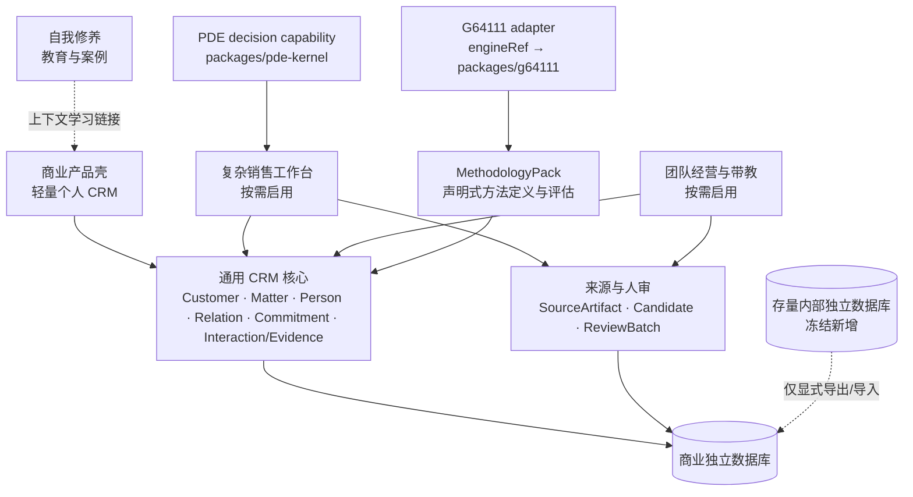

# ADR-002：商业版单一演进与通用 CRM 能力分层

> **2026-09-04 部分替代说明：** [ADR-004](ADR-004-个人商机推进工作台与研发范围收敛.md) 已获项目所有者批准，替代本文中的团队经营、企业方法论中心、套餐升级与旧 G5–G7 产品路线，并批准 PostgreSQL 单一引擎的分阶段目标。共享核心、正式数据单一权威、租户隔离、人审、审计、算法权威、迁移/恢复及环境隔离继续有效；SQLite 退出 Gate 前双库纪律保持不变。以下批准记录与正文保留为历史依据，当前执行看 ADR-004 与商业清单。

- **状态：** 已接受（Accepted）
- **日期：** 2026-08-19
- **Approved at：** 2026-08-19
- **决策人：** 项目所有者
- **Owner：** 项目所有者
- **设计依据：** `docs/designs/jianghu-lightweight-personal-crm-methodology-packs.md`
- **关联基线：** `docs/架构-双版本关系与变更治理v1.md`（ADR-001）
- **关联执行计划：** `docs/superpowers/plans/2026-08-19-lightweight-personal-crm-commercialization.md`
- **关联状态清单：** `docs/商业版开发待办清单v1.md`
- **关联 Epic：** [EPIC-CRM-001 · GitHub #32](https://github.com/ZiZ-LG/jianghu/issues/32)
- **Supersedes：** ADR-001 中“内部版与商业版作为两个产品方向持续演进”的产品路线结论
- **Preserves：** ADR-001 的共享核心、数据库唯一真相源、人审、跨租户隔离、算法单一权威、物理部署隔离和重大偏差治理
- **代码授权：** 仅 `CORE-101`；其余 CORE/SAAS 任务仍须按清单逐项进入 READY/IN_PROGRESS，不得并行启动

## 1. 决策摘要

采用以下方向：

1. 商业版成为江湖唯一持续功能建设和常规产品发布形态。
2. 存量内部部署冻结新增能力，只保留安全、兼容、数据恢复和经批准的显式迁移维护。
3. 产品采用“通用轻量 CRM 核心 + 可选复杂销售工作台 + 可选团队经营 + 版本化方法论包”的能力分层。
4. G64111 以独立 adapter 和 `engineRef` 接入，不再作为通用核心字段、术语、导航或校验前提。
5. 迁移采用单一逻辑真相源与 Expand → Migrate → Contract；不新建 Matter/Opportunity 或 Commitment/PlanAction 的长期双主表。
6. 内部与商业环境继续物理隔离；商业套餐升级只改变 entitlement，不搬迁业务数据。

本 ADR 只批准架构和治理边界。价格、套餐配额、支付、SSO、托管模型额度和具体连接器采购不在本决策内。

## 2. 为什么现在决策

现有江湖已经拥有可复用的客户、人物、关系图、录音转写、候选人审、G64111、PDE、幂等与审计资产，但核心契约和页面仍强绑定复杂大客户销售：

- `packages/domain-contracts/src/actions.ts` 的 Account/Opportunity 命令要求 `customerType`、固定销售阶段和 `engageStage`；
- `server/prisma/schema.prisma` 的 Opportunity、OppRole、PlanAction、OppStage 等模型混合了通用事项、G64111、预测和行动语义；
- `server/src/scope.ts` 当前仅对 viewer 做名下客户收紧，owner/admin/member 仍是租户全读，不能表达曹经理“本人 + 两名下属 + 显式共享”的商业团队范围；
- `server/src/suggest.ts` 的收件箱仍聚合 PersonSuggestion、RelSuggestion、ChangeProposal、Reminder 和 pending Evidence，多套候选机制不适合继续扩展会后速审；
- `server/src/pde/assemble.ts` 仍直接读取 `engageStage` 和 G64111 输入；
- `app/src/lib/today.ts` 已有“今日三件事”，但 PlanAction 仍无外部约会确认窗口、独立执行状态和改期审计。

曹经理的真实失败证明，首日价值应是“客户 + 一句话下一步 + 时间 + 临近确认”，持续价值则是“资料进入 → 人审沉淀 → 判断外化 → 行动验证 → 团队复用”。继续把这条主线嵌进内部版硬编码会扩大耦合和迁移风险。

## 3. 被取代与被保留的 ADR-001 内容

### 3.1 被取代

ADR-001 下列结论在本 ADR 批准后失效：

- 内部版与商业版作为两个产品方向持续建设；
- 内部版继续承接新增 WorkBuddy-first 产品能力；
- 以内部版路线图作为后续产品功能建设的默认顺序。

### 3.2 继续有效

下列结论继续有效，且任何实施不得降低：

- 单一 monorepo 与共享领域核心，不建立长期完整代码 fork；
- 江湖数据库是正式业务数据唯一 SoR；
- G64111 与 PDE 各自保持单一权威实现和现有 golden/parity 纪律；
- 机器生成的人物、关系、字段变化、证据、关键人或计划建议必须先进入候选，人审后才成为正式数据；
- 所有读写按 `tenantId` 失败关闭，权限由服务端执行；
- SQLite 与 PostgreSQL 保持跨库可移植，生产 schema 通过确定性渲染和版本化 migration；
- 内部与商业环境的数据库、备份、域名、密钥、日志和发布流水线物理隔离；
- 新重依赖、任意代码扩展、敏感数据外发或安全边界降低仍属于重大偏差。

## 4. 十条不可逆边界

1. **产品路线：** 商业版是唯一持续功能建设和常规发布形态；内部部署冻结新增，只接收安全、兼容、恢复和显式迁移补丁。
2. **教育边界：** “自我修养”是销售、CRM 和方法论教育的唯一承载面；CRM 只保留与当前动作有关的一句话提示和学习链接。
3. **通用核心：** 核心固定为 Customer / Matter / Person / Relation / Commitment / Interaction-Evidence。
4. **人审边界：** 原始资料可自动进入，草稿和候选可自动生成；统一 Candidate 必须先收敛，ReviewBatch 只锚定预审，人物、关系、画像、标签、证据、关键人、Interaction 和计划建议经人审后才正式生效。
5. **能力分层：** 复杂销售工作台和团队经营是独立 product capability；MethodologyPack 只拥有方法定义、实例值、评估和迁移，不拥有连接器、情报、假设、待办、目标、预测或带教状态。
6. **G64111 解耦：** G64111 只通过 adapter 与 `engineRef` 调用共享包；`primaryDPersonId`、固定阶段、ADURC 和 `engageStage` 不进入核心必填字段或默认导航。
7. **权限：** 新商业 Team 默认 scoped；member-manager 可写但只见稳定负责人、有效团队成员和显式 Grant 覆盖的 Matter。所有列表、直查、搜索、AI、导出与聚合复用统一 effective-scope resolver；敏感资料再叠加 creator/share ACL。viewer 永不因团队身份扩权。
8. **企业定制：** 企业方法论只能是声明式、版本化、可审计、资源受限的配置；不允许任意 JavaScript、Python、SQL、二进制插件、网络或文件访问。
9. **迁移纪律：** Matter/Opportunity、Commitment/PlanAction 等采用单一物理真相源和分阶段兼容；禁止长期双写、空值 fallback 双读和第二权威字段。
10. **数据连续性：** 内部与商业数据继续物理隔离；Free → Pro → Team → Enterprise 不搬业务数据。跨环境迁移只能由用户发起、先 dry-run、幂等且可审计的导出/导入完成。

## 5. 产品与架构分层



方法论读取经过权限裁剪的标准化 CRM 快照，只输出评估、缺口和建议。任何层需要改变正式 Customer、Matter、Person、Relation、Commitment、Interaction 或 Evidence 时，都必须调用唯一正式命令或生成候选，不得直接写表。

## 6. 核心模型决策

| 产品概念 | 物理策略 | 首阶段关键变化 |
|---|---|---|
| Customer | 复用 Account 行和稳定 ID | 提供通用 DTO；新增可空开放 `categoryKey`，旧 `customerType` 留给销售 adapter |
| Matter | 复用 Opportunity 行和稳定 ID | 新增 `kind`、`lifecycleStatus`、`outcomeKey`、priority、targetDate、`primaryOwnerUserId` 与转移审计 |
| MatterParticipant | 新建唯一通用参与关系 | 从 OppRole/OpportunityMember 推导回填；二者继续各自承担方法论角色与 legacy visibility |
| Relation | 复用 Edge | 新增开放 `kind`；L1–L4 仅作为销售视图映射 |
| Commitment | 从 PlanAction 演进 | 允许只挂 Customer；增加 UTC/IANA 时区、全天日期、执行/确认双状态、scheduleVersion 和改期审计 |
| Interaction | 复用 VisitNote/Note 的活动语义并建立统一读模型 | SourceArtifact 导入不自动创建 Interaction；候选采纳事务中才创建或关联 |
| Evidence | 复用 EvidenceEvent | 机器来源保持 pending review；批准后才影响评估 |
| ReviewCandidate | 统一 Candidate 物理表的领域契约 | 收敛现有五类写入方后才扩客户字段、承诺、关键人和计划候选 |

通用 Matter 生命周期为 `active | paused | completed | canceled`，结果使用开放 `outcomeKey`。销售 `won/lost` 映射为 `completed + outcomeKey`，不进入全行业核心状态。

## 7. 方法论与 PDE 边界

- MethodologyPack 包含字段、阶段、角色、核对清单、行动模板、规则引用、版本和迁移映射。
- 发布版本不可变；Matter 固定绑定具体版本。升级必须 dry-run、copy-on-write、CAS 切换并可回滚。
- G64111 包只保存字段映射与 `engineRef`，计算继续调用 `packages/g64111`；禁止复制公式。
- 通用焦点使用 `StakeholderFocus`，不能读取或回写 `primaryDPersonId`。
- 方法论当前阶段由 `MethodologyStageState` 权威保存，不能与 `pipelineStage` 或 OppStage fallback 双读。
- PDE 的决策阶段迁入独立 `PdeDecisionContext.stageKey`，通过 `decisionProfileRef` 绑定；解绑 G64111 不删除 PDE 输入。
- `IndustryPack` 继续表示 PDE 行业参数，不改名、不并入 MethodologyPack。

## 8. 权限与敏感资料

统一读权限公式：

```text
tenant scope
∩ RBAC / product capability
∩ effective Customer/Matter resource scope
∩ sensitive creator/share ACL（仅敏感资源）
```

实施要求：

- `TenantDataScopePolicy` 显式区分 `legacy_tenant_shared` 与 `scoped`；
- 存量内部租户未经迁移继续 legacy 语义；
- 新商业 Team 默认 scoped，普通 member 不再租户全读；
- 所有 list、按 ID 直查、搜索、AI 上下文、导出、组合和聚合先调用同一 resolver；
- SourceArtifact、Transcript、私密 Note 和 Candidate 默认 creator-only；共享、撤销和 reviewer 权限可审计；
- 团队聚合只读取正式数据白名单，不查询或先加载原始转写、凭据、私密备注和未审核候选。

## 9. 迁移与回滚

迁移固定采用 Expand → Migrate → Contract：

1. **Expand：** 只加通用字段、表、索引、契约和 adapter，不删旧字段。
2. **Migrate：** 先生成 dry-run 报告；回填生命周期、负责人、参与关系、候选和方法论状态；无法可靠映射的行进入隔离队列。
3. **Shadow parity：** 对通用 DTO、G64111 输入、PDE 输入和预测字段运行新旧结果对比；差异失败关闭。
4. **Cutover：** 每个逻辑字段由 authority map 指向唯一来源，停止旧路径新写入。
5. **Contract：** 只有消费者清单为零、恢复演练成功且有回滚点时，才放宽非空约束或删除兼容字段/命令。

任何回滚优先切回 adapter/binding 或恢复旧 authority source，不通过逆向猜测重建旧值。已发布方法论版本、评估快照、AuditEvent 和用户正式业务记录不可因回滚丢失。

## 10. 实施阶段门

| Gate | 条件 | 允许开始 |
|---|---|---|
| G0 治理 | ADR-002 明确批准；商业任务清单生效；`INT-502` 被项目所有者明确完成、转交或关闭 | 基础重构与 schema 设计 |
| G1 收敛与契约 | App shell 重构完成；通用 DTO、authority map 和 capability policy 通过 | 通用模型扩展 |
| G2 通用核心 | Matter/Participant/Relation/Commitment migration、scope resolver、SQLite/Postgres 恢复验证通过 | 商业轻量壳 |
| G3 首日价值 | 两分钟快速记录、待确认/待跟进/完成、改期和审计闭环通过；G64111 关闭 fixture 通过 | 复杂销售个人闭环 |
| G4 复杂销售 | 统一 Candidate 完成；SourceArtifact ACL、ReviewBatch 采纳事务、ResearchBrief、假设与 4–5 商机组合通过 | 团队能力 |
| G5 团队 | scoped 权限矩阵、预测快照重放、带教闭环和敏感白名单聚合通过 | 企业方法论 |
| G6 方法论 | declarative-v1、G64111 adapter、第二个非 G64111 fixture、迁移回滚通过 | Enterprise GA / 兼容层收缩 |

阶段门未通过时，只允许修复当前阶段缺陷，不得以 UI 演示绕过数据、权限或迁移前置项。

## 11. `INT-502` 的处置门

本 ADR 不把未完成的内部发布验收改写为 GO，也不删除已有证据。项目所有者在批准本 ADR 时已选择并记录：

1. 完成 rc10 内部发布门后冻结；
2. **已选择：明确停止内部发布，将现有证据归档并转为维护冻结；**
3. 将剩余发布责任和期限转交给明确 Owner。

处置已于 2026-08-19 落档：`INT-502` 以 `NO-GO / STOPPED` 关闭，未完成验收项保留为历史证据，不再形成发布阻塞；内部部署仅接受安全、兼容、恢复和经批准的显式迁移维护。商业清单按单任务纪律启动 `CORE-101`。

## 12. 备选方案

### A. 继续双产品方向

优点是内部团队仍可快速追加专属能力。缺点是用户体验、权限和契约会继续受内部销售语义牵引，并长期占用产品研发资源。与已批准设计方向不一致，不采用。

### B. 商业版单一演进，内部冻结（已采用）

优点是研发焦点单一，同时保留共享核心、历史数据和显式迁移能力；可用 capability 承接个人、复杂销售、团队和企业方法论。代价是需要一次系统性的契约、权限和数据迁移。已采用。

### C. 新建商业仓库并重写

优点是短期页面更自由。缺点是立即复制 G64111/PDE、安全、人审、迁移和恢复机制，形成第二权威实现，数据连续性和修复成本不可接受。不采用。

## 13. 明确不包含

- 微信通讯录或聊天记录自动抓取；
- 替换飞书妙记、飞书多维表格、SFA、ERP 或财务系统；
- 自建录音、ASR、通用项目管理、LMS、知识库或无代码 BPM；
- AI 静默更新正式画像、关系、证据、关键人、假设结论或计划；
- 任意代码方法论插件；
- 定价、套餐额度、支付、SSO、托管模型额度；
- 自动复制内部真实客户数据到商业环境；
- 在本 ADR 阶段删除 Opportunity、PlanAction、IndustryPack 或旧命令。

## 14. 批准标准

本 ADR 已由项目所有者明确回复“批准 ADR-002”，并于 2026-08-19 完成审批记录。单独批准设计文档不等同于批准本 ADR；代码仍按任务逐项授权。

批准同步结果：

1. 本文状态已改为“已接受”，Approved at 为 2026-08-19；
2. ADR-001 的 `Superseded by` 已指向 ADR-002，且仅替代持续双产品演进部分；
3. 商业版任务清单已进入 Active；
4. `INT-502` 已按“停止发布、证据归档、维护冻结”处置；
5. `CORE-000` 完成，项目所有者随后明确授权启动且只启动 `CORE-101`。

## 15. 审批记录

- **批准人：** 项目所有者
- **批准日期：** 2026-08-19
- **原始决定：** “批准 ADR-002；INT-502 停止内部发布并归档现有证据，转为维护冻结；同意创建 EPIC-CRM-001；暂不启动代码。并开始 CORE-101。”
- **解释口径：** 最后一条明确授权覆盖同一消息中“暂不启动代码”的一般限制，但只覆盖 `CORE-101`；不授权其他代码任务、推送、合并或部署。
