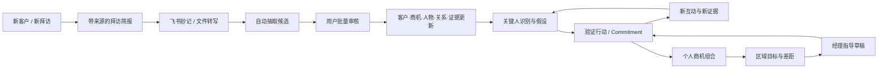
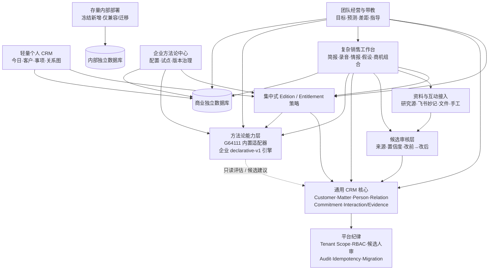
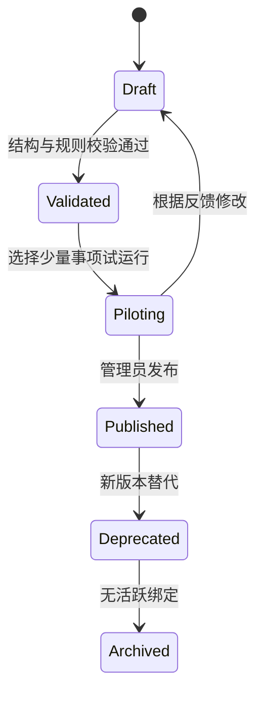
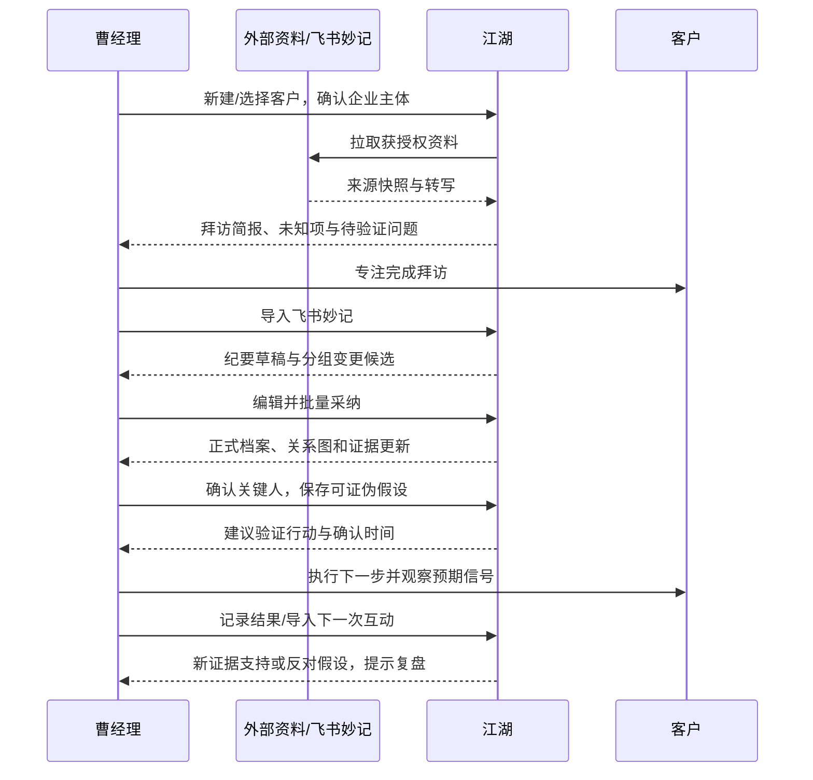

# 设计：江湖轻量化个人 CRM 与企业可定制销售能力包

Generated by /office-hours on 2026-08-18<br>
Revised from full Cao-manager journey on 2026-08-19<br>
Branch: main<br>
Repo: ZiZ-LG/jianghu<br>
Status: APPROVED — ADR-002 ACCEPTED
Mode: Startup

## Approval Record

- Approved by: Project owner
- Approved on: 2026-08-19
- Approved scope: 本文确定的产品方向、四层能力边界、数据与权限原则、迁移路线和企业定制边界。
- Governance result: ADR-002 已于 2026-08-19 接受；CORE/SAAS 任务已登记，代码仍按单任务逐项批准和验收，当前仅授权 CORE-101。

## 决策摘要

江湖采用方案 B：把产品核心改造为“客户／事项＋关系图”的通用个人 CRM，并把 G64111、复杂销售阶段、干系人角色、评分和行动建议从通用核心中抽离为可插拔的方法论包。

企业租户获得“方法论中心”：可在受约束的声明式模型中创建、测试、版本化和发布自己的销售方法论。企业定制不允许上传任意代码、执行任意 SQL 或直接改变 CRM 核心表结构。已发布方法论版本不可变；存量事项固定绑定原版本，升级必须先预演、再确认、可回滚。

通用核心之上增加两个独立产品能力层：面向曹经理个人的“复杂销售工作台”，负责拜访简报、录音沉淀、情报地图、关键人推演、假设验证和商机组合；面向其区域负责角色的“团队经营与带教”，负责目标、预测、差距和指导。二者可以调用方法论包，但不属于方法论包本身，也不能反向把销售专有字段变成通用核心必填项。

资料和转写可在授权范围内自动进入，摘要与变更候选可自动生成，但正式 Interaction、人物、关系、标签、证据、关键人和计划只能经人审产生；会后速审上线前先完成统一 Candidate 收敛。新商业 Team 采用独立的 scoped 行权限，曹经理作为可写的 team-scoped member 只见本人、两名下属和显式共享的 Matter；原始转写、私密备注和未审核候选还要经过创建者／共享 ACL，经理身份不自动取得正文。

“自我修养”与 CRM 分工明确：前者是平台提供的销售、CRM 与方法论普及、案例和客户教育的唯一承载面；后者只处理真实客户资料、关系上下文和下一步执行。CRM 只提供与当前动作直接相关的一句话提示及学习入口，不复制课程、文章或完整方法说明。

本设计不再延续“内部版与商业版”双版本基线，商业版作为唯一持续功能建设和常规产品发布的形态。现有内部版停止新增能力建设，不纳入后续产品架构；只允许必要的安全、兼容和显式迁移维护补丁。内部历史数据、数据库、密钥、域名和部署继续保持隔离，不自动迁移或进入商业环境。商业版免费用户升级到 Pro、Team 或 Enterprise 时继续使用同一租户和同一批业务数据，不做业务数据搬家。

本文确定的产品与架构方向已于 2026-08-19 获项目所有者批准，但不直接授权代码实施。按现有治理，它属于重大方向变更；实施前仍必须形成 ADR、登记任务并完成对应实施授权。

## Problem Statement

当前江湖围绕内部复杂大客户销售构建，核心语义、页面和数据均高度绑定“商机、G64111、PDE、WorkBuddy 和内部销售协作”。前一版设计解决了“不要漏掉下一步”，但对曹经理真正的长期工作仍描述不足：他缺的不是销售知识，而是一个能替他承接信息、外化判断并持续验证的工作台。完整问题有五层：

1. 产品职责混淆。销售、CRM 与方法论的普及和客户教育应由“自我修养”承接；如果 CRM 再放入课程、文章或系统化教学，不仅重复建设，也会让用户在完成一个简单动作前先学习一套术语。
2. 信息进入没有闭环。新客户资料、飞书妙记转写、微信沟通、道听途说的情报和个人判断分散在不同地方；系统若只存联系人和待办，曹经理仍需靠脑子把它们拼成客户与商机全貌。
3. 推理过程没有外化。关系图只展示“谁与谁有关”还不够；曹经理需要区分事实、转述、推断和假设，识别核心关键人，并把“怎样搞定他”的判断转成可验证、可滚动修正的计划。
4. 个人执行与经理带教割裂。曹经理既经营自己的 4–5 个复杂商机，又带两名初级销售；若个人记录无法汇总成区域目标、预测、差距和指导，团队管理仍要回到飞书表格与口头复盘。
5. 核心与方法论耦合。若 G64111 的字段、术语、校验和页面继续硬编码在核心里，企业难以按自身方法论定制，未启用复杂销售能力的用户也会持续承受无关复杂度。

要解决的问题不是把“商机”批量改名为“事项”，也不是在 CRM 内再做一套销售教育，而是建立一个不依赖具体行业和方法论的轻量客户工作核心，再按需叠加复杂销售与团队经营能力：教育归“自我修养”，CRM 负责从资料和互动到情报、判断、计划与复盘的工作闭环，G64111 作为可选方法论包彻底脱离核心，同时保留存量数据、租户隔离、商业升级和企业定制能力。

## Demand Evidence

当前最强证据是一位具体用户、一个完整工作流和一次真实失败，尚不是付费或留存证据：

- 用户：To B 项目管理类软件的大客户经理曹经理。他既是一线销售，又是带两名初级销售的区域负责人；方法论丰富，认知瓶颈不是“不会卖”，而是客户、商机和干系人过多造成的信息与推理负荷。
- 当前行为：客户干系人与通讯录主要在微信；拜访常用飞书妙记等工具录音；承诺和后续动作仍主要靠脑子记或搜索聊天记录；部门用飞书多维表格管理商机和汇报字段。
- 最近失败：已经约好解决方案交流，但临近时没有再次确认；客户也忘了约会，最终交流未发生。
- 明确需要：拜访前自动汇总客户背景；会后把录音转成可审核的客户／商机／干系人更新；在关系图上区分情报与假设、识别关键人并滚动验证；同时经营 4–5 个商机，并基于下属记录判断区域目标和指导推进计划。

这说明第一价值不是“再建一套公司级商机台账”，而是让曹经理在不增加记录负担的情况下，把每次接触转成可追溯情报、可解释判断和明确下一步。约会确认仍是最快激活点；“拜访准备 → 录音沉淀 → 候选审核 → 关系与假设更新 → 下一步验证”才是持续使用的核心价值闭环。

现阶段不能把这一案例表述为已验证 PMF。商业验证仍需通过真实使用、重复跟进完成率和付费行为获得，但不再以继续访谈作为本设计的前置条件。

## Status Quo

曹经理当前使用的是一套分散但合理的组合：

```text
公开资料 / 企业信息工具：拜访前临时搜索客户背景
飞书妙记：保留拜访转写，但与客户、商机和干系人档案分离
微信：联系人、关系线索、转述情报和沟通上下文
个人脑内 / 零散记录：判断谁关键、怎样推进、哪些假设待验证
飞书多维表格：部门商机阶段、金额和管理汇报
会议 / 口头复盘：汇总两名下属进展并给出指导
```

江湖不应在第一阶段替换微信通讯录、飞书妙记或飞书商机表。它应成为这些工具之间的客户智能、推理和行动层：

```text
新客户 / 新拜访
  → 汇总带来源与时效的拜访简报
  → 导入飞书妙记转写或会议材料
  → 自动抽取客户、商机、人物、关系、情报与下一步候选
  → 用户批量审核后更新正式档案和关系图
  → 围绕关键人建立假设、预期信号与验证行动
  → 新互动继续沉淀证据，支持或证伪原假设
  → 今日与商机组合提醒该做什么、哪条线索已失效
  → 区域视图汇总本人和下属的目标、预测、缺口与指导计划
```

## Target User & Narrowest Wedge

### 首个目标用户

复杂 B2B 销售中的“经理型一线销售”，首个具体样本是曹经理：

- 行业与角色：To B 项目管理类软件的大客户经理，同时担任区域负责人；
- 团队结构：本人仍承担一线商机，两名初级销售向其汇报；
- 工作规模：同时经营 4–5 个处于不同阶段、涉及多名干系人的长周期商机；
- 已有能力：具备成熟销售方法论和个人判断，不需要 CRM 教他基础销售知识；
- 核心压力：遗漏关键情报或下一步会直接影响赢单与区域营收；无法看清下属商机则难以及时纠偏；
- 购买理由：把有限注意力集中到最关键的人、最不确定的假设和最该发生的行动上。

### 最窄切口

#### 首日激活闭环

在不接管微信、不替换飞书、不要求配置 G64111 的前提下，让曹经理在一个快速记录界面、两分钟内完成：

1. 建立或选择客户；
2. 写下一句话的下一步，例如“周四 15:00 与客户交流方案”；
3. 选择时间，并按需开启“提前确认”（默认可给出提前一天的建议时间）。

保存即完成最小记录。事项、联系人、确认时间细节和来源证据均可在同一界面渐进补充，不作为首次保存的必填项；用户不应为了记住一个约会被迫先建完整事项或关系图。之后在“今日”看到“待确认／待跟进”，完成交流后补下一步。

关系图提供这次跟进的上下文，但“今日待确认／待跟进”才是默认入口。

#### 持续使用的最小价值闭环

选择一个真实商机和一次真实拜访，完成“拜访前简报 → 导入飞书妙记 → 审核结构化候选 → 更新人物与关系图 → 标记一个核心关键人 → 建立一条待验证假设 → 生成下一承诺”。这个闭环必须在不要求曹经理会后重新誊写完整纪要的前提下成立。

#### 团队扩展闭环

当本人闭环已稳定使用后，再让曹经理看到本人和两名下属的商机组合、区域目标与预测缺口，并把一次经理指导转成下属可确认的计划建议。团队能力建立在真实一线记录之上，不能要求销售为了管理报表重复录入第二套数据。

## 曹经理端到端用户旅程

| 阶段 | 曹经理要回答的问题 | 产品输出 | 所属层 |
|---|---|---|---|
| 新客户建档 | 这家公司是谁，近期发生了什么，拜访前还缺哪些背景？ | 带来源、时效和未知项的客户简报；主体多候选由用户确认 | 复杂销售工作台 |
| 拜访准备 | 这次见谁、目标是什么、哪些问题必须验证？ | 客户／商机摘要、人物关系、未决假设、拜访目标与问题清单 | 复杂销售工作台＋方法论包 |
| 会中记录 | 能否专注沟通，不再一边谈一边填 CRM？ | 接收飞书妙记链接、已授权转写或文件上传；原始材料加密留存 | Interaction/Evidence |
| 会后沉淀 | 这次谈话改变了哪些客户、商机和人物认知？ | 纪要草稿与分组候选：客户字段、商机字段、人物／标签、关系、证据、承诺 | 候选审核层 |
| 关系分析 | 谁真正影响决策，哪些关系只是传闻或推断？ | 事实、转述、推断、假设分层的关系图；关键人建议附理由与证据 | 复杂销售工作台＋方法论包 |
| 策略推演 | 要搞定哪个关键人，我的判断是什么，怎样证明或证伪？ | 关键人目标、假设、预期信号、验证行动、支持／反对证据和复盘状态 | 复杂销售工作台 |
| 滚动经营 | 4–5 个商机里今天最该处理什么，哪里正在失控？ | 今日行动＋商机组合：待确认、无下一步、情报陈旧、关键人缺口、假设待验证 | 通用核心＋复杂销售工作台 |
| 区域管理 | 本人与两名下属能否达成目标，差距来自哪里？ | 已签／预测／缺口、按人和商机下钻、方法论缺口与数据新鲜度 | 团队经营与带教 |
| 经理指导 | 下属下一步应改变什么，指导有没有被执行和验证？ | 带依据的指导记录与计划建议；下属确认后成为 Commitment，后续可复盘 | 团队经营与带教 |



## 产品定位

> 江湖是一个以客户、事项和关系为核心的个人 CRM：把散落在公开资料、微信、会议、录音和脑子里的信息，变成可追溯的客户认知、可验证的销售判断和不会漏掉的下一步；关系图解释谁影响谁，复杂销售工作台承接推演与滚动计划，方法论包决定如何评估，但都不污染通用核心。

### “自我修养”与 CRM 的职责边界

| 产品面 | 负责 | 明确不负责 |
|---|---|---|
| 自我修养 | 销售、CRM 和方法论的普及；概念解释；案例拆解；系统化课程与客户教育 | 不保存真实客户业务数据，不承担提醒、确认或事项推进 |
| CRM | 客户、事项、人物、关系、承诺和证据；今日行动；与当前字段或动作直接相关的一句话提示 | 不重复课程、长文、案例库或完整方法论教学 |
| 方法论能力包 | 面向执行的字段、阶段、规则、动作模板和简短释义；平台内置包可通过 `learningContentRef` 链接到“自我修养” | 不内嵌一套学习中心，不把阅读教学内容设为完成 CRM 动作的前置条件 |
| 企业方法论中心 | 配置和治理企业自己的执行方法；为字段和规则提供简短定义；可引用租户自有、外部受控的培训材料 | 不托管企业培训内容，不替代企业 LMS、知识库或培训体系；企业外部链接不属于平台客户教育 |

平台提供的同一知识内容只维护一个权威来源：“自我修养”。CRM 的空状态、字段帮助和行动提示只解决“此刻怎么做”，用户需要理解“为什么这样做”或系统学习时再进入“自我修养”；跳转后返回 CRM 时保留原客户与事项上下文，但不得把真实客户数据带入公开教育内容。企业自有材料只作为租户受控的外部培训链接存在，不由 CRM 承载，也不进入平台客户教育内容库。

### 核心产品原则

- 个人优先：一个人无需企业配置、WorkBuddy 或销售方法论即可获得完整价值。
- 行动优先：关系图是上下文，不是每天的起点；“今日”和“下一步”是高频入口。
- 教育与操作分离：系统学习归“自我修养”，CRM 只保留就地提示和学习链接，不重复建设教学能力。
- 渐进披露：快速记录只要求完成行动闭环所需的最少信息；事项、人物、关系、证据和方法论按需要展开。
- 来源优先：资料、录音、情报、画像字段、关系和判断都能回到来源、时间、提交者与审核状态；没有来源的 AI 结论不能伪装成事实。
- 事实与假设分离：已审核事实、转述情报、机器推断和销售假设在数据与视觉上分层；假设只能驱动验证计划，不能直接改正式关系或评分输入。
- 一线记录复用：团队管理读取一线销售已产生的正式业务数据，不要求为管理汇报重复录入；经理指导也要回到可执行、可验证的下一步。
- 客户与事项分离：客户是长期关系容器；事项是围绕客户推进的一件事，可为销售、服务、合作、招聘或其他类型。
- 方法论可选：没有绑定方法论的事项仍可完整使用；绑定后只增加评估和建议，不改变核心实体语义。
- 同租户连续升级：免费到付费只改变权限与能力，不复制业务数据、不更换实体 ID。
- 存量数据隔离：冻结的内部环境与商业环境继续物理隔离，内部真实数据不自动进入商业环境。

## Constraints

- 继承现有多租户、RBAC、viewer 行级可见性、审计、幂等和恢复纪律；所有新业务读写必须按 `tenantId` 作用域执行。
- 系统可以自动拉取并加密保存用户授权的原始资料或转写，也可以自动生成只读简报和纪要草稿；AI、企查查或外部 Agent 产生的人物、关系、标签、画像字段、事实判断、关键人判断和计划建议只能成为候选或预览，必须人审后才进入正式业务数据。
- 客户研究必须显示来源、抓取／生成时间和主体匹配状态；同名企业或多候选主体必须由用户选择，不能自动锁定。无法给出来源的内容必须标成“待核实”，不得进入正式画像。
- 录音和转写按最小留存处理：凭据与正文加密、租户隔离、幂等去重、可降解／删除；团队汇总默认不包含原始转写、凭据、私密备注和未审核候选。
- 团队汇总必须同时满足 `tenantId`、有效行级数据范围、团队归属与父实体可见性。现有 owner/admin/member 的租户共享和 viewer 的本人客户规则不能直接表达“本人＋两名下属”；Team 能力上线前必须先建立统一服务端 scope resolver，不能用前端筛选或单独报表查询模拟隔离。
- 原始转写、上传材料、私密备注和未审核候选除父实体 scope 外，还必须有 `createdByUserId` 与显式可见性／共享 ACL；默认仅创建者可见，经理身份不自动取得正文读取或候选审核权。
- Prisma 数据模型继续保持 SQLite 与 PostgreSQL 可移植，不使用原生 enum、Json 或数组类型。
- G64111 只能由 `packages/g64111` 的权威实现计算；通用领域契约、核心必填字段、默认导航和基础服务不得依赖 G64111、ADURC、L1–L4 或评分术语，只有 G64111 适配器可以通过 `engineRef` 调用该包。
- PDE 仍是独立决策内核，不被通用 CRM 或企业自定义规则隐式改写。
- 商业版不能依赖 WorkBuddy；存量内部部署可继续 WorkBuddy-first，但只做必要的兼容、安全和迁移维护，不再据此扩展商业核心。
- 不建立长期代码 Fork；edition 和 entitlement 差异必须集中表达，前后端同时执行。
- 现有 `app/src/store.ts` / `packages/domain-contracts` Action 契约变更必须同步前后端。
- `INT-502` 已由项目所有者停止内部发布并以 NO-GO/STOPPED 归档；内部部署转维护冻结，不得将既有证据解释为 GO。

## Premises

以下前提已由前序讨论与方案 B 选择确认：

1. “客户／事项＋关系图”比“联系人＋提醒”更能保留江湖差异化，但默认首页必须从关系图转向今日行动。
2. 首个可验证价值是避免承诺和约会失联，不是替换企业现有商机汇报系统。
3. 通用 CRM 核心应保持方法论中立；G64111 是首个内置方法论包，不是唯一合法方法。
4. 企业必须能按自身销售方法论定制，但定制应是声明式、受约束、可验证的配置，而不是租户代码执行平台。
5. 现有模型应通过兼容层与增量迁移演进，不能新建一套长期双写的平行 CRM。
6. 存量内部环境和商业版继续使用独立数据库；商业版租户内的 Free → Pro → Team → Enterprise 保持数据与 ID 连续。
7. 方法论发布和升级必须可复现、可审计、可预演、可回滚。
8. 曹经理的长期价值不是“系统替他判断”，而是系统替他承接资料、证据、假设和行动链，让其个人经验可被外化、验证和复盘。
9. “自动沉淀／自动更新”解释为原始资料自动进入、结构化候选自动生成、用户一次审核后批量生效；不解释为 AI 静默改写正式客户、商机、人物或关系。
10. 复杂销售工作台是产品能力层，拥有情报、假设、验证计划与商机组合；MethodologyPack 只提供阶段、词汇、规则和评估，不承载连接器、录音、团队目标或工作流状态。
11. 团队经营必须先复用稳定的一线数据闭环，再做区域汇总；没有下一步、数据陈旧和证据不足必须作为数据质量本身显示，不能用 AI 补齐假数字。
12. 区域目标与预测属于销售／团队扩展，不属于全行业通用 Matter 核心；其汇总口径必须显式、版本化并可追溯。

## Approaches Considered

- Approach A｜改名兼容层：把商机文案改为事项、隐藏部分复杂字段。已否决，因为销售专有语义仍会持续渗入通用用户体验，企业定制也只能继续加条件分支。
- Approach B｜通用核心＋能力包：客户、事项、人物、关系、跟进和证据构成稳定核心；复杂销售工作台与团队经营作为可选产品能力，G64111 与企业方法论作为版本化方法论包。已选择，兼顾个人轻量、现有资产复用和企业扩展。
- Approach C｜商业版只做现有模型的独立投影壳：短期可作为 B 的迁移手段，但不作为长期架构；否则内部模型与商业投影会形成两套语义和长期适配债。

本轮新增旅程也有三种归位方式：全部塞入通用核心，开发直观但会把所有用户变成复杂销售用户；全部交给外部 Agent／飞书，改动最小但继续割裂资料、判断与行动；在通用核心之上建立“复杂销售工作台＋团队经营”两个可选能力层，可复用现有录音、候选、关系图、策略沙盘和 PDE 资产，又不污染轻量入口。该第三种归位是已选方案 B 的自然展开，不重新改变既有方向。

## Recommended Approach

### 1. 总体分层



方法论层只读取经过权限过滤的标准化 CRM 快照，并输出评估、缺口和建议。复杂销售工作台负责把这些结果放进真实工作流；团队层负责在授权范围内聚合。任何层都不能直接改变客户、事项、人物或正式关系；需要写回时必须生成候选或明确的人工作业，由用户采纳。

### 2. 通用领域模型

为避免和现有技术层 `Action` 命令契约重名，产品里的“下一步”统一称为跟进承诺 `Commitment`。

| 目标概念 | 含义 | 现有资产与迁移策略 |
|---|---|---|
| `Customer` | 长期客户或合作对象 | 复用 `Account` 物理数据和稳定 ID；先提供通用 DTO/UI 语义，不要求立即改表名 |
| `Matter` | 围绕客户推进的一件事，含稳定 `primaryOwnerUserId` 或明确未归属状态 | 目标语义替代 `Opportunity`；首阶段复用现有物理行，新增 `kind` 等通用字段，禁止另建双主表 |
| `Person` | 客户内的人与联系对象 | 直接复用现有 `Person`，保持归属、归档、合并和候选人审能力 |
| `MatterParticipant` | 人与事项的参与关系 | 新建通用真相源并从 `OppRole` / `OpportunityMember` 推导回填；旧表继续分别承担销售角色与 visibility/ACL，不与参与关系混义 |
| `Relation` | 人与人之间的关系图 | 复用 `Edge` 的客户级和事项级作用域；目标 DTO 使用 `matterId` |
| `Commitment` | 用户承诺要完成或确认的下一步 | 从 `PlanAction` 演进；允许只挂客户，事项和人物可选；增加确认窗口与状态 |
| `Interaction` | 经用户确认的会面、沟通、拜访等业务活动元数据；原始正文属于 SourceArtifact | 复用 `VisitNote`、`Note` 的活动语义和录音溯源纪律，逐步统一读模型；导入资料本身不自动创建正式 Interaction |
| `Evidence` | 可用于判断的已审核证据 | 复用 `EvidenceEvent`；机器抽取继续 `pending_review`，不因能力包而放宽 |

通用核心之外还有两类平台支撑对象，但它们不是新的客户业务主实体：`SourceArtifact` 表示获授权导入的转写、文件或外部资料快照，可优先复用现有 `Transcript`、`Note` 和任务结果；`ReviewCandidate` 是统一 `Candidate` 物理表对产品层暴露的契约，表示机器建议的字段、人物、关系、证据或行动变更。依据已批准的《架构-收敛路线图v1》，下一次收件箱功能迭代前必须先把 `PersonSuggestion`、`RelSuggestion`、`ChangeProposal`、`Reminder` 与 `pending_review EvidenceEvent` 等写入方收敛到统一 Candidate 和 helper，再增加新候选种类；不得先用长期聚合投影扩出第六套机制。

`Matter.kind` 使用字符串而非数据库 enum。V1 只承诺 `sales_opportunity` 和 `general` 两种模板；`service_project`、`partnership`、`recruiting` 仅是未来示例，在出现真实流程证据前不进入首发范围。未知 kind 不得导致核心读失败。核心只依赖通用字段：标题、生命周期、负责人、优先级、目标日期、下一承诺、客户归属和归档状态。

Matter 的通用生命周期固定为 `active | paused | completed | canceled`，结果另存开放字符串 `outcomeKey`。允许 `active ↔ paused`，允许 active/paused 进入 completed/canceled；从 completed/canceled 重新打开必须走显式命令并审计。销售包把现有 `won/lost` 映射为 `lifecycleStatus=completed + outcomeKey=won/lost`，不能把 won/lost 变成所有行业的核心状态。

销售专有字段，如赢单概率、预计签约额、ADURC、G64111 项和 PDE 输入，不再被视为所有 Matter 的必填核心字段。现有硬编码按下表归位：

| 现有字段/约束 | 通用核心归属 | 销售或方法论归属 | 迁移方式 |
|---|---|---|---|
| `Account.customerType: 1..4` | 新增开放字符串 `categoryKey`，可空 | 旧 customerType 只供 G64111/客户分类适配器读取 | 通用 Customer 命令不再要求 1..4；旧字段先保留，逐消费者审计后再可空或移入销售扩展 |
| `Opportunity.customerType/changeMode/status` | Matter 只保留 `kind/lifecycleStatus/outcomeKey/priority/targetDate` 等中性字段 | 客户销售分类、变化模式和 won/lost 结果属于销售扩展 | 存量回填 `kind=sales_opportunity` 并映射生命周期/结果；新通用命令不接收销售字段；物理非空约束在消费者清单完成后再放宽，过渡默认值不得暴露为业务事实 |
| `Opportunity.pipelineStage` | 无；通用 Matter 不假设有销售阶段 | 当前方法论阶段唯一读取 `MethodologyStageState`；未绑定方法论时显示“未配置”，不回读旧阶段 | 迁移期 G64111／默认销售模板可把旧字段声明为唯一 legacy storageBinding 并影子生成新状态；切换后旧字段只读冻结，组合页不得在两源间 fallback |
| `OppStage.stageKey` | 无 | 只表示年视图中的历史／计划阶段时间段，不是“当前阶段”权威源 | 保留为兼容时间线；消费者清单完成后改由阶段变更审计派生或退役，不能与 pipelineStage／MethodologyStageState 竞争当前值 |
| `Opportunity.engageStage` | 无 | G64111 的 C4 方法论值与 PDE 决策阶段必须拆成两个逻辑字段 | 初期分别从旧值影子映射到 `MethodologyValue(g64111.engage_stage)` 与 `PdeDecisionContext.stageKey`；parity 后各自单写。解绑 G64111 不删除 PDE 输入，PDE 也不得继续读取 G64111 值 |
| `Opportunity.primaryDPersonId` | 无；通用人物参与和策略焦点不包含 D 语义 | G64111 主 D 由该包的 RoleAssignment／Value 表达；通用关键人焦点使用独立 `StakeholderFocus` | 初期仅 G64111 adapter 可读旧字段并做 parity；通用关系图、商机组合和假设工作台禁止读取。解绑 G64111 隐藏主 D 但保留 StakeholderFocus 与历史方法论快照 |
| `Opportunity.expectedAmountW/winProbability/expectedSignDate` | 无 | 销售金额与预测属于 `ForecastEntry`／销售结果扩展；手填赢单概率不等于显式预测 | 旧字段只生成迁移候选；用户确认周期、币种和 category 后才成为 ForecastEntry，未确认前不计入 commit。影子核对后停止新通用写入；weighted 指标只有显式公式启用时才读取概率 |
| `Person.orgLevel/coachLevel/form` | Person 核心只保证姓名、职务、头像、联系与归属 | 组织层级、教练等级和 FORM 属于销售人物画像或方法论字段 | 保留旧字段供 G64111 适配器读取；通用 Person 不要求填写，后续逐字段切换唯一存储来源 |
| `OppRole.role/sentiment/confidence` 固定 ADURC | `MatterParticipant` 只表达人物参与某事项 | `MethodologyRoleAssignment` 表达方法论角色和立场，可一人多角色 | 新建通用参与关系；ADURC 继续由 G64111 包适配，不能成为通用角色 enum |
| `Edge.layer` 固定 L1–L4 | Relation 使用开放 `kind/label/directed` 和客户/事项作用域 | L1–L4 是销售包的视图映射与校验规则 | 旧 Edge 保留；通用 DTO 不要求 layer，销售视图按能力包映射，未知关系类型仍可展示 |
| `PlanAction.gapItem/scripts/target/resources/...` | Commitment 只承载承诺、时间、确认、负责人和完成状态 | 补分项、话术、打法和资源属于销售行动扩展 | 旧销售命令继续强制销售 Matter；新通用 Commitment 走独立命令，销售扩展字段不进入通用必填 |
| Action 契约中的 1..4、ADURC、L1–L4 校验 | 通用 V2 命令使用开放字符串与中性约束 | 旧命令继续服务内部销售兼容 | 前后端共享契约并存迁移，逐命令 parity 后收缩旧契约，不在单端偷偷放宽 |

一个逻辑字段在任一时刻只能有一个权威存储来源。方法论字段定义必须声明 `storageBinding = core_path | methodology_value | legacy_path`，legacy_path 只允许迁移期使用并有停止日期／消费者清单。初期 G64111 adapter 可读取已登记的 Person/OppRole/BI/UCV/Opportunity legacy 字段；企业自定义方法使用 `MethodologyValue`。逐字段影子读取和 parity 后必须显式切换并停止旧源写入，不能长期双写或以“新值为空就读旧值”的 fallback 掩盖漂移。

G64111-off fixture 除验证页面无专有词外，还必须在依赖层断言：通用工作台和组合查询不读取 `primaryDPersonId`、ADURC、`pipelineStage`、`engageStage` 或固定阶段枚举；PDE assembler 只从显式 `decisionProfileRef/PdeDecisionContext` 取得阶段。这样“禁用方法论包”才是数据依赖上的真正解耦，而不只是隐藏 UI。

### 3. “约会确认”作为通用核心能力

曹经理的失败不是普通截止日遗漏，而是“约会存在，但双方没有在临近时再次确认”。执行和确认是两个正交状态，不能用一个 `status` 混在一起：

- `kind`：meeting、call、message、task 等开放字符串；
- `executionStatus`：planned、completed、canceled、missed；
- `confirmationStatus`：not_required、pending、confirmed、declined；
- `scheduledAtUtc` / `dueAtUtc`：有具体时刻的承诺统一存 UTC；
- `timeZone`：保存创建者选择的 IANA 时区，用于展示和提醒计算；
- `isAllDay` / `localDate`：全天事项使用本地业务日期，不伪造午夜 UTC；
- `confirmationDueAtUtc`：最晚确认时刻；
- `confirmedAt` / `confirmedBy`：实际确认记录；
- `scheduleVersion`：每次改期递增；旧提醒随版本失效；
- `nextCommitmentId`：完成后形成下一步的可追踪关联；
- `source` / `sourceRef`：手工、导入、Agent 等来源；
- `customerId` 必填，`matterId` 与 `personId` 可选。

改期保持 Commitment ID 稳定，并写一条包含旧/新时间、旧确认记录与操作者的 schedule revision；旧确认记录在 revision 中标记 `stale`。当前 Commitment 若新日程仍需确认，`confirmationStatus` 一律重置为 `pending`；否则为 `not_required`。客户拒绝为 `declined`；约定时间已过但未记录结果时仍保留原正式状态，只派生 `past_due` 提醒，用户明确选择后才能标记 `missed`、完成、取消或改期。

确定性巡检只生成只读提醒：`confirmation_due`、`commitment_due`、`matter_without_next_commitment`。两类提醒使用不同去重键：Commitment 提醒为 `tenantId:commitmentId:reminderKind:scheduleVersion`；事项缺少下一步提醒为 `tenantId:matterId:reminderKind:businessWeek`，businessWeek 按租户业务时区计算。确认、完成、取消、拒绝或改期后旧 Commitment 提醒自动结束；Matter 创建有效下一承诺后缺口提醒自动结束。巡检不自动修改正式业务数据。个人版第一阶段以站内“今日”为主，日历、邮件、企微或其他外部通知作为连接器后续增加。

### 4. 从资料到正式事实的四层结构

| 层 | 内容 | 是否可自动产生 | 是否影响正式画像／关系／评分 |
|---|---|---|---|
| 原始资料层 | 企业信息响应、网页／文件快照、飞书妙记转写、手工上传材料 | 可在用户触发或已授权连接器范围内自动拉取；必须幂等、带来源、按策略加密和留存 | 否 |
| 派生草稿层 | 客户简报、拜访准备、会议纪要、摘要和待核实问题 | 可自动生成和刷新；必须显示生成时间、来源清单、未知项与失败状态 | 否，可随来源变化重新生成 |
| 变更候选层 | 客户／商机字段、人物、标签、关系、证据、承诺、关键人和计划建议的改前→改后 | 可自动抽取；预审时按 SourceArtifact／ReviewBatch 分组，采纳后才关联正式 Interaction | 否，等待用户采纳、编辑后采纳或驳回 |
| 正式业务层 | 已确认的 Customer、Matter、Person、Relation、Commitment、Interaction/Evidence 和销售扩展值 | 只能由人工明确提交或采纳候选产生 | 是，进入后续评估、提醒、汇总与审计 |

“自动沉淀”在产品上表现为：用户导入一次资料，系统完成解密／解析、去重、挂载、摘要和候选分组；用户在一张会后速审单中批量处理。预审阶段以稳定 `sourceArtifactId + reviewBatchId` 为父锚，不自动创建正式 Interaction；Candidate 继承 SourceArtifact 的创建者和敏感 ACL。用户采纳时确认活动类型、时间和 Customer/Matter 归属，由同一幂等事务创建或关联正式 Interaction，再把所选变更、Evidence、Commitment 与审计关联到该 Interaction。若全部驳回或资料尚未归类，不产生正式 Interaction。

采纳事务必须先重新检查租户、effective resource scope、sensitive ACL、父实体、batch 状态、实体版本和旧值，再原子写入所选变更与审计；部分冲突不得把未冲突项静默写入，应返回可理解的逐项结果供再次确认。同一 `reviewBatchId + acceptanceVersion` 重试只能得到原结果，不能重复创建 Interaction、人物、关系或 Commitment。

客户研究简报还需满足：

- 首先解析客户主体；同名公司或多候选结果让用户选择，选择结果与统一社会信用代码等锚点一起保存；
- 每条事实或摘要段都能展开查看来源、抓取时间和适用主体；过期或访问失败保留上次快照并明确标识；
- 公开资料、企查查／企业信息服务、用户上传材料和 CRM 已审核事实分栏展示，不把来源质量不同的内容混成一句无出处结论；
- 拜访前简报聚焦“本次需要知道什么”：公司概况、近期变化、已有合作、活跃事项、相关人物、未决假设、上次承诺和待验证问题，而不是生成一份泛行业报告。

录音／转写链路优先复用现有能力：飞书妙记按链接或已授权入口拉取转写，文件上传作为降级路径；江湖不自建 ASR。原始转写继续 AES-256-GCM 加密、按租户和用户凭据隔离、按外部引用去重，并允许抽取后降解或删除。说话人识别不确定、同名人物、跨客户提及和无法挂载的内容必须进入待归类状态，不能猜测归属。

### 5. 复杂销售工作台的产品与数据边界

复杂销售工作台是可选 product capability，不是 MethodologyPack。它拥有资料接入、情报推理、假设验证和商机组合的工作流状态；方法论包只为这些界面提供可替换的角色词汇、阶段、评估规则、关键人判定维度和行动模板。禁用 G64111 后，工作台仍能使用通用的情报、假设与计划，只是不显示 G64111 评分和 ADURC 视图。

| 扩展概念 | 职责 | 与现有资产的关系 |
|---|---|---|
| `ResearchBriefSnapshot` | 保存某次拜访前简报的来源清单、生成时间、摘要与未知项；是可再生快照，不是客户画像真相源 | 复用 Account.profile、EnrichJob、企查查 resolve/company-data、现有 CuratedSummary 和外部资料能力；正式字段更新仍走候选 |
| `IntelligenceItem` | 保存一条销售情报及其 `assertionType`、来源、发生／获知时间、置信度和作用对象 | 新的销售扩展；`assertionType = observed | reported | inferred`，道听途说使用 `reported`，不能伪装成 Evidence |
| `StakeholderFocus` | 保存曹经理本轮经营聚焦的人物、目标变化、确认人、依据和有效期；是方法论中立的策略焦点，不等于 G64111 的 D 角色 | 新的复杂销售扩展；方法论可建议候选，但用户确认后才创建，通用工作台不得读取 `Opportunity.primaryDPersonId` 代替它 |
| `SalesHypothesis` | 代表围绕某 Matter／Person 的可证伪判断身份、当前修订指针、状态、负责人和下次复盘时间 | 从现有 `StrategyRisk(kind=assumption)` 增量演进，不能继续只存一段无验证结构的文本 |
| `SalesHypothesisRevision` | 追加保存每版主张、理由、预期信号、反证条件、创建人和创建时间 | 新增不可变修订；修改假设只推进 `currentRevisionId`，不覆盖旧判断 |
| `HypothesisEvidenceLink` | 把已审核 Evidence 以 supporting／contradicting 方式连接到假设 | 新增追加式关联；不覆盖原证据，不让模型自行宣布最终真伪 |
| `StrategyCard` | 描述针对关键人的策略选择、依据和备选打法 | 复用现有模型，但去除通用层对 G64111 gapItem 的必填依赖；方法论包可继续映射 |
| `Commitment` | 承载验证假设、接触关键人和推进里程碑的具体下一步 | 复用通用核心；通过可空 `hypothesisId`／策略关联形成滚动计划，不另建第二套待办真相源 |
| `OpportunityPortfolioView` | 汇总本人 4–5 个活跃销售 Matter 的注意力缺口 | 派生读模型，不新增主表；读取正式数据、方法论评估与巡检结果 |

现有 `CuratedSummary` 只作为 CRM 内部资料的兼容摘要输入，不再与 ResearchBrief 同时充当“客户现状摘要”权威展示。`editedByHuman=true` 的内容按用户资料保留并作为带来源的输入，不能被 ResearchBrief 刷新覆盖；AI 生成且未人工编辑的旧摘要可作为缓存输入并标明生成模型和 `basedOnAt`。ResearchBrief 成为拜访准备的唯一默认展示；全部消费者切换并完成历史保留后，停止新建旧 CuratedSummary AI 缓存，是否物理退役另走 Contract 任务。

`SalesHypothesis.status` 目标语义为 `untested | testing | supported | contradicted | retired`。系统可根据新增证据建议状态变化，但用户确认前只显示“建议支持／建议证伪”。修改假设时追加 `SalesHypothesisRevision` 并以乐观并发推进 `currentRevisionId`；旧主张、理由和证据链接保持不可变，确保复盘时看得出判断如何变化。

关系图必须同时服务“看事实”和“做推演”，但两种状态不能混淆：

- 实线：用户已确认的正式 Relation；
- 灰色虚线加 `?`：机器候选关系，采纳后才转正式；
- 点线推演覆盖：用户正在测试的假设关系或影响路径，关闭推演不改变正式图；
- 情报徽标：`observed / reported / inferred`、来源、时间和新鲜度；
- 关键人高亮：由当前方法论版本或通用规则给出“建议关键人＋理由＋证据缺口”，用户确认后创建／修订方法论中立的 StakeholderFocus；不能自动把建议写成正式焦点或 G64111 角色。

滚动计划不做成重型项目管理。一个假设至少包含“希望关键人发生什么变化、怎样观察到、什么信号会推翻它、下一步向谁做什么、何时复盘”；对应 Commitment 完成后，系统要求补充结果或关联 Evidence，再提示保留、修正或放弃假设。销售可以随时手工录入道听途说的情报，但必须选择或保留默认 `reported` 类型、记录来源描述与获知时间。`reported`／`inferred` 不通过改标签直接升级为 Evidence；用户完成核验后应创建一条独立 Evidence，并保留对原 IntelligenceItem 的溯源关联。

### 6. 团队经营与带教边界

团队层解决曹经理的第二角色，不把个人 CRM 默认变成管理驾驶舱。目标模型属于销售／团队扩展：

| 模型／读模型 | 职责 |
|---|---|
| `SalesTeam` / `SalesTeamMembership` | 租户内团队、经理与成员关系；不复用字符串地区作为授权依据 |
| `RevenueTarget` | 团队／个人、周期、币种、目标金额与来源；版本化保存调整记录 |
| `ForecastEntry` | 某 Matter 在某目标周期的唯一显式预测输入：category、金额、币种、预计签约日、负责人、实体版本与修改审计；V1 category 为 `pipeline | best_case | commit | omitted` 字符串 |
| `SalesOutcomeRecord` | 已签口径的正式销售结果：Matter、`outcomeKey=won`、签约金额、币种、签约日期、来源与版本；未录入或未导入时不能由预计金额代替 |
| `ForecastSnapshot` | 某时点已签、承诺、最佳情形、可选加权预测、缺口和所用公式／方法论版本的可重放快照；保存规范化输入副本，不只保存 Matter ID |
| `TeamPortfolioView` | 在授权范围内按成员、阶段和 Matter 汇总金额、关键人、下一步、数据新鲜度和风险 |
| `CoachingReview` | 经理对一次商机复盘的观察、差距、依据和建议；区分共享反馈与经理私有草稿 |
| `CoachingActionProposal` | 经理提出的计划调整；下属确认后转成 Commitment，或由具备显式指派权限的经理直接创建并留下审计 |
| `TenantDataScopePolicy` | 平台级行权限模式：`legacy_tenant_shared` 保持内部版现状，`scoped` 启用按归属／团队／显式共享的资源范围；新商业 Team 默认 scoped |
| `ResourceAccessGrant` | 对 Customer／Matter 的显式用户或团队共享，含权限、有效期、授予人和撤销审计；不替代 tenant 条件或父实体校验 |

V1 的区域视图采用固定、可解释的单币种口径：RevenueTarget 定义 `[periodStart, periodEnd]`、币种和租户业务时区；“已签”只汇总周期内 `SalesOutcomeRecord.signedAt` 且同币种的签约金额；“显式预测”只汇总仍为 active 且 `ForecastEntry.category=commit`、预计签约日在周期内的金额；“最佳情形”汇总 commit＋best_case；`缺口 = max(目标金额 − 已签 − 显式预测, 0)`。pipeline 和 omitted 不进入显式预测，旧 `winProbability` 不参与该公式。若租户启用 weighted 指标，必须另存确定性公式版本并单列展示，不覆盖显式预测。

ForecastSnapshot 必须复制每个输入 Matter 的 id/version、primaryOwnerUserId、生命周期／结果、ForecastEntry version/category/amount/currency/expectedCloseDate、SalesOutcomeRecord version/signedAmount/signedAt、目标版本、租户时区、方法论／公式版本和授权版本，保证 Matter 后续变化后仍能重放旧结果。V1 不做汇率换算；混合币种、缺少签约金额或日期的行失败关闭并列入“未计入原因”，不能静默折算或拿预计金额补齐。实际回款不属于“已签”，财务系统未接入时明确标为未接入。

团队权限采用三层相交而不是给现有角色加例外：`RBAC/capability 可做什么 ∩ effective resource scope 可对哪些 Customer/Matter 做 ∩ sensitive ACL 可读哪些正文`。所有列表、按 ID 直查、搜索、AI 上下文、导出和聚合复用同一个服务端 scope resolver。

- `legacy_tenant_shared` 仅为存量内部部署保留 owner/admin/member 的租户内共享语义和 viewer 的本人客户只读语义；切换到 scoped 必须显式迁移、预演和审计，不能静默改变存量权限。
- 新商业 Team 使用 `scoped`：`member` 不再因角色本身获得全租户数据。曹经理应是具有 `portfolio.read`、`coaching.manage` 的 member，其有效 Matter 集合为“本人稳定 userId 归属＋所管理团队中有效成员的稳定 userId 归属＋显式 ResourceAccessGrant”；需要全租户读取必须另有 `data.read_all`，不能从 member 或经理身份隐式推出。
- viewer 保持只读且只见本人归属客户，不能被配置为需写入带教记录的团队经理；即使误配团队 membership，也不扩大 viewer 行级范围。未来若需要只读区域分析角色，应新建独立 capability 与 scoped policy，不复用 viewer 绕过现有门禁。
- Matter 必须拥有稳定的 `primaryOwnerUserId` 或处于明确的“未归属”队列；姓名、地区字符串和现有 `OpportunityMember` 干系人表都不能参与员工授权。团队管理只授予 Matter scope；Customer 只暴露必要的基础标题，客户级人物、关系和其他 Matter 仍需 Customer grant 或各自 Matter scope，避免同一客户跨团队时横向泄露。
- 经理默认只能看到有效范围内的正式商机摘要、已审核且已共享证据、下一步和共享计划。SourceArtifact／Transcript／私密 Note／ReviewCandidate 必须默认 `private` 并记录 `createdByUserId`；只有创建者显式改为 `matter_shared` 且读取者同时拥有 Matter scope 与 `source.read_shared` 时才可读正文。读取共享 Candidate 不等于可采纳，只有创建者或得到显式 `candidate.review_shared` 的 reviewer 才能处理，并继续接受目标实体写权限校验。团队聚合永不读取这些敏感对象。

`portfolio.read`、`coaching.manage`、`commitment.assign`、`source.read_shared`、`candidate.review_shared`、`data.read_all` 等权限通过集中式 capability／permission 表达，不把“区域经理”硬编码成新的全局角色。团队成员离队、Matter 转移、Grant 撤销或团队关系失效后，resolver 必须在下一次请求即时失败关闭；快照保留生成时的输入 ID 与授权版本供审计，但不能借历史快照重新读取已撤销正文。

团队指导遵循“差距 → 依据 → 建议 → 确认 → 执行 → 复盘”：系统可以提示“关键人未确认”“两周无新证据”“无下一步”“预测依赖单一假设”，经理基于具体记录写指导；AI 只能生成指导草稿。下属接受建议后才成为自己的 Commitment；直接指派需要独立权限，并记录指派人、接受状态和后续结果。

### 7. 方法论包的产品边界

一个方法论包可选择性包含：

- 适用的 `Matter.kind`；
- 阶段与阶段门；
- 干系人角色词汇与角色约束；
- 评估维度、问题、字段和值域；
- 证据要求与完整性检查；
- 评分或分级规则；
- 风险、缺口和下一步建议规则；
- 行动模板、话术提示、UI 标签和简短操作释义；
- 可选的 `learningContentRef`：平台内置包只指向“自我修养”；企业包只能引用租户自有、外部受控的培训材料；
- 所使用的计算引擎和版本。

所有组成部分均可选。一个方法论可以只有阶段和核对清单，不必强制有总分；也可以只定义角色和证据要求。通用核心不得假设每个 Matter 都有“赢单率”“决策人”或“评分”。

方法论包只承载“执行时系统需要知道什么”，不承载“如何系统学习这套方法”。G64111 的概念普及、完整教程与案例统一留在“自我修养”；CRM 只显示当前字段的简短释义、下一步提示和可选学习链接。企业自定义方法同样只能配置必要释义并引用企业自有的外部培训入口，不能把内容上传到 CRM，也不能把 CRM 变成课程或知识库系统。

方法论包也不拥有研究连接器、原始转写、IntelligenceItem、StakeholderFocus、SalesHypothesis、Commitment、RevenueTarget、ForecastEntry、SalesOutcomeRecord、ForecastSnapshot 或 CoachingReview。它可以定义“哪些信息重要、怎样判断缺口、怎样分类预测、建议什么动作”，但真实资料、工作状态、团队目标和审计始终由相应产品能力层管理；更换方法论版本不得删除这些数据。

### 8. 两类方法论引擎

#### 内置权威引擎

- `g64111:<semver>`：只调用 `packages/g64111`，能力包保存字段映射、展示和版本引用，不复制公式。
- PDE 不是第二个 MethodologyPack。它继续作为独立 decision capability，使用自己的行业参数资产；某 Matter 若启用 PDE，只在绑定上保存显式 `decisionProfileRef`，不与 primary methodology 争夺字段或版本所有权。

#### G64111 解耦硬边界

- 通用 `Customer / Matter / Person / Relation / Commitment` 契约、数据库必填约束和默认商业导航中不得出现 G64111 维度、ADURC、L1–L4、赢单评分等专有语义。
- 只有独立的 G64111 capability adapter 可以把通用快照和已审核证据映射为 `packages/g64111` 输入，并通过 `engineRef=g64111:<semver>` 调用权威引擎；核心服务和通用 UI 不得直接 import 评分包。
- 未安装、未绑定或被租户禁用 G64111 时，客户、事项、人物、关系图、跟进承诺、今日列表和导入导出必须可独立运行，且不出现失效导航、空白必填字段或 G64111 文案。
- 禁用或解绑 G64111 只隐藏该包的评估、阶段、角色和建议视图，不删除或改写 Customer、Matter、Person、Relation、Commitment、Interaction/Evidence 及历史审计。
- 迁移期遗留销售字段只能由兼容适配器读取；不得成为新通用命令的必填参数，也不得作为通用核心的权威语义继续扩散。

#### 企业声明式引擎

- `declarative-v1`：支持字段校验、映射表、加权求和、阈值、min/max、all/any 和有限条件表达式。
- 规则必须是确定性的：禁止网络访问、文件访问、随机数、当前时间隐式输入、循环、递归、任意脚本、任意 SQL 和动态依赖安装。
- 发布前编译为规范化中间表示，校验字段引用、类型、循环依赖、缺失值策略和最大复杂度。
- 同一输入、同一包版本和同一引擎版本必须得到同一输出；输入哈希、内容哈希和引擎引用进入评估快照。

`declarative-v1` 进入开发前必须先有单独、可测试的引擎规格。该规格至少固定 AST/schema、字段类型、missing 与 null 语义、数值精度与舍入、引用命名空间、canonical serialization 与 hash、最大深度/节点/步骤、错误码、固定 fixtures 和引擎版本兼容规则。规格未批准前，企业 V1 只能发布阶段、角色、核对清单和行动模板，不能发布自定义评分公式。

若企业需要任意代码插件，属于未来单独的受审托管扩展，不在本设计范围内，也不得由租户管理员直接上传执行。

### 9. 企业方法论生命周期



- `Draft` 可编辑，不可用于正式批量评估。
- `Validated` 通过确定性校验和测试用例，但尚未发布。
- `Piloting` 通过独立 `MethodologyPilotAssignment` 选择少量 Matter；结果与当前 primary 方法并排比较，不覆盖 active binding 或原评估。
- `Published` 内容不可变；任何修改都创建新版本。
- `Deprecated` 不能新绑定，但存量 Matter 可继续读取和复算。
- `Archived` 只在没有活跃绑定且审计留存满足要求时进入；历史评估仍可追溯。

企业 V1 仅 tenant owner/admin 可编辑和发布。若真实客户需要，可在后续 RBAC 设计中增加细粒度 `methodology.manage` 权限，不在现有四种角色上临时硬编码新角色。

### 10. 企业方法论数据模型

目标模型如下；名称是领域契约，不要求第一步就重命名现有 Prisma 表：

| 模型 | 关键职责 |
|---|---|
| `MethodologyPack` | 租户级方法论身份、名称、来源模板、当前发布版本 |
| `MethodologyPackVersion` | 不可变版本、状态、引擎类型/版本、内容哈希、可选 `learningContentRef`、发布人与发布时间 |
| `MethodologyFieldDefinition` | 字段 key、作用对象、类型、值域、必填和缺失值策略 |
| `MethodologyStageDefinition` | 阶段、顺序、进入/退出条件 |
| `MethodologyRoleDefinition` | 干系人角色、适用范围和约束 |
| `MethodologyRuleDefinition` | 受限操作符、输入引用、权重、阈值和输出 key |
| `MethodologyActionTemplate` | 缺口对应的建议动作、话术、证据要求 |
| `MethodologyBinding` | Matter 与某个已发布版本的一次不可变绑定；历史追加保存，不以可竞争的 active 布尔值表达当前主版本 |
| `MethodologyPilotAssignment` | 试点 Matter、候选版本、基线 binding、状态和试点时间；不改变 Matter 当前主绑定 |
| `MethodologyStageState` | 某 binding/version 下的当前阶段、进入时间、人工覆盖和依据 |
| `MethodologyRoleAssignment` | 某 binding/version 下人物的一个或多个方法论角色；由角色定义控制 cardinality |
| `MethodologyValue` | 某 binding/version 下 Matter、人物或关系字段的规范化值、来源和审核状态 |
| `MethodologyEvaluation` | 保存规范化 `inputsJson`、`resultJson`、Evidence IDs、`aclVersion`、pack/engine version 和双向哈希的完整快照 |
| `MethodologyMigrationRun` | 版本迁移预演、映射、冲突、确认、执行与回滚审计 |

所有租户业务表都必须有 `tenantId`，并建立 tenant + parent 的组合查询约束。方法论定义优先使用结构化行，不把整套可执行配置只塞进 JSON 文本。复杂快照可以按现有跨库纪律保存为 JSON 字符串，但不能依赖数据库原生 Json 查询。

平台内置模板不作为跨租户共享的可变业务行被直接引用。发布时将版本化模板物化为租户级不可变快照；这样每次评估仍只读取本租户数据。G64111 快照记录权威引擎版本，升级需显式执行。

每个 Matter 在 V1 通过可空的 `activeMethodologyBindingId` 指向唯一 primary binding；切换使用 Matter version/CAS，在 SQLite 和 PostgreSQL 都由同一 Matter 行原子保证唯一当前值。Binding 历史追加且不可变；pilot 使用独立 Assignment，不抢占 active 指针。不支持多方法论组合、继承或覆盖链。PDE 可作为独立 decision capability 并行启用，但不拥有方法论阶段、角色或字段值。

现有 `IndustryPack`、`ActionCatalog`、`SignalCatalog` 属于 PDE 的行业参数、信号和行动资产，不等同于 MethodologyPack，也不在第一阶段物理转换。MethodologyPack 只通过显式 `decisionProfileRef` 选择是否联用某个 PDE profile；`EVSnapshot` 继续保持现有完整输入/结果快照纪律。若未来要收敛命名，应先在独立 ADR 中把 `IndustryPack` 语义澄清为 `PdeIndustryProfile`，并证明不破坏 PDE 历史重放。

### 11. 绑定、评估与写回边界

1. 用户为 Matter 选择一个 primary 已发布方法论版本，创建不可变 binding，并通过 Matter 的 `activeMethodologyBindingId` 原子指向它；或使用租户默认模板创建 Matter。
2. 服务端读取已通过 `tenant ∩ RBAC/capability ∩ effective resource scope` 过滤的通用 CRM 快照和已审核 Evidence；涉及原文或私密资料时再相交 sensitive ACL。
3. 方法论引擎运行确定性评估，生成分项、缺口、风险和建议动作。
4. 结果保存为可复现快照；展示层标明方法论与版本。
5. 建议动作、人际关系、角色或字段变更只进入候选/草稿；用户采纳后才调用正式 mutation。

方法论不能：

- 绕过核心权限扩大用户可见数据；
- 把未审核证据用于正式判断而不标识；
- 直接创建 Person、Relation 或 Commitment；
- 覆盖用户已人工修改并锁定的内容；
- 在后台静默切换存量 Matter 的版本。

### 12. Edition 与商业能力

版本差异通过集中式 entitlement 表达，禁止在业务组件散布 `if (enterprise)`：

| 层级 | 产品能力方向 | 数据行为 |
|---|---|---|
| Free | 通用客户、事项、关系图、基础跟进和手工资料沉淀 | 注册时创建租户并加入一个初始用户；所有 ID 与数据可继续升级 |
| Pro | 个人复杂销售工作台：研究简报、录音／转写处理、情报与假设、商机组合；具体额度后定 | 只增加 capability 与用量，不迁移业务数据；机器更新仍走候选审核 |
| Team | 多人协作、SalesTeam、区域商机组合、目标／预测、带教与更完整审计 | 同一租户增加成员、团队范围与权限；经理汇总只读正式可见数据 |
| Enterprise | 方法论中心、版本治理、企业模板、受管连接器、数据策略和高级权限 | 方法论、团队和连接器配置继续 tenant-scoped；不自动复制跨环境数据 |

具体价格、配额和套餐命名不在本设计中锁定。现有 `Tenant.plan` 保持字符串，可在商业模式 ADR 后扩展；权限判断应依赖集中式 capability/entitlement 服务，而不是前端只看 plan 字符串。

## 核心用户体验

### 1. 分层入口与轻量化约束

- 快速记录首屏只要求三个输入：客户、一句话的下一步、时间。事项、人物、确认策略、来源和证据均为可选展开项；在事项或客户详情内发起时自动继承已有上下文。
- “今日”是一张可直接操作的扁平列表，不做项目管理驾驶舱。首层只展示“待确认／待跟进／已完成”三种用户语言；拒绝、错过、改期和取消保留为详情中的异常状态或二级操作，不增加首层认知负担。
- “无下一步事项”是一个补漏提示，不是要求用户维护的新流程状态；点击后直接打开已带入客户／事项的快速记录。
- 全局默认入口仍是今日／商机组合；进入启用了复杂销售能力的某个销售 Matter 后，关系图成为主要工作画布，因为曹经理需要用视觉空间梳理人物、情报和假设。关系图不阻塞创建客户或快速跟进。
- 默认路径不出现教程页、方法论入门向导、复杂任务层级、甘特图或工作流设计器。需要解释概念时使用一句话提示和“去自我修养了解”链接。
- 同一事项最多显示一个当前 primary 方法论面板，且默认折叠；未绑定方法论时不保留空占位。
- 研究、录音、推演、商机组合和区域视图按 capability 渐进出现；未启用时不显示残缺入口或营销占位。个人用户启用复杂销售工作台后仍不自动出现团队管理导航。

底层仍保留完整的执行、确认、改期和审计状态，以保证可靠提醒与数据迁移；轻量化指减少用户必填项和首层状态，不是删掉必要的数据纪律。

### 2. 个人版信息架构

```text
今日        待确认 / 待跟进 / 已完成；无下一步作为补漏提示
客户        客户列表 / 客户详情 / 拜访简报
事项        通用事项列表；启用复杂销售后可切换商机组合
关系图      客户级或事项级人物关系
收件箱      资料待归类 / 会后速审 / 人物关系与字段候选 / 提醒
区域        仅 Team 且有权限时出现：目标 / 预测 / 差距 / 带教
设置        账户、导入导出、团队与已启用能力
```

客户与事项共用稳定主干；复杂能力只在对应上下文增加标签页：

```text
[客户名称]  [生成拜访简报]  [导入妙记]  [新建跟进]

下一步：周三 16:00 前向李总确认周四方案交流   [标记已确认]

概览 | 事项 | 人物 | 关系图 | 动态 | 资料与录音（启用后）

活跃事项
  方案交流       待确认      李总      周四 15:00
  续费准备       有下一步    王经理    下周一
```

如果 Matter 未绑定方法论，不显示评分、阶段门或方法论术语。绑定后，方法论面板作为事项详情的可折叠区域出现，不能占据个人版默认首页。

### 3. 拜访前：客户简报不是泛化搜索报告

```text
[滨海建设集团｜拜访简报]       生成于 08-19 09:30  [刷新]

本次拜访：智慧项目管理平台方案交流 · 李总 / 王主任
上次承诺：今天确认演示范围
近期变化：2 条（来源、日期可展开）
已知关系：李总影响立项，王主任负责技术评估
待验证：预算是否已进入年度计划？李总是否为最终拍板人？
建议问题：来自当前方法论包，可关闭

来源 6 个｜2 个已过期｜1 个主体待确认
```

新建客户后，系统可以自动排队生成第一版简报；拜访前由用户手工刷新。若主体未确认、连接器未配置、部分来源失败或只有旧快照，界面仍展示可用部分并把缺口放在首屏，不能用演示数据或无出处文字填满页面。简报中的结构化更新全部以候选方式出现。

### 4. 会后：一张速审单完成录音沉淀

```text
[飞书妙记：8 月 19 日方案交流]      原始转写已加密

纪要草稿      3 个结论 · 2 个待核实问题
客户/商机     4 项字段变更候选
人物/标签     新人物 1 · 人物更新 3
关系/情报     正式关系候选 1 · 转述情报 2
证据/下一步   Evidence 3 · Commitment 2

[逐项查看] [采纳所选 8 项] [全部驳回] [保留草稿稍后处理]
```

候选在预审时按一次 ReviewBatch 分组，每一项显示来源原句、目标实体、改前→改后、置信度和可能影响。用户可以编辑后采纳，并在提交前确认活动时间与归属；同名人物、跨客户提及、冲突旧值和低置信度项默认不勾选。采纳事务创建／关联正式 Interaction 后，关系图、人物画像、事项动态和今日行动同步刷新；未采纳项保持候选，不参与方法论评估、预测或经理汇总。

### 5. 商机作战室：关系图＋关键人＋滚动验证

```text
[智慧项目管理平台]  阶段：方案认可  目标：300 万  预计：Q4
注意：主拍板人待确认 · 1 条假设缺反证 · 下一步周四到期

┌────────────────关系图────────────────┬────────关键人焦点────────┐
│ 实线=已确认  灰虚线?=候选  点线=当前假设 │ 李总｜建议关键人              │
│ 人物、影响路径、来源与情报新鲜度         │ 为什么：方法论规则 + 3 条证据   │
│ 点击节点聚焦人物，不在图上堆完整表单       │ 目标变化 / 未决问题 / 情报缺口   │
└──────────────────────────────────────┴─────────────────────────┘

假设：若王主任认可实施风险可控，他会推动李总立项
预期信号：王主任主动安排技术评审，并允许业务部门参加
证据：支持 2 / 反对 1 / 转述 1
验证计划：周四技术交流 → 观察参会人和会后动作 → 周五复盘
```

销售可以从图上选择一个焦点人，再建立策略与假设。系统结合当前方法论和已审核证据解释“为什么建议此人”，但最终焦点由曹经理确认并保存为 StakeholderFocus，不回写 primaryDPersonId。what-if 沙盘继续零写库；只有用户把某条假设保存为 SalesHypothesis 并创建验证 Commitment 后，才进入滚动计划。每次复盘展示“原判断、发生了什么、哪些证据支持／反对、下一版判断”，避免把最新结论覆盖成永远正确。

### 6. 曹经理完整个人主流程



### 7. 商机组合：同时经营 4–5 个长周期商机

事项页启用复杂销售能力后，可切换“商机组合”。它不是另一套漏斗或项目计划，而是一张注意力清单：

```text
商机                 阶段      目标/预测     关键人        下一步       风险
滨海·项目平台         方案认可   300/180 万   李总·待确认    周四交流     假设缺反证
中北·数据中心         客户立项   500/120 万   钱总·未触达    无下一步     12 天无新证据
华东·续费扩容         合同谈判   200/160 万   王总·已确认    今日确认     正常
```

默认排序先看逾期／待确认、无下一步、关键人缺口、情报陈旧和高影响假设，再看用户手工优先级。阶段只读取当前 active binding 的 MethodologyStageState；未绑定方法论时显示“未配置”，不得 fallback 到 pipelineStage 或 OppStage。金额、预测和方法论风险只对 `sales_opportunity` 展示；通用 Matter 不出现这些列。4–5 是曹经理的舒适经营规模和验收样本，不是产品硬上限。

### 8. 区域经营与带教

```text
[华东区域｜Q4]  目标 1200 万  已签 360 万  显式预测 510 万  缺口 330 万

成员       活跃商机  预测     无下一步  关键人缺口  数据新鲜度
曹经理     4         310 万   0         1          今日
小陈       3         120 万   1         2          5 天前
小王       2          80 万   0         1          2 天前

差距来源：小陈“中北项目”无下一步；小王两项商机均未确认拍板人
[进入商机复盘] [写指导建议]
```

经理从汇总数字下钻到具体 Matter、正式证据和计划，不读取原始录音或未审核候选。一次指导至少写清“观察到的差距、依据、建议改变、期望结果和复盘时间”；AI 可以起草，曹经理确认后发送。下属可接受、编辑后接受或说明不接受；接受后生成自己的 Commitment。区域视图同时展示数据新鲜度，避免把“没有记录”误判为“没有进展”。

### 9. 企业方法论中心

企业管理员看到独立入口“方法论中心”：

1. 从空白、内置模板或现有方法论副本创建草稿；
2. 配置阶段、角色、评估字段、规则、证据和行动模板；
3. 运行结构校验和租户自备测试用例；
4. 选择少量 Matter 试点，并与旧方法结果并排查看；
5. 发布不可变版本；
6. 对存量 Matter 运行升级影响预演；
7. 管理员确认后分批迁移，保留回滚点与审计。

普通成员只使用已发布方法，不看到设计器、发布和迁移控制。个人用户不启用企业 capability 时，导航和页面中不出现方法论中心。

## 数据连续性与迁移

### 1. 三类“迁移”必须分开

#### 套餐升级

Free → Pro → Team → Enterprise 始终是同一个商业租户、同一数据库、同一实体 ID。只更新 entitlement，不复制 Customer、Matter、Person、Relation 或 Commitment。

#### 现有内部部署升级模型

存量内部部署只在兼容、安全或显式迁移需要时于原独立数据库执行版本化 schema migration，保留现有 ID、外部引用、审计和 G64111/PDE 结果。商业数据库不读取或镜像内部数据。

#### 用户主动从内部环境迁到商业环境

若未来确有组织切换需求，采用显式导出/导入包，而不是数据库直连复制：

- 导出前选择租户和范围，生成 schemaVersion、manifest、实体数量和校验和；
- 导入先 dry-run，展示 ID 冲突、成员映射、方法论版本和缺失依赖；
- 创建目标租户内的新映射或保留可安全复用的 opaque ID；
- 导入过程幂等、可审计，失败不删除源数据；
- 源环境停用和数据删除必须另行确认，不与导入自动绑定。

### 2. 核心模型迁移：Expand → Migrate → Contract

#### Phase 0｜治理批准

- 新建 ADR，明确商业版成为唯一持续功能建设和常规产品发布的形态，并取代“双版本持续演进”基线；存量内部部署冻结新增，只允许安全、兼容和显式迁移维护补丁，数据仍与商业环境隔离。
- 已在商业版状态清单登记新的 SAAS/CORE 任务；`INT-502` 已由项目所有者显式关闭为 NO-GO/STOPPED 并转维护冻结。

#### Phase 1｜建立通用语义兼容层

- 在共享 domain contracts 中定义 Customer、Matter、Commitment 等通用 DTO 和命令。
- `Account` 对外映射 Customer；`Opportunity` 对外映射 Matter；`PlanAction` 对外映射 Commitment。
- 保持原物理 ID，不新建 Matter/Opportunity 双主表。
- 建立逐字段 authority map，明确每个逻辑字段当前从 `core_path | methodology_value | legacy_path` 中哪一个读取；legacy_path 必须登记消费者清单、影子 parity、停止条件和移除阶段，适配器不得同时把两个来源都当真或做空值 fallback。
- 集中 edition/capability policy；存量内部 UI 和 API 只在兼容、安全或显式迁移需要时通过适配器运行，不再承接新增产品能力。

#### Phase 2｜只加不删的数据扩展

- 为现有 Opportunity 物理模型增加通用 `kind`、priority、`lifecycleStatus`、`outcomeKey`、稳定 `primaryOwnerUserId`、versioned owner-transfer audit 和必要索引；存量回填 `sales_opportunity`，并把 active/paused/won/lost 映射到通用生命周期和销售结果。负责人可从 Account.primaryOwnerUserId 生成 dry-run 建议，但必须由管理员确认；无法可靠映射的 Matter 留在仅管理员可处理的“未归属”队列，不能按姓名猜测或默认全员可见。销售必填字段只有在消费者清单全部兼容后才放宽为可空或迁入扩展。
- 新建 `MatterParticipant` 作为通用参与关系的唯一物理真相源，并从现有 `OppRole`/`OpportunityMember` 推导回填；`OppRole` 继续只承担 G64111 角色，`OpportunityMember` 继续只承担旧 visibility/ACL 语义，二者不再被通用 UI 当作参与关系主表。新通用写入只写 MatterParticipant；内部适配器在需要销售角色时于同一事务另写语义不同的 OppRole。
- `Edge` 继续是 Relation 的唯一物理真相源，新增开放 `kind`；L1–L4 只由销售适配器映射。通用关系消费者全部兼容后再放宽 `layer`，不得另建长期并行 Relation 表。
- 新增通用 Commitment 命令，但旧 `ADD_PLAN_ACTION` 继续强制绑定销售 Matter。依次改造 state 组装、scope guard、删除反向引用、undo/redo、StrategyCard 派发、WorkBuddy/企微同步、巡检、完成回填和 AuditEvent 后，才允许客户级 Commitment 不带 matterId。
- Commitment 时间模型一次性增加 UTC、IANA 时区、全天日期、双状态、scheduleVersion 和改期审计，避免先上线不可迁移的日期语义。
- 增加方法论包、版本、绑定、值、评估和迁移审计模型。
- 生成 SQLite 与 PostgreSQL 版本化 migration，并验证备份恢复。

#### Phase 3｜读写切换与影子校验

- 所有新商业 UI 只使用通用契约。
- 存量内部部署可继续读取 Opportunity 语义并通过兼容写路径运行，但不得反向要求通用核心新增销售专有必填字段。
- 对 sales_opportunity 运行新旧 DTO、G64111 输入和评估结果 parity；逐项覆盖 primaryDPersonId、pipelineStage、engageStage、OppStage 和预测字段的 authority map，发现差异时失败关闭。
- G64111 MethodologyPack 只编排现有权威输入和引擎引用；现有 PDE `IndustryPack` 保持原位，通过 `decisionProfileRef` 做只读适配与影子 parity，不在此阶段转换。
- 为 PDE 新增独立 `PdeDecisionContext.stageKey`（或由已批准 PDE 规格指定的等价字段），先从 legacy engageStage 影子校验，切换后 PDE assembler 不再读取 G64111 方法论值。

#### Phase 4｜商业壳上线

- 新注册用户默认进入轻量个人 CRM，不自动启用复杂销售面板。
- 验证 Customer／Matter／Relation／Commitment 的首日激活闭环，以及 capability 关闭时的导航和数据完整性。
- 验证商业数据库、密钥、备份、日志和部署与存量内部环境完全隔离。

#### Phase 5｜复杂销售个人闭环

- 先执行已批准收敛路线图中的“统一 Candidate 表”前置项：迁移 PersonSuggestion、RelSuggestion、ChangeProposal、Reminder 与 pending Evidence，统一 kind、状态、来源、旧值／新值、创建者、可见性、幂等键和写入 helper；收件箱切为单表后，才增加客户字段、标签、Commitment、关键人和计划等新 kind。
- 同步为 SourceArtifact、Transcript、私密 Note 和 Candidate 增加稳定 `createdByUserId`、`private | matter_shared` 可见性与显式共享／reviewer ACL；会后资料默认 private，读取、解密、抽取、重挂载、降解、删除和导出都执行该 ACL，不能等 Team 阶段再补。历史记录若无法可靠映射创建者，进入仅 tenant owner/admin 可处理的隔离队列，不默认租户共享，也不进入团队聚合。
- `ReviewCandidate` 作为统一 Candidate 的领域契约实现会后速审单；`SourceArtifact` 可继续对 Transcript、Note、EnrichJob 和外部资料任务做统一来源投影，但不得再建立另一套候选主表。
- 会后候选先挂 `sourceArtifactId/reviewBatchId`，不自动创建正式 Interaction；用户采纳时在同一幂等事务中确认归属并创建／关联 Interaction。全部驳回不产生 Interaction。
- 复用企查查主体解析、公司数据和 account profile 任务生成 ResearchBriefSnapshot；所有资料段保留来源、新鲜度、主体与失败状态。
- 将 CuratedSummary 纳入迁移盘点：人编摘要作为带来源输入保留，旧 AI 摘要仅作兼容缓存；ResearchBrief 成为唯一默认拜访摘要展示，禁止两套摘要同时自称权威。
- 以“飞书妙记链接／授权拉取＋文件上传”跑通转写加密、幂等、抽取、候选审核、降解删除；不自建 ASR，不让未审核抽取进入正式画像、关系或评分。
- 增加 IntelligenceItem、StakeholderFocus、SalesHypothesis、SalesHypothesisRevision 与 HypothesisEvidenceLink；把现有 StrategyRisk assumption 迁移为可验证结构，把 StrategyCard 和 Commitment 连接成滚动计划，保持 what-if 零写库。StakeholderFocus fixture 必须证明不读取或回写 primaryDPersonId。
- 上线个人商机组合读模型，先用曹经理 4–5 个销售 Matter 验证注意力排序、关键人缺口、无下一步与情报新鲜度。
- 只有用户选择 G64111 模板时才安装并绑定 G64111；未安装任何方法论包的复杂销售 fixture 仍须完成情报、假设和计划闭环。

#### Phase 6｜团队经营与带教

- 先增加 `TenantDataScopePolicy`、Matter 稳定负责人、ResourceAccessGrant 和统一 effective-scope resolver；新商业 Team 默认 scoped，存量内部租户继续 legacy_tenant_shared，未经显式迁移不改变权限语义。
- 增加 SalesTeam／Membership、RevenueTarget、ForecastEntry、SalesOutcomeRecord、ForecastSnapshot、CoachingReview 与 CoachingActionProposal，全部 tenant-scoped 并有稳定父实体校验；曹经理 fixture 使用带团队能力的 member，不使用 viewer 或租户全读角色。
- 将 Phase 5 已建立的敏感资料 ACL 接入统一 effective-scope resolver；团队聚合继续硬排除，经理仅在显式共享且具备对应 permission 时读取／审核正文。
- V1 目标、ForecastEntry 与 SalesOutcomeRecord 可手工录入或导入；按单币种固定公式生成 ForecastSnapshot，复制完整规范化输入、实体版本、公式、时区、权限版本和方法论版本。财务实绩未接入时明确标识，不做伪自动化或隐式汇率换算。
- 上线团队商机组合和按成员下钻；覆盖 member-manager、普通 member、viewer 误配经理、`data.read_all`、跨团队、跨租户、同客户跨团队、私密／共享原文、归档成员、Grant 撤销和商机转移后的权限测试。
- 跑通经理指导草稿 → 下属接受／编辑／拒绝 → Commitment → 复盘；直接指派由 `commitment.assign` 单独授权并审计。

#### Phase 7｜企业方法论定制

- 先上线受约束的字段、阶段、角色、核对清单和行动模板。
- `declarative-v1` 独立规格、fixtures 和兼容规则批准后，再开放评分规则、试点、版本迁移与审计。
- Enterprise GA 前必须用第二个非 G64111 的租户方法论 fixture 证明核心没有销售硬编码。

#### Phase 8｜收缩兼容层

- 只有在所有消费者完成切换、迁移 parity 通过、生产恢复演练成功且有明确回滚点后，才删除旧字段或旧命令。
- 物理表是否重命名不影响产品成功；如果重命名收益不足，可以长期保留数据库表名，通过 Prisma mapping 和通用契约隔离。

### 3. 方法论版本迁移

存量 Matter 永远固定绑定具体 `MethodologyPackVersion`。升级过程为：

1. 对比旧/新版本的阶段、角色、字段、值域、规则和行动模板；
2. 自动生成可确定映射，不能确定的项列为人工处理；
3. dry-run 计算受影响 Matter 数、缺失值、阶段变化、分数变化和不可逆项；
4. 管理员选择全部、分组或单事项迁移；
5. 迁移采用 copy-on-write：为新 binding/version 新增 StageState、RoleAssignment 和 MethodologyValue，不覆盖旧版本实例数据；
6. 验证新值与评估快照后，使用 Matter version/CAS 在同一事务内切换 `activeMethodologyBindingId`；执行使用幂等 migration run；
7. 回滚以同样 CAS 原子切回旧 binding；旧值、旧 inputs/result 快照和旧证据引用仍完整，新版本审计不删除；
8. AI 可以建议映射，但不能自动确认。

## API 与契约边界

新增或演进的命令至少覆盖：

- Customer / Matter：创建、更新、归档、恢复；
- Person / Relation：保持现有候选与作用域守卫；
- Commitment：创建、重新安排、标记确认、完成、取消、生成下一步；
- Research：解析客户主体、请求／刷新简报、读取来源快照；正式画像更新只通过 ReviewCandidate；
- Source / Interaction：导入转写或文件、挂载／重新归类、触发抽取、降解／删除原文；
- Candidate Review：按 SourceArtifact／ReviewBatch 读取分组候选、确认活动归属、编辑后采纳、批量采纳、驳回和冲突重试；采纳时才创建／关联正式 Interaction；
- Intelligence / Hypothesis：新增情报、修订／退役假设、连接支持或反对证据、创建验证 Commitment；
- Portfolio：读取本人可见的商机组合、注意力缺口与数据新鲜度；
- Access Scope：解析当前用户可见 Customer/Matter ID、维护显式 ResourceAccessGrant、共享／撤销敏感资料并读取授权版本；
- Team / Target / Forecast：维护团队与成员、目标版本、ForecastEntry、SalesOutcomeRecord，并按固定口径生成和读取可重放预测快照；
- Coaching：创建指导草稿、发送、接受／编辑／拒绝建议、在授权下直接指派；
- Methodology：创建草稿、更新定义、校验、试点、发布、弃用；
- Binding / Evaluation：绑定版本、评估、读取历史快照；
- Migration：预演、确认、执行、回滚。

这些命令进入共享 `packages/domain-contracts`，服务端负责 `tenant scope ∩ RBAC/capability ∩ effective Customer/Matter scope ∩ sensitive ACL`。前端 capability 隐藏不能代替服务端授权。任何列表、搜索、按 ID 直查、AI 上下文、导出和团队聚合都必须先调用统一 resolver 得到当前用户可见的资源集合，再读业务行；禁止沿用“非 viewer 直接放行”，也禁止先全租户聚合后在响应层过滤。存量 `viewerCanReadAccount/Opp` 仅作为 legacy policy 的兼容实现，不能成为 Team 新权限模型。

## Security, Privacy & Governance

- 所有方法论定义、绑定、值、评估和迁移记录均 tenant-scoped；跨租户相同名称或 key 不形成共享引用。
- ResearchBriefSnapshot、SourceArtifact、Transcript、IntelligenceItem、SalesHypothesis、团队目标、预测和带教记录同样 tenant-scoped；团队对象还必须校验 team membership 与 Matter 归属。
- `TenantDataScopePolicy` 决定存量协作语义或 scoped 语义；服务端 scope resolver 是所有资源读取的唯一入口。scoped 模式下 member 默认不具备全租户数据范围，团队经理范围只来自稳定 userId 归属、有效 team membership 与显式 ResourceAccessGrant。
- built-in template 作为版本化发布资产物化到租户，不让业务运行依赖可被其他租户修改的全局行。
- 方法论规则无网络、文件、密钥或任意代码权限；执行设置步骤、节点数和耗时上限。
- 方法论结果不允许扩大 AI 上下文；AI 仍只读取当前用户可见且按 manifest 最小化的数据。
- 外部研究与录音连接器必须由用户或租户管理员明确启用，凭据继续 AES-256-GCM 加密；每个处理任务记录来源、用途、操作者、模型／连接器版本和留存状态，但审计事件不复制正文。
- 原始转写、上传材料和敏感情报按最小留存处理；用户删除／降解原文后，保留必要的来源指纹和已审核派生事实，界面必须说明哪些内容仍因业务审计而保留。
- ResearchBrief 和 AI 摘要不能虚构引用；来源不可访问、主体不确定、内容过期或模型失败时返回部分结果与明确错误，不用演示数据顶替真实客户资料。
- SourceArtifact、Transcript、私密 Note 和 Candidate 默认 creator-only；显式共享必须记录共享范围、操作者、时间和撤销。即使读取者具备 Matter scope，也必须再满足 sensitive ACL，不能从经理身份或 `portfolio.read` 推导正文权限；共享 Candidate 的采纳还需 `candidate.review_shared` 与目标实体写权限。
- 团队汇总不暴露原始转写、连接器凭据、私密备注、未审核候选或超出经理权限的个人敏感字段；导出沿用同一字段级最小化策略。汇总查询从 schema／repository 层使用正式数据白名单，不能先读敏感对象再丢弃。
- 发布、弃用、试点、迁移和回滚全部写 AuditEvent，但不复制敏感业务正文。
- 企业导入的方法论文档若包含机密内容，沿用现有加密、最小留存和不外发原则；是否使用外部 AI 提取必须由租户明确配置。
- entitlement 在服务端强制执行；降级时业务数据和历史方法论不删除，只限制新建、编辑或发布能力，并提供导出路径。

## Non-goals

- MVP 不自动抓取个人微信通讯录或聊天记录，也不承诺绕过微信平台能力边界。
- MVP 不替换企业的飞书多维表格、SFA、ERP、财务实绩系统或汇报流程；先用 CRM 内正式数据和手工目标跑通组合与带教，双向连接器后置。
- 江湖不自建录音或 ASR 基础设施；优先消费飞书妙记等获授权转写，文件上传作为降级路径。
- “自动更新”不等于静默改库：机器抽取的画像、标签、人物、关系、证据、关键人、假设结论和计划建议未审核前不得成为正式数据。
- 不把 ResearchBrief 做成无边界的通用搜索／舆情平台；它只服务当前客户、拜访和待验证问题，并必须保留来源与时效。
- CRM 不重复建设“自我修养”已有或应承接的普及文章、课程、案例库和完整方法论教学，也不把阅读内容设为记录客户动作的前置条件。
- 不把个人 CRM 扩展为通用任务管理、项目管理、LMS 或企业知识库；事项和承诺只服务于客户关系与行动闭环。
- 不让系统替销售宣布“某人就是最终关键人”或“某假设已被证明”；系统给建议和证据结构，最终判断由有权限的用户确认。
- 不把团队视图做成员工监控或自动绩效裁决工具；没有记录必须显示为数据缺口，不能直接推断销售没有工作或能力不足。
- 不把江湖做成通用无代码 BPM、表单搭建或任意脚本平台。
- 不允许企业上传 JavaScript、Python、SQL 或二进制插件作为方法论。
- V1 不支持同一 Matter 组合、继承或叠加多个 primary 方法论；PDE 只作为独立 decision capability。
- 不在个人首页展示 G64111、PDE、ADURC 等复杂术语，除非用户主动启用相应能力包。
- 不立即删除 Opportunity、PlanAction、IndustryPack 等现有物理模型或兼容命令。
- 不自动把内部真实客户数据复制到商业环境。
- 本设计不决定具体价格、配额、支付渠道、SSO 或采购合同条款。

## Success Criteria

### 个人价值

- 新用户不安装 WorkBuddy、不配置方法论、也不先阅读教学内容，只需“客户＋一句话下一步＋时间”三个必填输入，就能在两分钟内建立一个有效跟进承诺；事项、人物和确认细节可后补。
- “今日”首层只用“待确认／待跟进／已完成”组织可执行动作，同时底层能基于独立的 executionStatus / confirmationStatus 正确处理被拒绝、改期后需重新确认、已错过、取消和无下一步事项。
- 曹经理案例可完整复现：临近方案交流前出现确认提醒，确认动作可审计，完成后能继续创建下一步。
- 关系图可在客户级和事项级使用，但不会阻塞最小行动闭环。
- CRM 内没有与“自我修养”重复的课程或长文；需要解释时只出现就地短提示和保留上下文的学习链接。

### 个人复杂销售闭环

- 新建客户后可生成一份带主体匹配、来源、生成时间和未知项的拜访简报；多主体未选择时不生成确定性客户结论，部分来源失败时显示部分结果和缺口。
- 曹经理能通过飞书妙记链接／授权入口或文件上传导入一次真实拜访；转写加密且幂等，系统生成纪要草稿和客户、商机、人物、标签、关系、证据、承诺候选，但审核前正式数据零变化。
- 会后速审单以 SourceArtifact／ReviewBatch 分组，支持逐项查看来源原句和改前→改后、确认 Interaction 归属、编辑后采纳与批量采纳；审核前不创建正式 Interaction，冲突项失败关闭，不造成半批静默写入，处理结果可审计。
- 道听途说的内容以 `reported` 情报进入，机器推断以 `inferred` 进入，均不伪装成已审核 Evidence；关系图能清楚区分正式、候选和推演覆盖。
- 用户能围绕一个关键人保存可证伪假设、预期信号、验证 Commitment 和复盘时间；新 Evidence 可被连接为支持或反对，系统只建议状态变化，历史判断不被覆盖。
- 在 G64111 禁用时，曹经理仍可使用客户简报、录音速审、情报、通用关系图、StakeholderFocus、假设和滚动计划；通用查询不读取 primaryDPersonId、ADURC 或旧固定阶段，启用后才增加 G64111 角色、评分、关键人规则和方法论动作模板。
- 商机组合能同时展示 4–5 个真实销售 Matter，并可靠浮出待确认、无下一步、关键人缺口、情报陈旧和高影响未验证假设；每一项都可下钻到来源或正式数据。

### 团队经营与带教

- 在 scoped 商业租户中，曹经理以带 `portfolio.read/coaching.manage` 的 member 身份只能看到本人、两名有效下属和显式 Grant 覆盖的 Matter；普通 member 不再租户全可见，viewer 误配 team membership 也不扩权。列表、直查、搜索、AI、导出和组合返回同一 effective-scope 结果。
- 预测快照按目标单币种保存每个 ForecastEntry、SalesOutcomeRecord 和 Matter 的规范化值与版本，以及目标、公式、时区、方法论和授权版本；旧数据变化后仍能重放。commit、best_case、已签和缺口遵循固定公式，混币与缺金额失败关闭，不把赢单概率或预计金额显示为已实现营收。
- 团队聚合通过正式数据白名单，不查询原始转写、凭据、私密备注和未审核候选；这些资源的列表、直查、解密、抽取、重挂载、降解、删除和导出还须执行 creator/share sensitive ACL，经理身份不隐式取得正文。
- 经理能从具体差距创建指导草稿；AI 建议不能自动发送。下属接受或编辑后接受时生成 Commitment，拒绝与理由、直接指派权限及后续执行结果都有审计。
- 下属商机转移、成员离队、团队调整、Matter 归档和套餐降级后，历史预测与带教记录仍可追溯，当前访问权限按最新归属失败关闭。

### 架构与数据

- 每个业务实体只有一个权威写入路径；迁移期不存在 Matter 与 Opportunity 两张长期双主表。
- Matter 的 active/paused/won/lost 存量可无损映射为通用生命周期与 outcomeKey，重新打开已结束事项必须显式审计。
- 每个 G64111/方法论逻辑字段都有唯一 storageBinding；primaryDPersonId、pipelineStage、OppStage、engageStage 和预测字段均进入 authority map，新旧来源切换通过影子 parity，长期不存在双写或 fallback 双读。
- Free → Pro/Team/Enterprise 升级后所有业务实体 ID、历史和审计不变。
- 内部与商业环境的数据、密钥、备份和发布路径保持隔离。
- 通用 Matter 在不绑定方法论时功能完整；删除/禁用方法论面板不会破坏核心数据。
- SourceArtifact、机器草稿和 ReviewCandidate 在审核前不会影响正式客户、人物、关系、证据、预测或方法论评估。
- 统一 Candidate 物理表和写入 helper 在会后速审单之前完成；预审批次用 sourceArtifactId/reviewBatchId 锚定，只有采纳事务才创建／关联正式 Interaction。
- 同一批候选采纳具备幂等键、并发冲突检查和事务边界：要么按明确结果完整生效，要么失败关闭，不产生无审计的部分写入。
- 所有新增资料、情报、假设、目标、预测与带教对象均强制 `tenant ∩ RBAC/capability ∩ effective resource scope`；敏感资料再相交 creator/share ACL。新 Team 的 member-manager、legacy member、viewer 和撤销场景均有失败关闭测试。
- 在禁用 G64111 capability 的测试配置中，通用核心仍可创建、读取、更新和归档 Customer/Matter/Person/Relation/Commitment，默认导航无失效入口，核心必填字段无 G64111 专有语义。
- 依赖检查证明只有 G64111 adapter 可直接引用 `packages/g64111`；通用领域契约、基础服务与通用 UI 不直接 import 评分包。
- G64111 共享包的现有公式、fixture 和 server parity 全部保持通过。
- PDE `IndustryPack` 与方法论包保持语义独立，现有 EVSnapshot 可继续重放。
- PDE 阶段输入迁到独立 PdeDecisionContext 并通过 decisionProfileRef 绑定；G64111 禁用后 PDE 不读取 engageStage 或其他 G64111 字段。
- SQLite 与 PostgreSQL migration、备份、恢复和回滚演练通过。

### 企业方法论

- 企业可创建第二套非 G64111 方法论，完成草稿、校验、试点、发布、绑定和评估，而无需改代码或数据库 schema。
- 已发布版本内容哈希不变；同输入、同版本、同引擎得到相同结果。
- 存量 Matter 不会因管理员编辑草稿而改变结果。
- Evaluation 保存规范化完整输入、完整结果、证据引用、ACL、pack/engine 版本与哈希，可重放而不只依赖哈希猜测输入。
- 版本升级可 dry-run，能列出无法自动映射项；实例值 copy-on-write、执行幂等，并可原子切回旧 binding。
- tenant isolation、legacy owner/admin/member、scoped member-manager、普通 member、viewer 和敏感 ACL 测试覆盖所有新接口。

## Product Metrics

第一阶段关注行为闭环，不用“注册数”代替价值：

- 激活：首次创建 Customer + Commitment，并设置下一步时间；Matter、Person 和确认策略作为可选深度指标；
- 周价值：每周按时确认/完成的 Commitment 数；
- 风险：过了 confirmationDueAtUtc 仍未确认的约会数；
- 连续性：完成 Commitment 后创建下一步的比例；
- 轻量性：未启用方法论也能完成核心旅程的用户比例；
- 记录负担：快速记录首屏一次成功提交率，以及用户完成“客户＋一句话下一步＋时间”所需时长；
- 拜访准备：真实拜访前打开或刷新的 ResearchBrief 比例，以及用户主动点开来源／未知项的比例；
- 会后沉淀：从转写导入到完成候选审核的时间、候选采纳／编辑／驳回分布，以及审核前正式数据误写数（目标为 0）；
- 判断闭环：有预期信号和验证 Commitment 的活跃 SalesHypothesis 比例，新证据进入后按时复盘的比例；
- 商机健康：活跃销售 Matter 中有下一步、关键人已确认、情报在新鲜度阈值内的比例；
- 团队经营：预测可下钻覆盖率、经理指导被接受并转成 Commitment 的比例、指导后按期复盘率；
- 企业价值：活跃方法论版本数、试点到发布转化、迁移预演中的冲突解决率。

## Risks & Mitigations

| 风险 | 影响 | 缓解 |
|---|---|---|
| “事项”过于宽泛 | 用户不知道该建什么 | 提供少量模板和默认 `general`，不把模板固化为数据库 enum |
| 关系图抢占主流程 | 用户建图后仍漏跟进 | 今日/下一步为首页；关系图作为客户与事项上下文 |
| 完整旅程反向拖重个人 CRM | 新用户被研究、录音、推演和团队入口淹没 | capability 渐进启用；快速记录与通用导航保持不变；复杂功能只在销售 Matter 上出现 |
| “自动沉淀”制造审核洪水 | 用户会后仍要逐字段劳动，最终放弃 | 按 ReviewBatch 分组、展示来源与置信度、支持用户显式选择后批量采纳；身份、关系、敏感字段和冲突项默认不选，用审核时间和驳回率持续收敛抽取 |
| 客户简报幻觉或主体错误 | 拜访前获得错误背景，直接损害信任 | 主体先确认、段落级来源与时效、失败显示缺口、结构化更新全部走候选，不用演示数据顶替 |
| 传闻与假设被当成事实 | 错误关系进入评分和管理决策 | assertionType 分层、图形语义区分、reported/inferred 不直接成为 Evidence、状态变化需人工确认 |
| 假设工具强化确认偏误 | 销售只搜集支持自己判断的证据 | 强制记录预期信号和反证条件，同时展示 supporting/contradicting Evidence，并允许显式退役 |
| 现有 member 全租户可见破坏团队隔离 | 曹经理看到其他区域，或 viewer 为带教被错误扩权 | 新商业 Team 默认 scoped；统一 resolver 覆盖旧 state/list/直查/搜索/AI/导出；viewer 永不因 team grant 扩权，legacy 只经显式迁移切换 |
| 经理汇总泄露敏感材料 | 原始录音、私密备注或未审核内容越权扩散 | 正式数据查询白名单＋effective resource scope＋creator/share sensitive ACL；原始层默认 private，直读与导出权限回归 |
| 预测被误当财务实绩 | 管理层基于概率数字承诺营收 | 已签只读 SalesOutcomeRecord，commit/best_case 只读 ForecastEntry；单币种固定公式、输入副本与未计入原因可下钻，未接财务系统时明确标识 |
| 企业定制膨胀成低代码平台 | 工期与安全失控 | 固定渲染组件、受限 DSL、无任意代码、能力分阶段开放 |
| 新旧模型双写漂移 | 数据与算法结果不可信 | 单物理真相源、兼容 DTO、影子 parity、Expand-Migrate-Contract |
| 会后速审继续扩大候选机制 | 多表写入、批量幂等和审核状态无法收敛 | 先完成统一 Candidate 表和 helper，再新增 ReviewBatch 与候选 kind；不以长期投影规避既有收敛路线 |
| G64111 被复制进配置 | 出现第二权威公式 | 内置包只保存 engineRef 和字段映射，计算必须调用共享包 |
| 教育内容在 CRM 重复建设 | 产品膨胀且两处内容不一致 | “自我修养”作为教学内容唯一来源；CRM 只保留短提示和学习链接 |
| 方法论升级改坏存量结果 | 企业不敢使用 | 已发布版本不可变、事项 pin 版本、dry-run、分批迁移、可回滚 |
| 个人 UI 被企业能力污染 | 通用产品仍显得复杂 | capability 驱动导航与面板，默认不安装复杂销售包 |
| 试图替换微信/飞书导致范围爆炸 | 无法快速验证核心价值 | 只通过链接、文件或授权连接器承接必要资料与行动，不建设聊天、通讯录或销售汇报的完整替代品 |
| 内部与商业数据混用 | 严重隐私与合规事故 | 独立数据库与部署；跨环境仅显式导出/导入，禁止后台复制 |

## Dependencies

- ADR-002 已由项目所有者批准，通用核心、方法论包和数据迁移边界生效。
- `INT-502` 已由项目所有者显式停止并归档；未完成发布验收项继续保留为历史 NO-GO 证据。
- 新开发任务进入唯一状态清单，并按 CORE / SAAS_PRODUCT / CUSTOMER_EXTENSION 分类。
- 下一次大型前端功能迭代前，按既有路线处理 App.tsx 可维护性风险，避免继续把商业能力堆进上帝组件。
- 先以现有 `Transcript`／录音路由、企查查 enrich、CuratedSummary、PersonSuggestion／RelSuggestion／ChangeProposal／Reminder／EvidenceEvent、StrategyCard／StrategyRisk、PlanAction 和 PDE what-if 做迁移盘点；不得在未审计消费者前另起一套重复机制。
- 会后速审单依赖已批准收敛路线图中的统一 Candidate 物理表先完成；独立技术规格必须定义 SourceArtifact／ReviewBatch／ReviewCandidate 契约、Candidate 迁移、Interaction 采纳事务、IntelligenceItem／SalesHypothesis 状态机和幂等／并发边界。
- Team 技术规格必须先固定 TenantDataScopePolicy、Matter primaryOwnerUserId、ResourceAccessGrant、统一 effective-scope resolver、敏感资料 ACL 与旧 API 消费者清单，再定义 SalesTeam 权限矩阵；没有权限迁移 dry-run 和回归矩阵不得上线区域视图。
- 预测技术规格必须固定 ForecastEntry、SalesOutcomeRecord、RevenueTarget 和 ForecastSnapshot 的单币种公式、完整输入副本、时区、版本与失败关闭规则。
- 外部研究源、飞书妙记和模型继续采用 BYO／租户授权；商业套餐的用量和平台是否提供托管额度由后续商业 ADR 决定。
- 方法论引擎和迁移必须有确定性 fixtures；企业 GA 前至少有一个非 G64111 fixture。

## Open Questions

当前没有阻塞设计的问题。以下事项留给后续商业或实施 ADR，不影响本架构成立：

- Free、Pro、Team、Enterprise 的最终名称、价格和配额；
- 个人版首个站外通知渠道；
- ResearchBrief 首发允许的来源组合、刷新频率和数据授权／采购方式；默认复用 CRM 已审核事实、用户材料和 BYO 企业信息／模型能力；
- 原始转写的默认保留期与企业覆盖策略；默认在抽取并审核后提示用户降解，而不是无限保留；
- 区域目标和财务实绩首发从手工录入、文件导入还是飞书多维表格读取；默认先手工／导入，双向连接器后置；
- 经理指导默认是“下属确认后成为 Commitment”，还是企业可授权直接指派；本设计默认前者，后者需要 `commitment.assign`；
- 企业方法论设计器 V1 的可视化程度；
- 哪一家设计伙伴的方法论作为第二个真实 fixture；
- 是否以及何时提供飞书多维表格双向连接器。

默认决策是：先站内提醒；客户研究和录音使用用户触发／获授权来源；正式数据全部经过速审；目标先手工／导入；经理建议先由下属确认；方法论中心先用表格式设计器；飞书双向同步后置。这些默认值只有出现真实付费需求和权限证据时才扩展。

## The Assignment

项目所有者下一步只做一件事：批准一页 ADR，明确以下十条不可逆边界，并为后续工作登记新的 CORE/SAAS 任务；在 ADR 和任务登记完成前不写代码。

1. 商业版成为唯一持续功能建设和常规产品发布形态；存量内部部署冻结新增能力，只保留安全、兼容和显式迁移维护；
2. “自我修养”负责平台的普及与客户教育，CRM 只负责轻量行动闭环和就地操作提示；
3. 通用核心固定为 Customer / Matter / Person / Relation / Commitment / Interaction-Evidence；
4. 原始资料可自动进入、草稿与候选可自动生成，但统一 Candidate 必须先完成机制收敛；预审以 ReviewBatch 锚定，画像、标签、人物、关系、证据、关键人、Interaction 和计划建议只有经人审才能成为正式数据；
5. 复杂销售工作台与团队经营是独立 product capability；MethodologyPack 只提供方法定义和评估，不拥有连接器、情报、假设、待办、目标、预测或带教状态；团队预测以 ForecastEntry／SalesOutcomeRecord 的单币种固定口径生成完整快照；
6. G64111 只以独立 adapter 和 `engineRef` 接入，不进入核心必填字段、通用契约或默认导航；primaryD、固定阶段和 engageStage 按 authority map 迁移，通用焦点与 PDE 阶段各有独立权威源；
7. 新商业 Team 采用 scoped 行权限，曹经理是可写的 team-scoped member；所有入口复用 effective-scope resolver，敏感资料再执行 creator/share ACL，团队汇总只读正式数据白名单；存量内部租户未经显式迁移继续 legacy_tenant_shared；
8. 企业方法论只允许声明式、版本化、可审计配置，不允许租户任意代码；
9. Matter/Opportunity 及 Commitment/PlanAction 等迁移采用单一逻辑真相源和分阶段兼容，不新建长期双写主表；
10. 存量内部环境与商业数据继续物理隔离，商业套餐升级不搬业务数据。

## What I noticed about how you think

- 你没有停在“销售人员经常忘事”，而是给出了“临近的时候没有确认时间，客户也忘了之前的约会”这一具体失败。它把产品切口从泛提醒收窄成了“外部承诺的确认闭环”。
- 你明确说“不需要无限做用户访谈”，说明这轮工作的目标是把已经积累的判断固化成可执行设计，而不是继续收集不会改变方向的信息。
- 你选择 B 后立刻补充“企业购买租户时，可以根据自身销售方法论进行定制”。这使架构边界更清楚：通用核心稳定，方法论成为商业扩展面，而不是继续硬编码更多销售字段。
- 你进一步把“学习为什么”和“执行下一步”拆给“自我修养”与 CRM 两个板块，并要求 G64111 彻底脱离核心。这不是文案调整，而是在控制产品表面积：教育内容单点维护，CRM 保持轻量，复杂能力通过包按需进入。
- 这次你没有只列“录音、画像、任务、报表”四组功能，而是从曹经理的一整段工作过程描述它们：拜访前做功课、会中专注沟通、会后沉淀、围绕关键人提出假设、用滚动计划证明或证伪，再把同一套记录用于带两名初级销售。这个顺序说明产品的主线不是数据录入，而是“信息进入 → 判断外化 → 行动验证 → 团队复用”。
- 你明确说曹经理“具备丰富的销售能力和方法论”，所以系统不应替他上课或假装比他更懂客户；真正有价值的是把其经验变成有来源、可复盘、可传递给下属的工作对象。
- 你没有要求江湖立即替换微信和飞书。保留用户现有工具、只补上它们之间最容易断掉的行动链，是这次轻量化能成立的前提。
