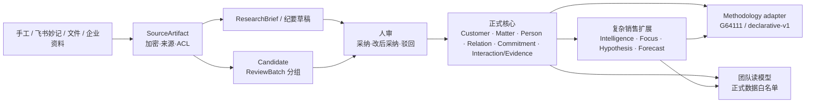

# 江湖轻量个人 CRM 商业化实施计划

> **2026-09-04 历史计划提示：** 产品后续路线由已批准的 [ADR-004](../../ADR-004-个人商机推进工作台与研发范围收敛.md) 和 [个人商机推进工作台计划](2026-09-04-personal-opportunity-workbench.md) 接替。本文的旧 G5–G7 不再自动调度；安全、迁移、备份恢复与算法职责已明确承接。下文 Active、任务状态、授权和估算均保留为原日期的历史，不代表当前执行状态；日常状态只查 [商业清单](../../商业版开发待办清单v1.md)。

> **状态：** Approved / Active
> **日期：** 2026-08-19
> **最近修订：** 2026-08-23（CORE-115 阶段门通过，SAAS-102 恢复）
> **Epic：** [EPIC-CRM-001 · GitHub #32](https://github.com/ZiZ-LG/jianghu/issues/32)
> **设计权威：** `docs/designs/jianghu-lightweight-personal-crm-methodology-packs.md`
> **架构门：** `docs/ADR-002-商业版单一演进与通用CRM能力分层.md`；`docs/ADR-003-G3前置Customer分类权威与创建命令.md`
> **状态清单：** `docs/商业版开发待办清单v1.md`
> **执行状态：** 以商业清单为准；CRM 当前唯一 `IN_PROGRESS` 为 `SAAS-102`。在项目所有者批准的双 worktree 例外下，“自我修养”可独立执行 `SAAS-601`；两线不修改同一契约、schema 或共享运行文件。

## 1. 目标结果

把现有“内部复杂销售作战地图”演进为全行业可用的轻量个人 CRM，同时保留三条可选升级路径：

1. **个人核心：** Customer / Matter / Person / Relation / Commitment / Interaction-Evidence；
2. **复杂销售：** 拜访简报、资料速审、情报、关键人焦点、假设验证、可解释关系信号、受控 Agent 与商机组合；
3. **企业能力：** scoped 团队经营、预测、带教和声明式 MethodologyPack。

第一可交付版本不是“换术语后的旧江湖”，而是能真实复现曹经理漏约会场景的行动闭环：两分钟记下客户和约会，临近时提醒确认，改期后旧提醒失效，完成后创建下一步。

## 2. 范围与发布切片

本计划覆盖整个已批准设计，但不把全部能力塞进一次上线。

| 发布切片 | 包含 Gate | 可观察结果 | 顺序工程量估算 |
|---|---|---|---:|
| R1 个人轻量核心 | G0–G3 | 无 WorkBuddy、无 G64111 完成快速记录、确认和关系上下文 | 约 62 工程日 |
| R2 个人复杂销售 | G4 | 完成简报、妙记速审、情报/假设、受控 Agent、关系干预和 4–5 商机组合 | 约 52 工程日 |
| R3 Team | G5 | 曹经理管理两名下属、预测缺口和带教闭环 | 约 23 工程日 |
| R4 Enterprise | G6 | 第二套非 G64111 方法论可发布、评估、迁移和回滚 | 约 27 工程日 |
| R5 GA 收缩 | G7 | legacy 消费者清零、恢复演练和套餐连续性 | 约 14 工程日 |

以上是单人串行工程量，不是日历承诺，也不包含外部设计伙伴等待、合规采购和真实租户观察窗口。任何并行都必须先证明不共享 schema、契约或关键文件。

### 2.1 2026-08-21 路线图范围调整

本次调整由本地竞品报告、得到大脑 CRM 笔记和官方产品／仓库交叉调研触发，属于 ADR-002 内的范围细化，不改变 R1 或当前 `CORE-103` 顺序。

| 时段 | 调整 | 取舍与影响 |
|---|---|---|
| Now｜G2–G3 | Quick Capture 可把自然语言解析成显式确认草稿；Today 统一输出 reason/source/time/action 解释契约 | 不增加新任务，不改变“待确认／待跟进／已完成”首层结构 |
| Next｜G4 | 新增 `CORE-206` 受控 Agent Job/Run 基座和 `SAAS-212` 关系信号／干预读模型 | R2 增加约 6 个串行工程日；G5/G6 相应顺延，不并行抢跑 |
| Next｜G5 | Forecast 增加结构化硬校验、关系／证据软警告和 override 理由；带教引用可下钻干预依据 | 吸收到现有 SAAS-302～305，不增加独立任务 |
| Later｜G6 | 新方法论版本可对历史已审核 Interaction/Evidence 重新评估并生成新快照 | 吸收到 CORE-405/SAAS-402，不覆盖历史事实或 active binding |
| Not scheduled | 全量邮箱／日历／微信被动采集、Clay 式名单与外联、完整售后 CRM、企业自定义 Agent Builder、自动外发 | 以明确后置范围抵消新增工作；出现真实付费与权限证据后另做 ADR／路线图决策 |

新增范围的产品标准不是“更多 AI”，而是四项可验证结果：每个干预都能解释并追源；每个 Agent 都有 Job Card 和运行审计；每次正式数据变化仍经用户命令或 Candidate 人审；每次权限撤销和 Job 停用都在下一次运行立即生效。

### 2.2 2026-08-23 G3 前置纠偏

`SAAS-102` preflight 证明共享 `CREATE_CUSTOMER` 契约尚无可执行的物理权威和审计命令。
项目所有者已批准 ADR-003：插入 3d 的 `CORE-115`，只提前 `customer.category`
必要子集，完成 `categoryKey/version`、可空销售兼容 `customerType`、双库迁移/恢复与
唯一幂等审计创建命令。`SAAS-102` 在该任务精确 SHA 的远端 CI 全绿后恢复；R1 顺序
工程量由约 59d 调整为约 62d，不改变 G3 目标或 G4 边界。

## 3. 已验证的当前基线

以下结论来自 2026-08-19 工作区代码盘点，不是历史假设：

截至 2026-08-21，`CORE-101/102` 已按清单完成；下表保留为改造起点证据，文件行号不作为当前实现状态。当前任务状态、验证证据和回滚点只以 `docs/商业版开发待办清单v1.md` 为准。

| 当前事实 | 代码锚点 | 实施含义 |
|---|---|---|
| Account/Opportunity 命令硬编码 1..4 客户类型、固定销售阶段和 engageStage | `packages/domain-contracts/src/actions.ts:49`、`packages/domain-contracts/src/actions.ts:74`、`packages/domain-contracts/src/actions.ts:396` | 必须新增通用 V2 契约，不能直接放宽旧销售命令 |
| Account/Opportunity 是现有主表且 ID 已被全链路引用 | `server/prisma/schema.prisma:86`、`server/prisma/schema.prisma:146` | Customer/Matter 先做 DTO 与字段扩展，不新建双主表 |
| PlanAction 强制 opportunityId，时间为本地日期字符串，只有 done | `server/prisma/schema.prisma:435`、`packages/domain-contracts/src/actions.ts:282` | Commitment 需一次性补 UTC/IANA、全天日期、执行/确认双状态和改期审计 |
| 当前 Today 是前端三源聚合，仍混有 G64111 缺口 | `app/src/lib/today.ts:1`、`app/src/lib/today.ts:26` | 新 Today 应由通用 Commitment 读模型驱动，G64111 缺口只能由能力包追加 |
| App.tsx 仍是 833 行双分支，重复全局弹窗 | `app/src/App.tsx:588`、`app/src/App.tsx:668`、`app/src/App.tsx:833` | 下一次前端能力建设前先做零行为拆分 |
| 候选分布在多表，Inbox 在请求时聚合五类数据 | `server/prisma/schema.prisma:248`、`server/prisma/schema.prisma:273`、`server/prisma/schema.prisma:599`、`server/prisma/schema.prisma:735`、`server/src/suggest.ts:456` | 会后速审前必须先统一 Candidate，不得新增第六套候选主表 |
| Transcript 已加密、幂等、支持飞书和文件上传 | `server/prisma/schema.prisma:651`、`server/src/recording.ts:75`、`server/src/recording.ts:261` | 复用来源与凭据层，补 ACL、ReviewBatch 和正式 Interaction 边界 |
| 录音抽取目前复用 voice 双轨，仍会按信任元数据写部分正式实体/纪要 | `server/src/recording.ts:126`、`server/src/voice.ts:275`、`server/src/voice.ts:292` | 新会后链路必须 machine-proposed 全候选，审核前正式业务零变化 |
| CuratedSummary 是实体级共享缓存，ResearchBrief 尚未成为独立带来源快照 | `server/prisma/schema.prisma:711`、`server/src/curated.ts:24` | 人编摘要保留，旧 AI 摘要降为兼容缓存，简报需来源/主体/时效 |
| owner/admin/member 当前租户全读，viewer 仅名下客户 | `server/src/scope.ts:1`、`server/src/state.ts:105` | 新 Team 必须引入 policy + 统一 resolver，不能给 member 追加经理例外 |
| PDE assembler 直接读取 engageStage 和 G64111 状态 | `server/src/pde/assemble.ts:16`、`server/src/pde/assemble.ts:88`、`server/src/pde/assemble.ts:122` | 必须先建立 PdeDecisionContext 并影子 parity，再切断依赖 |
| G64111 已有共享包、前端 adapter 和 server parity 测试 | `packages/g64111/`、`app/src/lib/g64111.ts`、`server/tests/g64111-parity.test.ts` | 只允许 adapter 调用，不能把公式复制进 MethodologyPack |
| 内部发布 INT-502 已由项目所有者停止并以 NO-GO/STOPPED 归档 | `docs/内部版开发待办清单v1.md:22`、`docs/内部版-发布验收记录.md:3` | 既有证据保留；未完成项不推定通过；内部版只做维护冻结 |

## 4. 不可破坏的实施纪律

### 4.1 数据与权限

- 每个查询和 mutation 首先限定 `tenantId`；跨租户永远失败关闭。
- 新商业接口统一通过 effective-scope resolver，禁止“非 viewer 直接放行”。
- 敏感资源权限是资源范围之上的第二次相交，不从经理身份推导正文访问。
- 机器产物不自动成为正式 Person、Relation、Evidence、StakeholderFocus、Interaction 或 Commitment。
- Agent Job 的动作模式只允许 `read_only | draft | candidate`；不得自动外发、改阶段／Forecast 或直写正式业务对象。
- 团队聚合只查询正式数据白名单，不先加载敏感正文再丢弃。

### 4.2 契约与迁移

- `packages/domain-contracts` 是新命令和 DTO 的共享权威；app/server 同步消费。
- 保留旧 Action 供内部兼容，新通用命令使用新名称与中性值域。
- 一个逻辑字段同时只有一个 authority source；禁止长期双写和“新值空就读旧值”。
- SQLite 开发可用 `db:push`，生产只接受版本化 migration + `migrate deploy`。
- 每次 schema 变更同时产出 SQLite 验证、PostgreSQL migration、`schema:postgres:check`、备份恢复和回滚说明。

### 4.3 算法与能力包

- 通用 UI、契约和基础服务不得直接 import `packages/g64111`。
- G64111 adapter 改动后必须跑共享包、app adapter 和 server parity。
- PDE 的 `IndustryPack` 不改义；`PdeDecisionContext` 只改变输入权威来源，不手改 oracle/golden。
- capability 隐藏只是展示层，服务端仍执行 entitlement 与权限。

### 4.4 交付

- 一次只做一个 CORE/SAAS 任务，小步 commit；commit message 包含任务 ID。
- 不在 dirty worktree 中覆盖用户文件；只暂存当前任务的 hunk。
- 不推送、不合并 main、不部署，除非项目所有者另行明确授权。
- 每个 Gate 先验证再更新清单；代码存在不等于任务完成。

## 5. 目标架构与真相流



唯一允许进入正式层的入口是用户直接提交的正式命令或 ReviewBatch 采纳事务。AI、连接器、巡检和方法论只能产出原始资料、草稿、候选或建议。

Agent 运行是 Formal／Sales 之上的受控编排层，不成为第二真相源。`AgentJobDefinition` 固定任务、触发器、scope manifest、actionMode、证据要求、预算／超时和版本；`AgentRun` 记录逐次权限版本、输入／输出引用、模型／连接器版本、成本与失败原因。`RelationshipSignal` 和 `InterventionItem` 是可过期、可解释的派生读模型，不是 Relation、Evidence、Forecast 或方法论值。

## 6. Authority map 初始表

`CORE-102` 已把下表扩为可机读／可测试 authority map。自 `CORE-103` 起，每个迁移任务必须维护对应消费者、影子比较、切换与停止条件，不能只更新本文表格。

| 逻辑字段 | 过渡期来源 | 目标来源 | 禁止事项 |
|---|---|---|---|
| Customer category | `Account.customerType` legacy | `Customer.categoryKey`；销售分类由 adapter 映射 | 通用命令要求 1..4 |
| Matter lifecycle | `Opportunity.status` | `lifecycleStatus + outcomeKey` | 将 won/lost 设为通用状态 |
| Matter current stage | `Opportunity.pipelineStage` | `MethodologyStageState` | 与 OppStage fallback 双读 |
| G64111 engage stage | `Opportunity.engageStage` | G64111 binding/value | PDE 继续读同一字段 |
| PDE decision stage | `Opportunity.engageStage` 影子来源 | `PdeDecisionContext.stageKey` | 从 MethodologyValue 隐式推导 |
| G64111 primary D | `Opportunity.primaryDPersonId` | G64111 RoleAssignment/value | 通用 Focus 读写 primaryD |
| 通用关键人焦点 | 无 | `StakeholderFocus` | 解绑 G64111 时删除 |
| 销售预测 | expectedAmount/winProbability/date legacy | `ForecastEntry` | 用预计金额冒充已签 |
| 销售结果 | Opportunity won + 预计金额 | `SalesOutcomeRecord` | 未确认输入计入实绩 |
| 通用参与人 | OppRole/OpportunityMember 推导 | `MatterParticipant` | 让 ADURC 或 visibility 表兼任参与表 |
| Commitment | `PlanAction` | 同一物理行的通用字段与命令 | 建第二张长期主表 |

## 7. 分阶段执行卡

### G0｜治理批准

#### CORE-000｜治理基线激活

- **改动文件：** ADR-002、本计划、商业清单、ADR-001、内部清单和发布验收记录。
- **执行：**
  1. 项目所有者已明确批准 ADR-002；
  2. `INT-502` 已记录为停止发布、证据归档、维护冻结；
  3. ADR-001 `Superseded by` 已指向 ADR-002；
  4. 商业清单已转 Active，只把 CORE-101 改为 READY。
- **验收：** `git diff --check`；无业务源码/schema 变化；状态文件无两个 IN_PROGRESS。
- **回滚：** ADR 未批准时删除或继续保留 Proposed 草案；运行系统不受影响。

### G1｜前端可维护性与通用契约

#### CORE-101｜App shell 零行为拆分

- **主要文件：** `app/src/App.tsx`、新 `app/src/components/GlobalDialogs.tsx`、新 UI state hooks/reducers、`app/src/App*.test.tsx`。
- **实现：** 提取两大 return 分支重复弹窗；收敛 Inbox props；按弹窗/选择/同步/会话分状态域；补齐 WeComSettings 两分支可达性，但不改产品语义。
- **验收：** 现有 app tests/typecheck/build 全绿；Hub、作战室、viewer、收件箱、录音、设置和同步错误人工回归无差异。
- **回滚：** 纯前端独立 commit，可整体 revert；不得夹带新 CRM 功能。

#### CORE-102｜通用 DTO、命令、capability 与 authority map

- **主要文件：** `packages/domain-contracts/src/actions.ts`、新 `packages/domain-contracts/src/crm.ts`、`packages/domain-contracts/src/index.ts`、`app/src/types.ts`、`server/src/types.ts`、新 `docs/架构-CRM字段权威映射v1.md`。
- **实现：** 定义 Customer/Matter/Commitment V2 中性契约；保留旧 Action；未知 Matter kind 可读；集中 capability/entitlement keys；为每个 legacy 字段登记唯一 source。
- **验收：** domain contract typecheck/tests；G64111-off 编译测试证明通用契约无 1..4、ADURC、L1–L4、固定阶段和 engageStage 必填。
- **回滚：** 新契约仅 expand；不切读写前可安全 revert。

### G2｜通用模型、权限与算法边界

#### CORE-103｜Matter 字段扩展

- **主要文件：** `server/prisma/schema.prisma`、PostgreSQL migration、rendered schema tests、`server/src/state.ts`。
- **实现：** 在 Opportunity 行增加 `kind`、`lifecycleStatus`、`outcomeKey`、priority、targetDate、`primaryOwnerUserId`、`activeMethodologyBindingId` 预留与必要 version/index；回填 sales_opportunity 和状态映射。
- **验收：** dry-run 数量与映射报告；active/paused/won/lost 无损映射；未知 kind 不使读模型失败；SQLite/Postgres schema parity。
- **回滚：** expand migration 保留旧列；切换前回旧 DTO，新增列不删除。

#### CORE-104｜稳定负责人和转移审计

- **主要文件：** schema/migration、新 owner migration script、`server/src/mutation/*`、`server/tests/visibility-acl.test.ts`。
- **实现：** 负责人只用稳定 User.id；Account owner 只产生建议，不自动决定 Matter owner；歧义/缺失进入未归属队列；转移使用 Matter version/CAS 并写 AuditEvent。
- **验收：** dry-run 可重复；重名、离职、跨租户和未归属失败关闭；转移后旧权限即时失效。
- **回滚：** 保留转移审计，authority 指针可切回 legacy policy；不按姓名逆推。

#### CORE-105｜MatterParticipant 与 Relation.kind

- **主要文件：** schema/migration、`server/src/mutate.ts`、`server/src/state.ts`、`server/src/mutation/actionScope.ts`、app store/types。
- **实现：** 新建参与关系并从 OppRole/OpportunityMember 推导；Edge 增加开放 kind；通用写只写 MatterParticipant，销售 adapter 可在同一事务写语义不同的 OppRole。
- **验收：** 一人多角色不制造多个参与人；viewer/legacy visibility 不被改变；未知 Relation kind 可展示；父实体/tenant 组合校验。
- **回滚：** 旧表继续存在；切回兼容投影，不删除新参与数据。

#### CORE-106｜Commitment 时间与状态模型

- **主要文件：** schema/migration、`packages/domain-contracts/src/crm.ts`、app/server types。
- **实现：** 在 PlanAction 物理行 expand `kind`、`executionStatus=planned|completed|canceled|missed`、`confirmationStatus=not_required|pending|confirmed|declined`、`scheduledAtUtc`、`dueAtUtc`、`timeZone`、`isAllDay`、`localDate`、`confirmationDueAtUtc`、确认记录、`scheduleVersion`、`nextCommitmentId` 和 source；`opportunityId` 兼容期保留。
- **验收：** UTC/IANA round-trip；全天事项不伪造午夜 UTC；旧 PlanAction 稳定映射；字段均跨 SQLite/Postgres。
- **回滚：** 旧字段仍可读；新增状态只在通用命令切换后使用。

#### CORE-107｜Commitment 命令与唯一写入路径

- **主要文件：** domain contracts、`server/src/mutate.ts` 或新 `server/src/commitments/*`、`server/src/mutation/commandRunner.ts`、`server/src/state.ts`、app store/wireAction。
- **实现：** create/reschedule/confirm/decline/complete/cancel/mark-missed/create-next；客户必填、matter/person 可空；改期保持 ID、递增 version、旧确认 stale；命令全部幂等并审计。
- **验收：** 同 key 重试不重复；CAS 冲突返回 409；过期不自动 missed；完成可关联下一步；undo/repair 有明确边界。
- **回滚：** capability 关闭新命令；旧 PlanAction 命令继续服务内部 adapter。

#### CORE-108｜Commitment 消费者迁移

- **主要文件：** `server/src/patrol.ts`、`server/src/jobs.ts`、`server/src/wecom.ts`、WorkBuddy/MCP adapter、`app/src/lib/today.ts`、StrategyCard/反馈路径。
- **实现：** 逐一迁移 state、删除反向引用、巡检、StrategyCard 派发、行动反馈、企微/WorkBuddy 同步；提醒键包含 scheduleVersion；巡检只生成提醒。
- **验收：** 消费者清单逐项勾销；确认/完成/取消/拒绝/改期后旧提醒结束；Matter 有有效下一步后缺口提醒结束；无静默业务写入。
- **回滚：** 单消费者独立 commit；未完成全部消费者前不允许 `opportunityId` 可空。

#### CORE-109｜统一 effective-scope resolver

- **主要文件：** 新 `server/src/resourceScope.ts`、`server/src/scope.ts`、`server/src/state.ts`、各 list/ID/search/AI/export 路由、权限测试。
- **实现：** 引入 `TenantDataScopePolicy=legacy_tenant_shared|scoped`；resolver 返回可见 Customer/Matter ID；legacy 保持现状，新商业用户走 scoped；viewer 上限不被 team/grant 扩大。
- **验收：** list、ID、search、AI、export、aggregate 同集；普通 member scoped 无租户全读；跨租户、撤销和未归属失败关闭。
- **回滚：** 存量租户 policy 不自动切换；商业 canary 可关闭 team capability，但不能回退 tenant 过滤。

#### CORE-110｜方法论身份、版本、绑定和试点基座

- **主要文件：** schema/migration、新 `server/src/methodology/*`、domain contracts。
- **实现：** 新增 tenant-scoped MethodologyPack、不可变 Version、Binding、PilotAssignment 与 Matter active binding CAS；平台内置模板物化为租户快照，PDE 仅通过 decisionProfileRef 关联。
- **验收：** V1 只有一个 primary binding；pilot 不改变 active 指针；跨租户引用失败；解绑不删除核心业务数据。
- **回滚：** expand-only；未切换 active binding 前可关闭 methodology capability，保留新增行。

#### CORE-111｜方法论定义、实例值和评估数据基座

- **主要文件：** schema/migration、domain contracts、base repositories/tests。
- **实现：** 新增 Field/Stage/Role/Rule/Action 定义、StageState、RoleAssignment、Value、Evaluation、MigrationRun；每个逻辑字段声明唯一 storageBinding，复杂快照用 JSON 字符串保持跨库可移植。
- **验收：** tenant + parent 校验；已发布 Version 行不可更新；同 Matter version/CAS 保证 active binding 唯一；schema 不依赖原生 enum/json。
- **回滚：** 只加模型，企业 authoring 尚未开放；旧 G64111/PDE 继续由 adapter 运行。

#### CORE-112｜G64111 adapter 与无包依赖门

- **主要文件：** `app/src/lib/g64111.ts`、`server/src/g64111.ts`、新 adapter/binding 模块、依赖扫描测试、fixtures。
- **实现：** 物化内置 G64111 pack/version；只有 adapter 可 import 共享包；用 engineRef 和 storageBinding 读取登记的 legacy_path；通用服务/组合/关系图禁止读取 primaryD、ADURC、pipeline/engageStage。
- **验收：** `rg`/测试证明 import 边界；G64111-off CRUD 和导航完整；共享包 32 项、app fixture、server parity 保持通过。
- **回滚：** binding/adapter 可切回登记的 legacy 读取；禁止复制公式作为回滚。

#### CORE-113｜PDE 决策阶段解耦

- **主要文件：** schema/migration、`server/src/pde/assemble.ts`、`server/src/pde/routes.ts`、PDE tests。
- **实现：** 新增 `PdeDecisionContext.stageKey` 和 `decisionProfileRef`；从 engageStage 生成影子值与 parity；切换后 assembler 只读新上下文。
- **验收：** 现有 EVSnapshot 可重放；G64111 disabled 时 PDE 不读方法论字段；golden 1e-6 和属性测试不变。
- **回滚：** authority 切回已登记 legacy source；不改历史 EVSnapshot。

#### CORE-114｜G2 阶段门

- **执行：** 跑全包类型/测试、SQLite/Postgres migration、备份恢复、方法论基础模型、G64111/PDE parity、scope 安全矩阵；记录消费者清单剩余项。
- **通过条件：** 无 fallback 双读；无第二主表；新商业 tenant 可 scoped；内部 legacy tenant 行为无回归。

### G3｜商业轻量个人 CRM

#### SAAS-101｜商业 shell 与默认能力

- **主要文件：** 新 commercial shell/capability registry、路由装配、`app/src/App.tsx`、server entitlement policy。
- **实现：** 新注册默认 Free 轻量核心；首页只显示今日、客户、事项和快速记录；复杂销售、团队、G64111/PDE 按 capability 出现。
- **验收：** UI 隐藏和服务端拒绝一致；旧内部 adapter 不承接新入口；无失效链接或空面板。
- **回滚：** commercial capability flag 关闭；内部 shell 不变。

#### CORE-115｜Customer 分类权威与创建命令前置

- **主要文件：** 双 Prisma schema、PostgreSQL migration、SQLite upgrade/恢复测试、`packages/domain-contracts/src/crm.ts`、新 Customer command route/executor、authority map 与销售 adapter 消费者。
- **实现：** Account 同行增加可空开放 `categoryKey` 与 `version`，`customerType` 放宽为可空且只留给显式销售 adapter；通用分类唯一读取 `categoryKey`，不 fallback、不双写、不猜测回填。只开放幂等、tenant-scoped、viewer 禁写、同事务 AuditEvent 的 `CREATE_CUSTOMER`，其他 Customer 命令继续失败关闭。
- **验收：** SQLite/PostgreSQL fresh install、升级、备份恢复、中断重跑和 parity；未分类 Customer 的两个分类字段均保持真实空值；幂等/并发/重复 ID/跨租户 owner/失效 actor/capability/审计回滚矩阵；旧 1–4 销售数据与 internal shell smoke；通用消费者无 `customerType` fallback。
- **回滚：** 部署前整体 revert；部署后 `CUSTOMER_COMMANDS_ENABLED=0` 关闭入口并前向修复，保留 expand 字段、审计与业务行。

#### SAAS-102｜两分钟快速记录

- **主要文件：** 新 QuickCapture 组件、Commitment API、Customer lookup/create、交互测试。
- **实现：** 首屏只强制客户、下一步文本、时间；matter/person/确认细节渐进补充；新客户可就地创建。可选自然语言解析只能生成一张显示目标对象、字段和动作的确认草稿，用户提交后才调用正式命令。
- **验收：** 曹经理文案“周四 15:00 与客户交流方案”在两分钟内保存；无 Matter 也成功；解析失败不丢输入；草稿未确认时 Customer/Commitment 零变化。
- **回滚：** 入口 flag 关闭，数据仍是正式 Commitment，不回滚业务记录。

#### SAAS-103｜Today 读模型

- **主要文件：** 服务端 today repository/route、`app/src/lib/today.ts`、CustomerHub/新 Today 页面。
- **实现：** 首层固定“待确认 / 待跟进 / 已完成”；排序由 confirmationDue、due、overdue 与无下一步驱动；统一 `InterventionItem` 输出 reasonCode、用户解释、sourceRefs、observedAt、ruleVersion、建议动作和目标。G64111/关系缺口只作为后续可选 provider，不进入通用排序必需项。
- **验收：** 同一 resolver 范围；时区边界、全天日期、改期 version、空 matter 测试；每项可解释并下钻到有权来源；新增 provider 不改变首层三类。

#### SAAS-104｜确认和改期闭环

- **实现：** 确认、拒绝、改期、完成、取消、人工 missed；past_due 只是派生提醒；改期重置确认；旧确认在 revision 中 stale。
- **验收：** 曹经理失败 fixture 在确认截止前浮出；客户忘约但系统不自动把业务态改 missed；所有动作有 AuditEvent。

#### SAAS-105｜通用客户/事项/关系上下文

- **实现：** 现有 Hub/Canvas 通过通用 DTO 渲染；general Matter 不要求销售阶段；Relation.kind 开放；关系图是上下文入口，不阻塞快速记录。
- **验收：** general 和 sales_opportunity 同时可读；未知 kind/Relation kind 降级展示；G64111 关闭无专有文案。

#### SAAS-106｜R1/G3 验收

- **自动门：** domain/app/server/G64111/PDE 全量；商业 capability on/off；租户/scope；SQLite/Postgres 恢复。
- **人工门：** 无 WorkBuddy/无方法论首日旅程；曹经理确认案例；移动/桌面；内部 legacy smoke。
- **发布边界：** 只允许商业隔离 canary；不得将内部数据库作为商业测试数据。

### G4｜复杂销售个人闭环

#### CORE-201｜统一 Candidate schema 与迁移

- **主要文件：** schema、版本化 migration、新 `server/src/candidates/*`、迁移报告脚本。
- **实现：** Candidate 统一 kind/status/source/old-new/payload/evidence/confidence/account/matter/sourceArtifact/reviewBatch/createdBy/visibility/dedupe；先 expand 并生成五类存量 dry-run。
- **验收：** 数量、状态、父实体和 dedupe parity；无法映射创建者进入 owner/admin 隔离队列；可回滚兼容读取。

#### CORE-202｜人物与关系候选切换

- **实现：** PersonSuggestion/RelSuggestion 所有写入方改用唯一 helper；旧 API 由投影兼容；采纳事务继续 tenant/父实体/CAS。
- **验收：** voice、enrich、suggest、MCP producer 覆盖；同 key 不重复；新旧回执 parity。

#### CORE-203｜字段、提醒和证据候选切换

- **实现：** ChangeProposal、Reminder、pending Evidence 写入统一 Candidate；Inbox 改单表；正式 Evidence 仅采纳时创建或改状态；巡检仍只读。
- **验收：** 五类收件箱数量和排序 parity；批量部分冲突不静默提交；旧表只读冻结并保留回滚期。

#### CORE-204｜敏感 creator/share ACL

- **主要文件：** schema、`server/src/resourceScope.ts`、recording/note/candidate routes、安全测试。
- **实现：** SourceArtifact/Transcript/private Note/Candidate 默认 private；显式 matter_shared、reviewer grant、撤销和 aclVersion；所有读取/解密/抽取/重挂载/降解/删除/导出复用 helper。
- **验收：** 经理、普通 member、viewer、创建者、shared reader/reviewer、撤销后访问矩阵；团队聚合查询不触碰敏感表。

#### SAAS-201｜SourceArtifact 通用来源层

- **实现：** 对 Transcript、上传文件、外部资料和必要 Note 建统一来源投影；保留原物理存储和加密；支持未归类、挂载和重挂载。
- **验收：** 外部 ref 幂等；来源指纹/保留状态完整；删除/降解说明准确；不建立第二转写主表。

#### CORE-205｜ReviewBatch 与 Interaction 采纳事务

- **实现：** Candidate 以 sourceArtifactId/reviewBatchId 分组；预审不建 Interaction；采纳时确认活动类型/时间/归属，按 `reviewBatchId + acceptanceVersion` 幂等原子写正式数据和审计。
- **验收：** 全驳回不建 Interaction；冲突返回逐项结果且未静默部分落库；重试不重复人物/边/Commitment/Interaction。

#### CORE-206｜受控 Agent Job 与运行审计

- **主要文件：** `packages/domain-contracts` Agent 契约、server Agent policy/runner/repository、版本化 migration、预算与权限负向测试。
- **实现：** 建立 `AgentJobDefinition`、`AgentRun` 和固定内置 Job registry；每个 Job 声明 trigger、scope manifest、`read_only | draft | candidate`、evidence policy、模型／连接器引用、预算、超时、重试和停用。每次运行重新执行 tenant、capability、effective-scope 与 sensitive ACL；candidate 只调用统一 Candidate helper。
- **验收：** Job 停用和权限撤销在下一次运行立即生效；预算／超时／重试失败关闭；read_only/draft 无正式写路径；candidate 不绕过 ReviewBatch；自动外发、阶段／Forecast 更新和正式对象直写均被拒绝并审计。
- **回滚：** 关闭 Agent capability 和触发器；保留 AgentRun 最小审计，不回滚已由用户采纳产生的正式业务记录。

#### SAAS-202～SAAS-212｜复杂销售工作流

| ID | 实现重点 | 关键验收 |
|---|---|---|
| SAAS-202 | `post_meeting_extract` candidate Job 生成分组候选；一张速审单展示来源原句、改前→改后、身份/关系默认不选、编辑与批量采纳 | Job Card/Run 可查看；审核前正式数据零变化；失败项可重试 |
| SAAS-203 | 飞书妙记链接/OAuth、文件上传接 SourceArtifact → ReviewBatch | 加密、幂等、ACL、抽取、降解/删除全链；不自建 ASR |
| SAAS-204 | ResearchBriefSnapshot 按主体、来源段、抓取时间、失败/未知项保存 | 多主体未选择不生成确定结论；部分失败保留缺口 |
| SAAS-205 | `pre_meeting_brief` read_only Job 与拜访前简报 UI；人编 CuratedSummary 保留，旧 AI 摘要降兼容缓存 | 默认只有一个简报权威入口；段落有来源／时间／未知项，Job 无正式写入 |
| SAAS-206 | IntelligenceItem 区分 observed/reported/inferred；StakeholderFocus 独立 | Focus 不读写 primaryD；传闻不伪装 Evidence |
| SAAS-207 | Hypothesis + Revision + supporting/contradicting EvidenceLink | 历史判断不覆盖；状态只建议、由用户确认 |
| SAAS-208 | 图上区分正式/候选/推演，假设生成验证 Commitment 与复盘 | 不强化单向确认偏误；显示反证条件 |
| SAAS-212 | `relationship_radar` read_only/draft Job；按互动新鲜度、单线联系、角色覆盖、可见暖路径、证据与下一步生成 RelationshipSignal/InterventionItem | 不生成黑盒总分；每项有 reason/source/time/ruleVersion/action；来源不可下钻时不升高严重级别 |
| SAAS-209 | 4–5 Matter 组合消费统一 InterventionItem，按待确认、无下一步、Focus/关系覆盖缺口、单线风险、情报陈旧和高影响假设排序 | 每项解释“为什么现在”、可下钻有权来源并生成行动草稿 |
| SAAS-210 | 可选安装 G64111；无方法论销售工作流照常运行 | 两套 fixture 同过；无包不读专有字段 |
| SAAS-211 | 曹经理完整个人旅程和 G4 安全门 | 真实妙记/文件一次；三类 Job 跑通；审核前零写正式；自动外发／正式越权写为 0；ACL 矩阵全绿 |

三个首发 Job 的动作边界固定如下，不在 G4 开放自定义：

| Job | 触发 | actionMode | 唯一允许输出 |
|---|---|---|---|
| `pre_meeting_brief` | 用户请求／获授权资料更新 | read_only | 带来源、时间、未知项的可再生 ResearchBriefSnapshot |
| `post_meeting_extract` | SourceArtifact 就绪后用户触发或事件排队 | candidate | 统一 Candidate helper 下的 ReviewBatch 候选 |
| `relationship_radar` | 用户请求／每日受控计划 | read_only/draft | 可解释 RelationshipSignal、InterventionItem 与未提交行动草稿 |

### G5｜团队经营与带教

#### SAAS-301｜团队、成员与显式 Grant

- **主要文件：** schema、team/access services、resolver、管理 UI。
- **实现：** SalesTeam/Membership、permission/capability、ResourceAccessGrant；曹经理是可写 member-manager，不是 viewer 或租户全读 admin。
- **验收：** 本人 + 两名有效下属 + 显式 Grant；viewer 误配不扩权；同客户跨团队不横向泄露。

#### SAAS-302～SAAS-307 与 CORE-301

| ID | 实现重点 | 关键验收 |
|---|---|---|
| SAAS-302 | RevenueTarget、ForecastEntry、SalesOutcomeRecord；版本和父实体校验；ForecastEvidenceCheck 区分结构硬错误与关系／证据软警告 | 金额／币种／日期错误失败关闭；无下一步、单线联系、关键角色缺口和证据陈旧只告警；用户继续时保存理由，不自动改 Forecast |
| SAAS-303 | 固定单币种公式和 ForecastSnapshot 完整输入副本，保存校验规则版本、警告和 override 理由 | 混币/缺金额失败关闭；旧快照可重放；当时的警告依据可解释 |
| SAAS-304 | 团队组合与成员下钻，消费正式可共享的 InterventionItem | 目标、已签、commit、best_case、缺口和关系／证据风险可解释并可追源；不读取敏感正文 |
| SAAS-305 | CoachingReview/ActionProposal 引用具体差距／信号／来源 → 接受/编辑/拒绝 → Commitment | AI 不自动发送；下属确认默认生效；来源撤销后不泄露正文 |
| SAAS-306 | entitlement、`commitment.assign`、离队/转移/撤销/降级审计 | 当前访问即时收回，历史快照仍可审计 |
| CORE-301 | resolver 覆盖 list/ID/search/AI/export/aggregate；正式数据白名单 | 全入口相同结果；敏感 repository 未被聚合调用 |
| SAAS-307 | 曹经理 + 两名下属 fixture | 区域缺口和一次指导闭环；viewer/跨租户负向测试 |

预测公式 V1 固定为：

```text
signed = 周期内同币种 SalesOutcomeRecord.signedAmount
commit = active Matter 且 ForecastEntry.category=commit 且 expectedCloseDate 在周期内
best_case = commit + category=best_case
gap = max(target - signed - commit, 0)
```

`pipeline` 与 `omitted` 不进入 commit；`winProbability` 不参与固定公式。weighted 只能以另一个有版本公式单列。

### G6｜企业方法论

#### CORE-401～CORE-406

| ID | 实现重点 | 关键验收 |
|---|---|---|
| CORE-401 | 在既有数据基座上实现草稿、校验、试点、canonical hash 和不可变发布服务 | 发布后内容不可改；内置模板仍是租户快照 |
| CORE-402 | declarative-v1 规格：AST、类型、missing/null、精度、canonical serialization、错误码与 fixtures | 规格可独立评审；复杂度上限固定 |
| CORE-403 | declarative-v1 compiler/evaluator：有限操作符、无网络/文件/时间/随机/循环 | 同输入/版本/引擎同结果；超限失败关闭 |
| CORE-404 | engine registry 统一路由 G64111/declarative-v1 | G64111 不复制公式；现有 fixture/parity 全过 |
| CORE-405 | Evaluation 保存完整 inputs/result/evidence/ACL/pack/engine/hash；允许新版本对既有已审核 Interaction/Evidence 生成新的并排快照 | 不依赖哈希猜输入；不覆盖历史事实、旧 Evaluation 或 active binding；权限撤销不泄露正文 |
| CORE-406 | 迁移 compare/dry-run/COW/idempotent/CAS switch/rollback | 不可映射项人工处理；旧 binding 和快照完整 |

#### SAAS-401～SAAS-403

- **SAAS-401：** 表格式方法论中心，先支持字段、阶段、角色、核对清单和行动模板。
- **SAAS-402：** 校验、试点、发布、弃用、绑定、评估、历史正式证据重评对比、迁移和回滚 UI；新快照默认不切 active binding，规则编辑仅在 declarative-v1 规格批准后开放。
- **SAAS-403：** 用一个真实非 G64111 方法论 fixture 完整跑通，不修改代码/schema。

### G7｜兼容层收缩与 GA

#### CORE-501｜消费者清零

- 逐项关闭 pipelineStage、engageStage、primaryD、expectedAmount 等 legacy 消费者；
- 影子 parity 为零差异且观察窗口通过后，authority 切到唯一新源；
- 禁止 fallback 双读；未切换的消费者保持显式阻塞。

#### CORE-502｜Contract migration

- 只有消费者清单为零才放宽旧非空约束或归档旧命令；
- 不强求物理表改名；若表名保留，通过 Prisma mapping/DTO 隔离；
- destructive migration 必须先备份、恢复演练和单独批准。

#### SAAS-501｜套餐连续性

- Free/Pro/Team/Enterprise 同租户、同 ID、同历史；
- 降级不删除数据，只限制新建/编辑/发布并允许导出；
- entitlement 服务端强制，不依赖前端 plan 字符串。

#### CORE-503 / SAAS-502｜生产总门

- SQLite/Postgres migration、备份恢复、rollback、依赖安全、租户/scope/ACL、算法、商业 shell、legacy internal smoke 全绿；
- 使用脱敏商业 canary 数据，不复制内部真实客户；
- 指标至少覆盖激活、确认及时率、下一步连续性、候选审核时间、审核前误写正式数据（目标 0）、预测可下钻和方法论重放。

## 8. 测试策略

### 8.1 每任务最小门

1. 新逻辑先写失败测试或 fixture；
2. focused tests；
3. 受影响包 typecheck；
4. 受影响包全量测试；
5. `git diff --check`；
6. 更新清单证据和回滚点。

### 8.2 共享收尾门

```bash
cd packages/domain-contracts && npm run typecheck && npm test
cd packages/g64111 && npm run typecheck && npm test
cd packages/pde-kernel && npx tsc --noEmit && npm run test
cd app && npx tsc --noEmit && npm run test && npm run build
cd server && npx tsc --noEmit && npm test && npm run schema:postgres:check
```

改过 `packages/*` 时，在 app/server 测试前重跑 `npm ci --install-links`。实际脚本以各 `package.json` 为准。

### 8.3 必须新增的负向矩阵

- tenant A 永远看不到/改不到 tenant B；
- legacy member 行为不被 scoped migration 静默改变；
- scoped member、member-manager、admin with data.read_all、viewer 误配 team；
- list/ID/search/AI/export/aggregate 同一 scope；
- SourceArtifact creator、shared reader、reviewer、manager、viewer、撤销；
- Candidate 批量冲突、重复 key、旧值改变、父实体归档；
- Agent Job 停用、权限／Grant 撤销、跨租户输入、scope 缓存过期、预算／超时／重试、read_only/draft 正式写入、candidate 绕过 helper、外发与 Forecast／阶段修改；
- RelationshipSignal 来源不可见／过期、规则版本变化、Matter 转移、single-threaded／coverage/warm-path 边界、无总分与高严重级来源下钻；
- Commitment 改期并发、旧提醒、全天日期、DST、past_due 不自动 missed；
- G64111 off 不读 primaryD/ADURC/pipeline/engageStage；
- PDE off/on 与 G64111 off/on 四组合；
- Forecast 混币、缺金额、缺日期、已转移 owner、归档 Matter；
- Forecast 结构硬错误、关系／证据软警告、override 理由、自动改写为零；
- Methodology published mutation、循环规则、超复杂度、跨租户引用、迁移冲突和回滚。

## 9. 数据迁移与恢复执行模板

每个 schema 任务都按以下顺序：

1. 只读统计现有行数、NULL、重复键、父实体孤儿和跨租户异常；
2. 写 SQLite schema 与 deterministic Postgres migration；
3. 生成 dry-run 报告，不直接把歧义记录猜成新值；
4. 备份测试数据库；
5. 执行 expand migration；
6. 回填并记录 checksum/数量；
7. 跑 shadow parity；
8. 恢复到隔离库并验证 readiness/关键旅程；
9. 只有 Gate 批准后切 authority；
10. contract 删除需另一个任务和明确回滚点。

生产不得使用 `prisma db push`。内部与商业数据库分别执行并分别验证；商业 migration 不能以连接内部数据库为前提。

## 10. 观测与产品验收

R1 关注：

- 首次 Customer + Commitment + 时间的完成率与耗时；
- confirmationDue 前确认率；
- 改期后旧提醒误触发数；
- 完成后创建 next Commitment 比例；
- 无 G64111 用户完成核心旅程比例。

R2 关注：

- ResearchBrief 打开/刷新与来源下钻率；
- SourceArtifact 导入到 ReviewBatch 完成的时间；
- 候选采纳/编辑/驳回分布；
- 审核前正式数据误写数，目标为 0；
- 有反证条件和验证 Commitment 的活跃 Hypothesis 比例；
- 关系信号展开／转 Commitment／忽略／过期分布，高严重级信号来源不可下钻数目标为 0；
- 三类 Agent Job 成功率、耗时／成本、草稿采用率、Candidate 采纳／编辑／驳回率、停用后误触发数，以及正式越权写入／未授权外发数目标为 0。

R3/R4 关注：

- ForecastSnapshot 可下钻覆盖率和未计入原因；
- ForecastEvidenceCheck 告警、override 理由和后续结果分布；
- 指导被接受并转成 Commitment 的比例；
- 已发布方法论版本、试点到发布转化和迁移冲突解决率；
- 同版本评估重放差异数目标为 0，新旧版本对同一历史正式证据的并排快照覆盖率。

## 11. 风险与停止条件

出现以下任一情况立即停止当前任务并提交偏差说明：

- 需要第二张 Matter/Commitment/Candidate 主表才能继续；
- 需要通用核心读取 G64111 专有字段；
- 新 Team 只能靠 member 租户全读实现；
- ReviewBatch 无法在单事务内保证不重复和不部分静默提交；
- 任一 Agent 需要绕过统一 Candidate／正式命令、自动外发、自动改阶段／Forecast 或扩大当前用户 scope 才能成立；
- 高严重级 RelationshipSignal 无法给出 reason/source/time/ruleVersion，或必须依赖一个不可解释总分；
- 原始转写或私密材料必须对经理默认开放；
- migration 无法给出 dry-run、恢复或回滚；
- declarative evaluator 需要任意代码或隐式当前时间；
- 跨库一致性只能依赖 PostgreSQL 原生 enum/json；
- 任一 Gate 预计范围或工期增长超过 30%。

## 12. 当前下一任务与启动边界

当前唯一执行任务与状态只以 `docs/商业版开发待办清单v1.md` 为准。2026-08-23 经项目所有者批准，`CORE-115` 先于 `SAAS-102` 执行，并满足：

1. 清单中只有 `CORE-115` 为 IN_PROGRESS，`SAAS-102` 保持 BLOCKED；
2. 记录 Owner、分支/worktree、开始时间、依赖和回滚点；
3. 只实施 ADR-003 所列 Customer 分类权威、双库 migration/恢复与 CREATE_CUSTOMER 命令，不夹带其他 CORE-501 字段、SAAS-103+ 或 G4；
4. 精确 SHA 的本地全量和远端 CI 全绿后，才能把 CORE-115 标为 DONE 并恢复 SAAS-102。

本次 2026-08-23 纠偏只授权 CORE-115 和其后恢复 SAAS-102；不授权并行、提前实现 G4、merge main 或部署。
