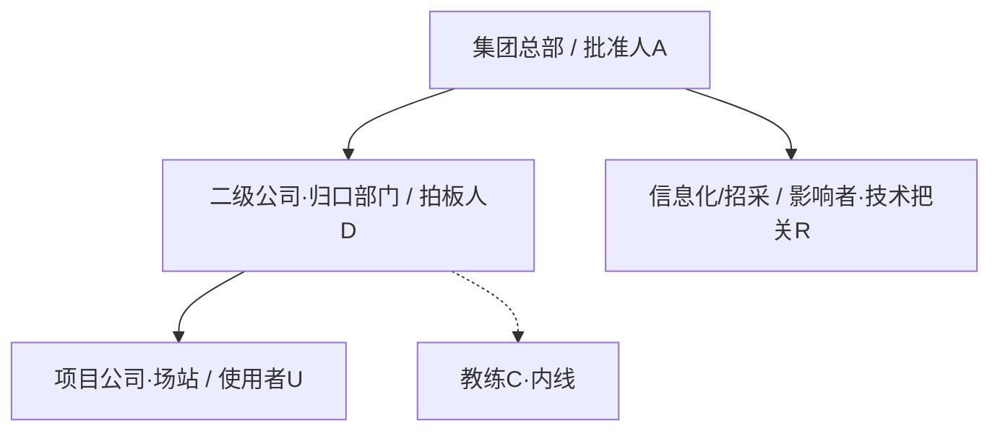

<!-- ════════════════════════════════════════════════════════════════════
  客户档案母版模板 · 数字能源 G64111 作战地图版 · v2.1（账户级 · 拆分版）
  Customer Profile Master Template (aligned with 销售罗盘·九问 / G64111 v1.1)
  ────────────────────────────────────────────────────────────────────
  【与商机档案的关系 · 重要】本模板是「账户级」客户档案，与「商机级」商机档案配套使用：
    · 客户档案（本文件）：一客户一份——客户画像 / ADURC 组织 / 人物 FORM / 资源 / 拜访归档 / 更新日志。
    · 商机档案（另一份，见「商机档案-母版模板」）：一商机一份——立项 C3 / 招采 C5 / G64111 打分 / 741 策略 / 行动计划。
    一个客户名下每个项目机会各对应一份独立「商机档案」；本档案「四、项目机会索引」只做全局索引，不含商机详情。

  【方法论锚点】G6-4-1-1-1 = 6 必清(C1-C6,35分) + 4 优势(P1-P4,45分) + 1 决胜(1K,20分) + 1 套竞争策略(741) + 1 个行动计划，满分 100。
    角色 ADURC：A 批准人(EB) / D 拍板人 / U 使用者(UB) / R 影响者·技术把关(TB) / C 教练(Coach)。
    倾向性图例：☆ 排他性公开支持(最高) | ＋ 明确支持 | ＝ 中性 | ？ 未知 | － 负面/抗拒 | ✕ 支持竞争对手。
    支持度温度：＋5 热情拥护 / ＋4 大力支持 / ＋3 支持 / ＋2 有兴趣 / ＋1 认可
                ｜ ？不计 / －1 不感兴趣 / －2 负面评价 / －4 抗拒 / －5 挺对手。

  【客户分类（四类·分别定制打法）】
    ① 央企发电集团（五大六小）  ② 地方能源国企  ③ 分布式头部民企  ④ EPC总承包商

  【占位符约定】[方括号]=待填字段，方括号内是"填什么"的提示，填好后删括号换真实内容。
  【字段级数据来源 / 置信度标记】✅ 已确认（客户/官方确认） 🔍 已调研（公开信息） 📝 推测（待验证） ⏳ 待补充

  【Skill 刷新规则 · 重要】
    1. 刷新前先读「档案元信息」「四、项目机会索引」「八、更新日志」，了解现状与版本。
    2. 情报优先级：客户当面确认 > 客户书面 > 公开调研 > 推测；高优先级可覆盖低优先级。
    3. 事实/角色字段 → 就地更新并刷新"来源/温度/更新日期"；痛点/拜访 → 追加保留历史。
    4. 情报按归属落区块：组织/人员→二、三；客户画像→一；资源→六。
       立项/招采/UCV/打分/竞争策略/行动计划 → 落到对应「商机档案」（不在本文件）。
    5. 每次刷新必须：① 更新顶部"最近更新/当前版本" ② 在「七、拜访记录归档」追加摘要
       ③ 在「八、更新日志」追加一行（版本 +0.1）④ 同步刷新「四、项目机会索引」的趋赢力与态势。
    6. 不要删除本说明块与各章节 HTML 注释（给 Skill 的指引，渲染时不可见）。
═══════════════════════════════════════════════════════════════════ -->

# [客户简称] · 客户档案（数字能源 G64111 作战地图）

<!-- 档案元信息（账户级）。最高趋赢力=本客户名下所有商机档案中最高的一套打分，便于快速判断主战场。 -->

> **档案编号**：[CUST-2026-001]　|　**客户全称**：[填写工商注册全称]
> **客户类型**：[① 央企发电集团（五大六小）/ ② 地方能源国企 / ③ 分布式头部民企 / ④ EPC总承包商]
> **负责销售**：[姓名]　|　**客户经理/团队**：[团队]
> **建档日期**：[YYYY-MM-DD]　|　**最近更新**：[YYYY-MM-DD]　|　**当前版本**：v[1.0]
> **在跟商机数**：[N]　|　**最高趋赢力**：[如 机会A 62% · 相对优势]　|　**整体阶段**：[需求调研/方案/招采…]

---

## 一、客户画像与分类

<!-- 填写指引：先给客户"对号入座"（四类），再补能源行业基本面。客户类型决定后续打法（见行动宝典）。
     基本信息用企查查+官网+年报核实；装机/项目/数字化现状靠调研补。来源列必标置信度。 -->

### 1.1 客户分类与决策链特征

| 维度 | 内容 |
|------|------|
| 客户类型 | [① 央企发电集团（五大六小）/ ② 地方能源国企 / ③ 分布式头部民企 / ④ EPC总承包商] |
| 市场地位 | [主导地位/重要力量/活跃力量/项目加速器] |
| 决策链特点 | [如：链条最长，总部定标准、二级做主体、项目去使用 / 老板一锤定音] |
| 典型组织层级 | [如：集团总部→区域/二级公司→项目公司/场站] |
| 采购方式与平台 | [集团集采/公开招标/竞谈/框架；走 国能e购 / 省公共资源交易中心 等] |
| 立项驱动力 | [十四五数字化规划/国企改革考核/双碳/降本增效/审计整改/抢并网/投标加分…] |
| 资金来源惯例 | [信息化专项/技改/研发/计入工程概算/自有资金] |

### 1.2 客户基本信息（能源版）

| 字段 | 内容 | 来源 |
|------|------|------|
| 企业全称 | [工商注册全称] | [✅/🔍] |
| 统一社会信用代码 | [18位] | [🔍] |
| 控股股东 / 实控人 | [股东及性质，如 国资委/省国资委/民营老板] | [🔍] |
| 上市与股票代码 | [如 002449.SZ / 非上市] | [🔍] |
| 总部地址 | [省市区] | [🔍] |
| 主营业务 / 板块 | [光伏/风电/储能/水电/综合能源…] | [🔍] |
| 装机结构与规模 | [光X GW / 风X GW / 储X GWh；在建项目数] | [⏳] |
| 业务布局 | [区域分布、重点基地、海外] | [🔍] |
| 数字化现状 | [已建系统：财务/ERP/OA…；薄弱/未覆盖环节] | [⏳] |
| 员工规模 / 营收 | [人数；上年营收净利] | [🔍] |
| 官网 | [URL] | [🔍] |

### 1.3 客户变化模式（判断紧迫度与切入方式）

<!-- 填写指引：四选一，决定切入话术。G增长型→给增量价值；T困境型→给止损方案制造紧迫（最佳窗口）；
     EK平稳型→先制造危机感；OC自负型→用标杆对标打破自负。 -->

- **当前模式**：[G 如虎添翼 / T 亡羊补牢 / EK 我行我素 / OC 班门弄斧]
- **判断依据**：[客户当前处境与心态，如：被审计点名投资管理粗放→T 困境型]
- **切入启示**：[对应打法]

---

## 二、ADURC 组织结构与角色图谱（账户级总图）

<!-- 填写指引：这是 C1 的核心、整份档案的地基。把所有接触到的人映射到 A/D/U/R/C，
     标注倾向性(☆/＋/＝/?/-/✕)与支持度温度(+5~-5)。倾向性须有"明确信息"支撑，不能凭客气臆断。
     角色 ADURC：A 批准人 / D 拍板人 / U 使用者 / R 影响者·技术把关 / C 教练。
     刷新规则：每次拜访后更新倾向性与温度；新接触人追加行。A 与各 D 是重中之重。 -->

### 2.1 ADURC 角色映射表

| 姓名 | ADURC 角色 | 细分(EB/UB/TB…) | 部门/职位 | 倾向性 | 温度 | 关注点/BI线索 | 接触状态 | 来源 |
|------|-----------|----------------|-----------|--------|------|--------------|----------|------|
| [姓名] | A 批准人 | E-DB 终决策 | [董事长/分管副总/CIO] | [☆/＋/＝/?/-/✕] | [+5~-5] | [公司整体回报与风险] | [未接触/已接触/密谋] | [✅/🔍] |
| [姓名] | D 拍板人 | — | [信息化部/财务部/工程部负责人] | [?] | [ ] | [本项目成败与个人责任] | [ ] | [⏳] |
| [姓名] | U 使用者 | U-WB 直接使用 | [项目部/场站 成本/计划/工程岗] | [ ] | [ ] | [好不好用、减不减负] | [ ] | [⏳] |
| [姓名] | R 影响者·技术把关 | T-CB 标准把关 | [信息化技术/总工办/招采] | [ ] | [ ] | [是否合规、是否达标] | [ ] | [⏳] |
| [姓名] | C 教练 | C-CO 指导 | [业务/信息化骨干] | [＋] | [ ] | [与我方的信任与共赢] | [ ] | [⏳] |

### 2.2 招采关键人（P2 打分依据 · 详细评分在对应商机档案）

<!-- 填写指引：三类招采关键人分别公关。判定：密谋=私下密谋参数/评标且对方同意落实；
     口头承诺=私下沟通同意采用有利评标策略；未有效接触=未私下沟通。 -->

| 招采角色 | 姓名/单位 | 接触深度 | 备注 | 来源 |
|----------|-----------|----------|------|------|
| 采购/招标管理部门负责人 | [姓名] | [密谋/口头承诺/未有效接触] | [占 P2 4分] | [⏳] |
| 招标代理 或 集采平台负责人 | [机构/姓名] | [密谋/口头承诺/未有效接触] | [占 P2 2分] | [⏳] |
| 甲方项目代表 | [姓名] | [密谋/口头承诺/未有效接触] | [占 P2 4分] | [⏳] |

### 2.3 组织架构图

<!-- mermaid 为模板，按客户三层/扁平结构替换。标注谁定标准、谁拍板、谁使用。 -->

### 2.4 教练（Coach）发展清单

<!-- 教练五级（可信度递增）：①提供有效信息 ②提供独特信息 ③评估关键人 ④提出行动建议 ⑤全面互动。 -->

| 教练 | 所在位置 | 当前级别(①~⑤) | 已提供的帮助 | 下一步培养 |
|------|----------|---------------|--------------|-----------|
| [姓名] | [部门/外部] | [③评估关键人] | [提供组织内幕/引荐] | [发展为④提建议] |

---

## 三、关键人物深度档案（FORM 表 + BI）

<!-- 填写指引：为 A 与每个 D 各建一张人物卡（C1 含 D 的 FORM 10分中 3分、C2 BI 5分）。
     FORM 大胆假设小心求证：先用公开信息/观察假设，再在互动中求证，全程让客户舒服不越界。
     国企序列重政绩与晋升，民营序列重财富与口碑——投其所好。
     刷新规则：FORM 逐步补全（家庭7问每补1项加分）；BI 一旦摸清写入并联动对应商机档案 C2 打分。 -->

### 3.1 [人物姓名 · 角色如 D拍板人/A批准人] FORM 卡

| FORM 维度 | 内容 | 来源 |
|-----------|------|------|
| 籍贯/口音 | [老家、共鸣点] | [📝假设/✅求证] |
| 年纪/生日 | [年龄段：立足/上升/当家/沉淀期；阴历阳历] | [ ] |
| 毕业院校 | [校友/师门/专业] | [ ] |
| 配偶 | [工作、家庭分工] | [ ] |
| 子女 | [年龄、升学/就业] | [ ] |
| 父母 | [健康、赡养] | [ ] |
| 职业经历 | [国企序列：职称/晋升 或 民营序列：业绩/期权/接班] | [ ] |
| 爱好/深层志趣 | [美食/茶酒/收藏…；成长/政绩/财富/传承] | [ ] |

**燃眉之急 BI（C2，个人/私人、紧急且重要）**：
- [摸清 D 的私人紧急痛点，如：数字化转型考核排名靠后＋个人晋升关口 / 投资失控焦虑＋融资规范 / 项目亏损预警＋投标短板]
- **BI 置信度**：[✅能明确陈述=对应商机 C2 得5 / 📝仅推测=0]

**已提供/拟提供的 UCV（C6，对手给不了的独特价值）**：
- [把方案包装成 D 的政绩与晋升资本，如：可向集团/省国资委交账的"降本＋投资管控"标杆成果；ROI＋区域标杆身份；降本＋投标背书双价值]
- **UCV 状态**：[获认可=对应商机 C6 得3 / 已落地解决=C6 得5 / 未提出=0]

<!-- 需要第二张人物卡时，复制 3.1 整块为 3.2、3.3…… -->

---

## 四、项目机会索引（全局视图 · 详情见各商机档案）

<!-- 填写指引：本客户名下每个"单一销售目标"的项目机会各占一行，详情（立项/招采/G64111打分/741/行动计划）
     在对应「商机档案」文件。本表只做全局索引与主战场速判。
     刷新规则：新商机加一行并新建一份商机档案；趋赢力/态势随该商机档案的打分同步刷新。 -->

| 机会编号 | 项目名称 | 单一销售目标 | 介入阶段(C4) | 趋赢力 | 竞争态势 | 主要对手 | 商机档案 | 下次复盘 |
|----------|----------|--------------|--------------|--------|----------|----------|----------|----------|
| 机会A | [项目名] | [本项目要赢得什么] | [需求调研/方案/概算/招标论证/招采执行] | [62%] | [相对优势·可争取] | [对手] | [商机档案-机会A.md] | [日期] |
| 机会B | [项目名] | [ ] | [ ] | [ ] | [ ] | [ ] | [商机档案-机会B.md] | [ ] |

---

## 五、信息缺口与情报任务（账户级）

<!-- 填写指引：账户级（组织/人员/画像）的情报缺口在此排 P0/P1/P2；
     某具体商机的打分缺口（C3/C5/招采参数等）在对应「商机档案」内排。
     刷新规则：任务完成后转入对应正式字段并在此标记 ✅ 已闭环。 -->

| 优先级 | 缺口 | 影响 | 获取方式 | 责任人 | 状态 |
|--------|------|------|----------|--------|------|
| P0 | [如 C1 决策链ADURC不全] | [影响整体打分与策略] | [深度访谈+组织架构图] | [姓名] | [⏳待补充] |
| P0 | [如 C2 D的BI未知] | [无法提供UCV] | [私下餐叙+FORM挖掘] | [姓名] | [⏳待补充] |
| P2 | [如 海外业务占比] | [影响跨国功能推荐] | [业务部门调研] | [姓名] | [⏳待补充] |

---

## 六、资源调配（第七问：如何有效用资源）

<!-- 填写指引：登记为本客户已/拟调用的资源——高层互访、集团专家、样板客户参观、咨询顾问。
     对应 1K/A 公关与 UCV 兑现。 -->

| 资源类型 | 具体安排 | 服务于(机会/关键人) | 状态 |
|----------|----------|--------------------|------|
| 高层互访 | [我方高层 ↔ 客户A/分管副总] | [1K·机会A] | [拟安排/已促成] |
| 集团专家/方案专家 | [专家支持/技术交流] | [R/D] | [ ] |
| 样板客户参观 | [同类标杆案例参观] | [打破OC自负/降低决策风险] | [ ] |
| 咨询顾问/外部教练 | [设计院/行业协会/总集成] | [C 教练] | [ ] |

---

## 七、拜访记录归档

<!-- 填写指引：每次拜访/沟通后，Skill 在此追加一条摘要（最新在上），不覆盖历史。
     每条须回答：见到谁、获得什么情报、刷新了哪些字段/打分、产生哪些行动。
     注：影响某商机打分的情报，同步落到对应「商机档案」。 -->

### [YYYY-MM-DD] [拜访主题/形式，如 信息化部技术交流]
- **参与人**：[我方 X / 客户方 Y（标 ADURC 角色）]
- **关键情报**：[新获信息：组织/BI/立项/招采/对手动向等]
- **倾向性变化**：[谁从 ＝ 升 ＋ / 谁需重点公关]
- **打分影响**：[影响了哪个商机档案的哪些项、趋赢力 X→Y]
- **新增行动**：[同步到对应商机档案的行动计划编号]
- **原始纪要**：[文件名/链接，⏳待补充]

<!-- 后续拜访按上方格式继续往上追加新块 -->

---

## 八、更新日志（账户级）

<!-- 填写指引：每次刷新加一行，版本 +0.1。这是账户级档案的版本追踪权威记录。
     来源标记与版本日志在 .md 侧维护（系统不存这两类元数据）。 -->

| 版本 | 日期 | 更新人 | 更新内容摘要 | 触发来源 |
|------|------|--------|-------------|----------|
| v1.0 | [YYYY-MM-DD] | [姓名] | 基于 G64111 v1.1 母版初始化客户档案 | [建档] |
| [v1.1] | [日期] | [姓名/Skill] | [如：补全ADURC图谱、新建机会A商机档案] | [MM-DD 拜访纪要] |
