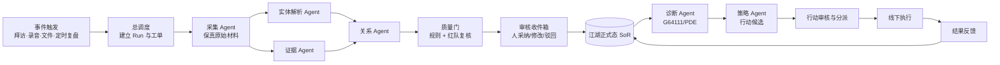

# 江湖产品规划：复杂销售 Agent 协作生产系统与 Roadmap v1

**状态：** 战略提案，待项目所有者批准  
**日期：** 2026-07-12  
**适用范围：** 江湖共享核心、内部版、商业版及 Agent/Workbuddy 适配器  
**不替代：** `docs/内部版开发待办清单v1.md`、`docs/superpowers/plans/2026-07-11-internal-edition-development.md`  
**上位约束：** `AGENTS.md`、`docs/架构-双版本关系与变更治理v1.md`

> 本文定义江湖未来 12–18 个月的产品方向与阶段门。当前内部版的代码任务仍严格按 `INT-*` 顺序执行；本文不创建新的 `IN_PROGRESS` 任务，也不授权改变安全、人审、BYO、租户隔离或双版本治理边界。

## 0. 执行摘要

### 0.1 核心判断

江湖不应停留在“干系人关系地图 SaaS”，也不应转成泛化的“多 Agent 开发平台”。更合适的方向是：

> **江湖是一套面向复杂大客户/大项目销售团队的 Agent 作战操作系统：把分散情报转化为可追溯的干系人事实、G64111/PDE 判断和可执行行动，并通过多个专业 Agent 的协作持续闭环。**

关系地图仍然重要，但其角色发生变化：

- 过去：关系地图是用户购买的主要产品；
- 未来：关系地图是人类与 Agent 共享的“现场态势图”和权威事实界面；
- 真正的产品价值：让团队更快发现缺口、形成被验证的判断、采取行动并从结果中学习。

### 0.2 本次建议的五项调整

| 维度 | 当前重心 | 建议调整 | 保留不变 |
|---|---|---|---|
| 产品定位 | 干系人作战地图 | 复杂销售 Agent 作战操作系统 | 复杂销售、关系图谱、G64111/PDE |
| AI 角色 | 建图、推断、策略助手 | 受控的专业 Agent 生产组织 | 机器推断不直接成为正式事实 |
| 产品形态 | 地图主界面 + 功能模块 | 作战室 + Agent 工作台 + 审核收件箱 + 证据账本 | 一个共享核心、两个产品方向 |
| 首发客户 | 较广的中小销售团队 | 先聚焦能源、电建、EPC 等高复杂度攻关团队 | 商业版仍须自包含、Agent-agnostic |
| 商业模式 | 50 席免费 + 捐赠 + BYO | 按“活跃商机/作战室”分层订阅；席位宽松；企业私有化增值 | 近期继续 BYO，AI 编排不按 token 单卖 |

### 0.3 关键取舍

江湖要卖的不是“更多 Agent”，而是“更可靠的销售行动闭环”。因此：

1. 不做通用 Agent 平台；专业 Agent 能力藏在复杂销售工作流里。
2. 不用自由聊天作为 Agent 协作协议；用工单、结构化产物、状态机和质量门。
3. 不把“自动化”理解为机器自动改正式数据；自动运行与自动写入分开管理。
4. 不按 Agent 数量或 token 次数收费；收费锚点应接近客户价值，即活跃商机、作战室和企业治理能力。
5. 不跳过当前可信化建设；没有可靠 SoR、人审、幂等、任务恢复和审计，多 Agent 只会更快地制造错误。

## 1. 从“流水线”到“Agent 生产系统”

用户提出的福特流水线类比成立，但软件生产与实体流水线有一处重要差异：Agent 工作不是单一线性工序，而更像可以并行、回退、复核的生产单元网络。因此，江湖应采用“标准工件 + 专业工位 + 编排调度 + 质量门”的有向工作流，而不是让多个 Agent 在群聊中自由协商。

| 工业生产要素 | 江湖中的对应物 |
|---|---|
| 原材料 | 拜访原话、录音转写、企查查信息、历史行动、用户输入 |
| 标准工件 | Evidence、PersonCandidate、RelationshipCandidate、Gap、Strategy、PlanAction |
| 工位 | 采集、实体解析、证据核验、关系推断、诊断、策略、反方审查等专业 Agent |
| 传送系统 | 事件、任务队列、依赖图、重试和升级机制 |
| 生产计划员 | Orchestrator，只负责拆解、分派、推进和停止，不拥有业务真相 |
| 质检 | 规则校验、第二 Agent 复核、G64111/PDE golden、人工审核 |
| 仓库与台账 | 江湖数据库、证据账本、Run/Step/Artifact 记录 |
| 出厂标准 | 可追溯、可解释、通过权限与质量门、由人采纳的事实或行动 |
| 售后反馈 | 行动结果、商机阶段变化、赢单/丢单原因、人工改动和驳回原因 |

真正产生规模效应的不是 Agent 数量，而是四件事：

- 交接物标准化，减少上下文重新解释；
- 专业化分工，减少一个 Agent 同时承担采集、判断和自证；
- 自动质检和返工，降低人类逐条检查成本；
- 结果反馈进入下一轮，持续改进流程而不是只改 Prompt。

## 2. 产品定位与市场选择

### 2.1 新的一句话定位

对外表达建议：

> **江湖：复杂销售团队的 Agent 作战操作系统。它让一组数字参谋自动整理情报、核验证据、诊断关系与策略缺口，再由人做最终判断和行动。**

短版宣传语：

> **不是让销售填更多表，而是给攻关团队配一支会协作、不会越权的数字参谋部。**

### 2.2 产品类别

江湖位于三个现有品类的交叉处，但不完全属于任何一个：

- 不是全功能 CRM：不负责线索营销、报价、合同、回款等全链后台；
- 不是单纯关系地图：地图只是态势界面，最终目标是行动闭环；
- 不是通用 Agent 平台：Agent 角色、产物和质量标准都被复杂销售领域模型约束。

建议定义的新类别是：**Complex Sales Agent OS / 复杂销售 Agent 作战系统**。

### 2.3 首发 ICP

首发不再以泛化“中小销售团队”为中心，而聚焦以下团队：

| 条件 | 典型特征 |
|---|---|
| 商机复杂度 | 销售周期通常 6 个月以上、关键干系人 10–50 人、多人共同攻关 |
| 交易价值 | 单一商机足以支撑团队投入售前、管理层和外部资源 |
| 决策结构 | 存在正式组织图之外的影响链、权力关系、支持度和竞争态势 |
| 管理痛点 | 情报分散在个人、微信群、纪要和文件中；周会主要靠口头汇报 |
| 治理要求 | 需要权限、溯源、人审、审计和私有化选项，不能接受 AI 随意改数据 |

首个滩头市场：

1. 能源集团、电建单位、EPC 总承包商的数字化与工程项目销售；
2. 面向上述客户的企业软件、工业设备、咨询和集成服务团队；
3. 方法论相近后再扩展到政企、金融、医疗等复杂账户销售。

暂不服务：短周期交易型销售、单人即可完成的简单商机、只需要通讯录管理的个人用户、希望完全自动外呼/群发的增长团队。

### 2.4 购买与使用角色

| 角色 | 主要诉求 |
|---|---|
| 经济购买者：销售负责人/事业部负责人 | 看清重点商机风险、资源投向和团队执行质量 |
| 内部推动者：大客户总监/销售方法论负责人 | 把个人经验转成可复用的攻关方法和周复盘机制 |
| 日常用户：销售、AR/SR、售前、交付前置成员 | 少录入、快速获得缺口和下一步行动 |
| 治理者：销售运营、IT、安全/合规 | 权限、审计、部署、数据边界和模型凭据可控 |

### 2.5 核心 Jobs-to-be-Done

1. **拜访后：** 我只提供原始材料，系统在几分钟内形成可审核的事实、关系和缺口。
2. **攻关前：** 我能知道现在最缺什么证据、应该影响谁、下一步行动为什么成立。
3. **周复盘：** 团队讨论发生了什么变化、哪些判断变得更可信、哪些行动逾期，而不是重新汇报一遍背景。
4. **管理层：** 我能跨商机看到单线风险、资源瓶颈和预测失真，但不能越权看到私密情报。
5. **组织学习：** 赢单/丢单和人工纠错能反过来改进工作流、模板和评估器。

## 3. 产品形态：一个入口、两个版本、三层体验

### 3.1 双版本关系保持不变

- **内部版：** Workbuddy-first。Workbuddy 负责采集和初步加工，江湖负责唯一真相、人审、判断、纠错和行动闭环。
- **商业版：** Agent-agnostic 且自包含。网页、文件、录音和客户自有 Agent 都可成为输入渠道，不要求安装 Workbuddy。
- **共享核心：** 领域模型、Action/API/MCP、G64111/PDE、提案、人审、权限、审计和恢复只实现一次。

这次规划不是把两个版本重新合并，而是在共享核心中增加可被两个版本复用的 Agent 生产契约和运行台账。

### 3.2 三层产品体验

#### 第一层：作战界面

- 客户指挥舱：客户态势、关键人物、组织和长期关系；
- 商机作战室：G64111/PDE、关系地图、策略、行动与变化；
- 组合驾驶舱：跨商机风险、资源投入、行动闭环和预测校准。

#### 第二层：Agent 生产界面

- Agent 工作台：显示本轮任务、工序状态、依赖、失败和预计产物；
- 审核收件箱：采纳、改后采纳、驳回、批量处理和查看依据；
- 证据账本：从结论下钻到原始材料、来源、时间、Agent 版本和人工修改；
- 自动化规则：事件触发、定时触发、停止条件、提醒和升级对象。

#### 第三层：治理界面

- Agent 能力注册与版本；
- 数据与模型权限；
- Run/Step/Artifact 审计；
- 成本、延迟、成功率、返工率和异常告警；
- 商业版的组织、配额、连接器和私有化配置。

### 3.3 界面原则

Agent 协作是产品能力，不应把用户变成工作流工程师：

- 默认只展示“发生了什么、为什么、下一步需要谁处理”；
- 编排图、Prompt 和模型参数只对管理员/高级用户渐进披露；
- 主要入口仍是商机作战室，而不是单独的 Agent 控制台；
- Agent 产物直接出现在对应业务语境中，审核收件箱承担集中处理。

## 4. Agent 协作生产机制

### 4.1 推荐的 Agent 组织

| Agent/角色 | 职责 | 主要产物 | 是否可直接改正式判断 |
|---|---|---|---|
| 总调度 Orchestrator | 建立 Run、拆工单、分派、等待、重试、停止、升级 | WorkOrder、RunPlan、状态 | 否 |
| 采集 Agent | 接收 Workbuddy、录音、文件、企查查等原始材料 | RawRecord、SourceRef | 仅可追加有明确来源的原始材料 |
| 实体解析 Agent | 识别人名、组织、商机并与已有对象匹配 | EntityMatch、PersonCandidate | 否 |
| 证据 Agent | 拆分主张、判断来源与时效、发现矛盾 | EvidenceCandidate、Conflict | 否 |
| 关系 Agent | 推断组织、影响、支持和竞争关系 | RelationshipCandidate | 否 |
| 诊断 Agent | 基于正式态计算 G64111/PDE 缺口和风险 | Gap、Risk、ScoreSnapshot | 分数派生可自动重算；输入不得越权修改 |
| 策略 Agent | 把缺口转成备选策略和行动 | StrategyCandidate、PlanActionCandidate | 否 |
| 红队 Agent | 对关键判断找反证、遗漏和过度推断 | ReviewFinding、ConfidenceAdjustment | 否 |
| 运营 Agent | 催办、排程、生成周复盘、监控陈旧信息 | Reminder、Digest、Escalation | 可自动执行低风险运营动作 |
| 人类负责人 | 最终采纳、修改、驳回、分派和执行 | ApprovedFact、CommittedAction、Outcome | 是 |

### 4.2 标准协作协议

Agent 之间不以自由聊天记录作为正式交接。每个工序至少交换以下结构化信息：

```text
WorkOrder
  runId / stepId / tenantId / accountId / opportunityId
  objective / requiredInputs / expectedArtifactTypes
  sourceRefs / permissionScope / deadline
  evaluator / retryPolicy / stopCondition / escalationTarget
  agentCapability / agentVersion / modelProfile
```

核心运行实体建议为：

- `AgentCapability`：Agent 能做什么、输入输出契约、权限和版本；
- `AgentRun`：一次完整闭环；
- `AgentStep`：一个专业工位；
- `WorkOrder`：调度与交接合同；
- `Artifact`：Agent 产物及其来源、置信度、版本和状态；
- `Evaluation`：规则、第二 Agent 或人工对产物的评价；
- `Outcome`：行动结果及其对后续流程的反馈。

状态机建议：

```text
PLANNED → READY → RUNNING → VERIFYING → CANDIDATE
                         ↘ REWORK ↗       ↓
                              ESCALATED   HUMAN_APPROVED → COMMITTED → OBSERVED
                                           ↘ REJECTED
```

任何状态都必须有明确的负责人、超时、重试上限和终止条件，避免 Agent 无限循环。

### 4.3 参考生产流



### 4.4 自动化不是统一开关

建议按“操作风险”确定自治等级，而不是给某个 Agent 一个笼统的全自动权限：

| 风险等级 | 典型动作 | 自动化规则 |
|---|---|---|
| A：可逆运营动作 | 重新计算、生成摘要、提醒、排队、导出、监控 | 可自动执行，保留日志和停止开关 |
| B：原始事实追加 | 用户明确提交的拜访原文、录音转写、来源文件 | 通过服务端校验、溯源、幂等后可追加 |
| C：结构化抽取 | 从原始材料提炼人物、角色、字段、BI/UCV | 自动运行，但只生成候选/提案 |
| D：关键判断 | 权力关系、支持度、关键影响人、策略、覆盖性修改 | 必须人审；高风险项增加红队/双检 |
| E：外部行动 | 向客户发消息、承诺、报价、提交正式文件 | 默认不得自动；另行授权和审批 |

这允许江湖在不放松真相边界的情况下实现高度自动化：系统可以全天候自动采集、分析、排队、复核和催办，把人类时间集中在少数关键判断上。

## 5. 三个真实产品场景

### 5.1 场景一：拜访后自动生成“可审核作战增量”

1. Workbuddy 或商业版录音连接器提交原始纪要；
2. 总调度创建 Run，并行调用实体解析与证据 Agent；
3. 系统匹配已有客户、商机和人物，无法确认的形成候选；
4. 关系 Agent 提取“谁影响谁、谁支持谁”等候选关系；
5. 红队 Agent 检查弱证据、矛盾和过度推断；
6. 人只审核关键差异，不必重读整篇纪要；
7. 正式态更新后，G64111/PDE 自动重算；
8. 策略 Agent 给出 1–3 个下一步行动候选和对应证据；
9. 销售采纳、修改并分派，行动结果回流。

目标不是“自动写完商机档案”，而是把“90 分钟拜访 → 一组可信、可执行的增量”压缩到 10 分钟内完成人审。

### 5.2 场景二：自动化周度商机复盘

每周固定时间，运营 Agent 对活跃商机建立复盘 Run：

- 比较一周前后正式态和证据变化；
- 标记趋赢力变化及真实驱动项；
- 找出陈旧情报、单线关系、未覆盖的 A/D、逾期行动；
- 红队 Agent 提出“当前判断可能错在哪里”；
- 形成可在 15 分钟内完成的复盘议程；
- 会后把确认事项转成行动，并追踪到下一次复盘。

结果是周会从“逐个讲状态”转成“处理异常、分配资源和做决策”。

### 5.3 场景三：管理层的跨商机资源调度

组合 Agent 在严格 ACL 下读取管理者有权查看的数据，产生：

- 高金额但证据薄弱的“虚高预测”；
- 多个商机争用同一专家/领导资源的冲突；
- 长期没有新证据却持续报高赢率的商机；
- 可由一次高层拜访同时推进的客户群；
- 需要停止投入或升级决策的商机。

管理者看到的是资源与决策建议，不是未经授权的私密 FORM/BI 明细。该场景是江湖从个人工具走向组织级产品的关键付费价值。

## 6. 商业模式建议

### 6.1 收费原则

1. **不按 Agent 数量收费。** 多 Agent 是后台实现，客户不应为内部工位数量买单。
2. **不按 token/调用次数单卖。** 近期继续 BYO，订阅卖编排、治理和工作流价值。
3. **不以席位为唯一锚点。** 复杂商机需要销售、售前、领导和专家共同参与，按席收费会抑制协作。
4. **以活跃商机/作战室为主要价值单位。** 它同时近似客户价值、数据规模和 Agent 工作量。
5. **企业治理单独增值。** 私有化、SSO、审计、专属连接器、服务等级和支持可形成高客单价。

### 6.2 推荐 SKU 结构

| 版本 | 目标 | 建议计费锚点 | 主要能力 |
|---|---|---|---|
| Pilot/Community | 设计伙伴和轻量验证 | 少量活跃商机，席位宽松 | 地图、基础 G64111、手工/文件输入、有限 Agent Loop |
| Team | 正式攻关团队 | 活跃商机/作战室档位，年度订阅 | 拜访到行动闭环、Agent 工作台、周复盘、协作与审计 |
| Enterprise | 大型集团/事业部 | 年度许可 + 部署/支持 | 私有化、SSO、细粒度 ACL、连接器、组织驾驶舱、SLA |
| Professional Services | 成熟后再启用 | 项目制 | 超出内置模板的方法论定制、数据迁移和组织落地 |

具体价格不在本阶段拍死。定价验证建议先比较三种方案：

- 每 10 个活跃商机一个档位；
- 每个“重点作战室”年度包；
- 事业部基础许可 + 活跃商机阶梯。

选择标准不是收入最大化，而是用户是否能在 30 秒内理解账单，并且不会因为新增协作者或多运行一个 Agent 而抑制使用。

### 6.3 对现有“50 席免费 + 捐赠”的处理

- 内部版和现有试用期可保持，不需要立刻改动；
- 捐赠可以保留为社区/早期支持入口，但不应承担正式商业模式；
- 商业版进入设计伙伴阶段时，改为“席位宽松、按活跃商机分层”的付费实验；
- BYO 继续作为近期正式边界；平台代付、托管统一凭据或套餐内模型额度必须另立商业模式 ADR。

## 7. 产品壁垒

江湖的壁垒不会是底层模型，也不是 Agent 编排框架。真正可积累的资产是：

1. **复杂销售领域图谱：** 人物、关系、角色、证据、商机和行动的统一模型；
2. **G64111/PDE 决策内核：** 从情报到策略与行动的可验证方法；
3. **证据—判断—行动—结果链：** 每个建议可追溯，每个结果可回流；
4. **人工审核反馈数据：** 哪类产物被采纳、如何修改、何时被驳回；
5. **组织工作流：** 周复盘、资源升级、风险审查和赢单复盘的标准化；
6. **可信治理：** 多租户、RBAC、私密信息、审计、恢复和 Agent 权限边界。

随着使用增长，江湖应优先优化“哪个工作流在什么商机阶段更有效”，而不是训练一个号称无所不能的销售大模型。

## 8. 指标体系

### 8.1 北极星指标

> **活跃商机的周度“经证据验证的关键行动闭环率”**

定义：本周应完成的关键行动中，具备来源/理由、已明确负责人、完成后记录结果并进入下一轮判断的比例。

它比“录入联系人数量”“AI 调用次数”或“地图打开次数”更接近真实客户价值。

### 8.2 关键指标

| 层级 | 指标 |
|---|---|
| 激活 | 首次创建商机到获得第一条被采纳行动建议的时间 |
| 生产效率 | 拜访结束到候选产物完成、到人审完成的中位时间 |
| 产物质量 | 首轮采纳率、改后采纳率、驳回率、返工轮数、矛盾检出率 |
| 协作效率 | 收件箱积压时间、跨角色交接等待、逾期行动率、周复盘完成率 |
| 数据可信度 | 100% 产物可追溯；跨租户事故为 0；机器越权正式写入为 0 |
| Agent 运营 | Run 成功率、静默失败率、重试恢复率、每个采纳产物的成本与延迟 |
| 商业 | 设计伙伴周活、试点转付费、活跃作战室扩张、续费与企业部署周期 |
| 业务结果 | 预测校准、销售周期、关键商机赢率；只做趋势观察，不轻率宣称因果 |

## 9. Roadmap：12–18 个月、阶段门优先

日期是容量假设，阶段门高于日历。当前开发继续完成 `INT-*`，战略 Roadmap 不得插队破坏内部版可信化计划。

### R0：可信生产地基（现在–约 3 个月）

**目标：** 先让单一 Agent/Workbuddy 的每次输入都可控、可恢复、可审计，为多 Agent 奠定工厂地基。

**执行映射：**

- 继续 `INT-107`、`INT-108`；
- 完成 M2 的写入队列、事务、幂等同步和后台任务恢复；
- 完成 M3 的纠错、合并、Token scope 和端到端契约；
- 完成 M4/M5 的主链、迁移、备份、发布和两周受控运行。

**本阶段只做设计、不提前插队实现：** `AgentRun/Step/Artifact/WorkOrder/Evaluation` 最小契约，要求能够复用现有 Job、Proposal、Evidence、Audit 和 Action。

**阶段门：** 内部发布门全部通过；机器越权写入为 0；后台任务可恢复；每个提案可追溯到来源与执行版本。

### R1：单商机自动闭环（约 3–5 个月）

**目标：** 打通“拜访/材料 → 候选情报 → 人审 → G64111/PDE → 行动”的第一条完整 Loop。

**范围：**

- 事件触发与定时触发；
- 采集、实体解析、证据、关系、诊断、策略六类专业能力；
- 商机内 Agent 运行状态与差异审核；
- Run trace、失败重试、人工接管和成本/延迟指标；
- 内部版 Workbuddy 输入，商业版网页/文件输入使用同一生产契约。

**不做：** 跨商机调度、开放 Agent 市场、自动对外触达。

**阶段门：** 拜访到候选产物中位时间 <10 分钟；关键候选首轮或改后采纳率 ≥70%；100% 结论可下钻到来源；至少 3 名内部用户连续 4 周使用。

### R2：多 Agent 作战单元（约 5–8 个月）

**目标：** 从串行助手升级为具备专业分工、并行处理、复核返工的 Agent 小组。

**范围：**

- Orchestrator + DAG 工单调度；
- 能力注册、版本固定、输入输出契约；
- maker-checker：关系/策略等高风险产物由第二 Agent 或规则复核；
- 红队 Agent、冲突检测、置信度校准；
- WIP 限制、超时、重试上限、失败终态和升级；
- 可配置但不暴露底层复杂度的工作流模板。

**阶段门：** 静默失败率可测且接近 0；高风险产物双检覆盖 100%；人工审核时间较 R1 降低 40%；复杂 Run 的重复执行不产生重复正式实体。

### R3：团队作战操作系统（约 8–12 个月）

**目标：** 让 Agent 协作嵌入团队周节奏和管理资源配置，而不只是单个销售的个人助手。

**范围：**

- 自动周复盘、异常优先议程和行动追踪；
- 跨商机组合驾驶舱与严格 ACL；
- 专家/领导资源冲突与升级建议；
- 企微/日历的克制提醒与一键回江湖审核；
- 赢单/丢单复盘形成 Outcome 数据；
- 商业版自包含旅程与首批外部设计伙伴试点。

**阶段门：** 3 个以上团队连续 8 周完成周复盘；关键行动闭环率持续提升；无 ACL 泄露；至少 2 个外部设计伙伴愿意为继续使用签付费意向。

### R4：商业化双版本（约 12–15 个月）

**目标：** 把已被验证的共享核心包装为可销售的 Team 与 Enterprise 产品。

**范围：**

- 活跃商机/作战室配额与年度订阅；
- 自助试点、组织管理、使用引导和数据导入；
- 企业 SSO、私有化部署、审计导出、备份恢复和 SLA；
- 连接器治理与客户自有 Agent 接入；
- 商业指标、支持流程和版本发布机制。

**阶段门：** 至少 3 个付费设计伙伴；单个团队可在有限交付支持下完成激活；单位经济可解释；内部版与商业版部署、数据、密钥和发布保持隔离。

### R5：可进化的 Agent 生产网络（约 15–18 个月）

**目标：** 用真实 Outcome 和审核反馈持续改进工作流，并为跨 Agent 互操作做准备。

**范围：**

- 建立版本化评估集与回归门；
- 比较工作流变体，而不是让生产 Prompt 自由漂移；
- 按客户类型/商机阶段选择更有效的编排模板；
- 在内部契约稳定后评估 A2A/MCP 等外部 Agent 互操作；
- 经审核的行业模板和能力包，不开放无治理的 Agent 市场。

**阶段门：** 新工作流在离线评估和受控线上试验中均优于基线；可一键回滚；改进不降低人审、权限和溯源标准。

## 10. 立即行动建议

以下是产品层行动，不改变当前唯一代码任务 `INT-107`：

1. **确认战略定位。** 是否接受“复杂销售 Agent 作战操作系统”作为商业版母定位。
2. **冻结首个 Loop。** 只选“拜访/纪要 → 可审核增量 → 行动”作为 R1，不并行建设多个炫技场景。
3. **定义 Agent 产物词典。** 在共享契约层明确 WorkOrder、Artifact、Evaluation 与现有 Evidence/Proposal/Action 的关系。
4. **选择 3 个真实商机做基准集。** 使用脱敏材料，记录当前人工耗时、错误、采纳率和行动结果。
5. **招募设计伙伴。** 优先寻找 2–3 个能源/电建/EPC 攻关团队，验证问题强度和付费锚点，而不是先做公开注册。
6. **单独立商业模式 ADR。** 在平台代付、确切免费额度、价格和私有化承诺进入开发前完成批准。

## 11. 明确不做

- 不做全功能 CRM 替代；
- 不做通用多 Agent 编排平台或低代码工作流平台；
- 不让 Agent 自动写入关系、角色、支持度、关键影响人和策略判断；
- 不在核心契约稳定前开放 Agent 市场或 A2A 外部网络；
- 不因追求“全自动”而自动向客户发消息、承诺、报价或提交正式材料；
- 不把内部 Workbuddy 习惯硬编码为商业版使用前提；
- 不在真实使用证据出现前大规模建设跨商机高级管理功能；
- 不以 AI 调用量、Agent 数量或生成文字数量作为产品成功指标。

## 12. CEO 审视报告（2026-07-12）

### 12.1 战略评分

| 维度 | 评分 | 判断 |
|---|---:|---|
| 问题强度 | 8/10 | 复杂销售的情报碎片、周会低效和个人经验不可复制是真问题 |
| 现有资产复用 | 9/10 | 关系图谱、G64111/PDE、提案、人审、MCP、Workbuddy 和可信化基线均可复用 |
| 差异化 | 8/10 | “领域决策内核 + Agent 生产组织 + 人审证据链”强于单纯 Copilot |
| 实施复杂度 | 5/10 | 多 Agent 很容易引入不可观测失败、成本和调度复杂度，必须按阶段门推进 |
| 商业清晰度 | 6/10 | ICP 较清楚，但价格、采购周期和私有化交付成本仍需真实设计伙伴验证 |
| 防御性 | 8/10 | 审核反馈、Outcome、领域契约和组织工作流可长期积累，底层模型可替换 |

### 12.2 最高风险与反证条件

| 风险 | 早期信号 | 反证/停止条件 | 应对 |
|---|---|---|---|
| 用户只想要纪要摘要，不愿维护作战系统 | 审核收件箱长期积压、行动不闭环 | 连续 4 周关键候选审核率 <30% | 缩小输入，提升差异审核，取消低价值产物 |
| Agent 产物看似丰富但不影响行动 | 建议采纳多、实际执行少 | 被采纳建议的行动转化率 <20% | 北极星锁定行动闭环，不奖励生成量 |
| 多 Agent 成本高于质量收益 | 返工与延迟上升 | R2 人工审核时间未比 R1 降低 | 回退单 Agent + 规则，只保留高价值双检 |
| 产品演变成重实施咨询项目 | 每个客户都要求改模型/流程 | 前 3 个客户无法共享 70% 工作流 | 收紧 ICP，模板化；定制服务后置 |
| 企业担心敏感关系数据 | 试点因安全评审停滞 | 无法通过客户最小安全审查 | 私有化、BYO、ACL、审计和最小化上下文优先 |
| 活跃商机计费不被理解 | 客户反复争论“什么算活跃” | 试点无法稳定形成可审计计量 | 改为作战室年度包或事业部基础许可 |

### 12.3 最终建议

| 决策 | 建议 |
|---|---|
| 是否调整定位 | **是。** 从“干系人作战地图”升级为“复杂销售 Agent 作战操作系统”，地图降为核心界面而非全部价值 |
| 是否现在建设通用多 Agent 平台 | **否。** 先完成一个高频、可量化的拜访到行动 Loop |
| 是否改变当前内部版任务顺序 | **否。** 先完成 `INT-107` 及既定 M1–M5 阶段门 |
| 是否保留双版本 | **是。** 内部 Workbuddy-first，商业版 Agent-agnostic，共享核心不分叉 |
| 是否全面自动写入 | **否。** 自动运行可以提高，正式判断仍由人审控制 |
| 是否立即改成平台代付模型 | **否。** 近期保持 BYO；另立 ADR 后再决定 |
| 是否值得继续投入 | **是，但以阶段门投资。** 先验证单 Loop 的采纳率和行动闭环，再投资多 Agent 与商业化外壳 |
