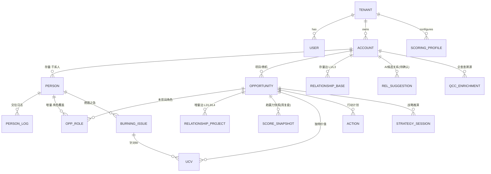
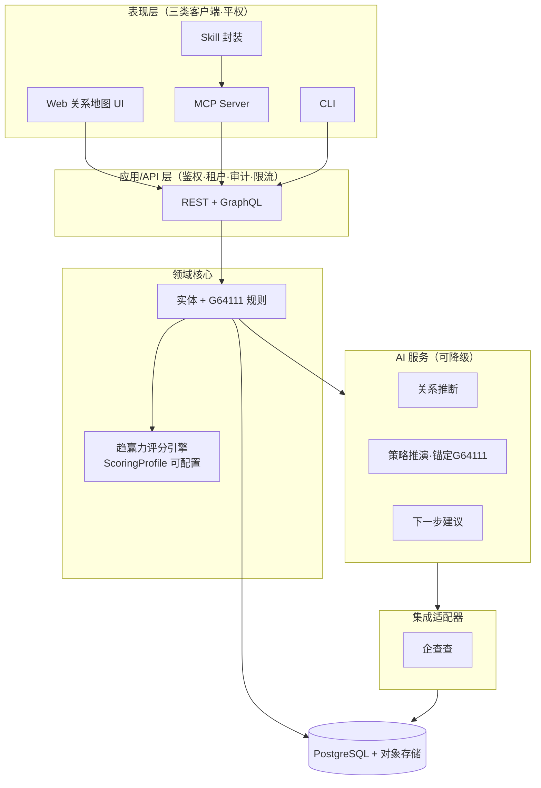

# 江湖 (Game of JiangHu) · 销售干系人管理系统

## 产品设计方案 / PRD

> **一句话定位**：面向复杂大客户/大项目销售的「干系人作战地图」——把"谁有权力、谁支持我们、谁反对、谁影响谁"这张活的权力关系网管理起来，由 G64111 方法论打分、由 AI 持续挖掘隐藏关系、推演攻关策略。

---

### 文档状态

| 项 | 内容 |
|---|---|
| 版本 | **v0.2**（规划稿，尚未动工）|
| 日期 | 2026-05-29 |
| 形态 | Web 端 SaaS（纯多租户）；远期可能扩展 App 端 |
| 方法论权威源 | `数字能源_G64111_行动宝典_v1.0.xlsx`（广联达数字能源版，母体＝销售罗盘·九问）|
| 配套文档 | [G64111-评分规格.md](G64111-评分规格.md)（核心算分引擎）|
| 状态约定 | ✅已确认 · 🟡建议(可改) · ⚠️待你确认 |
| v0.2 变更 | 按行动宝典纠正：角色模型(A/D/U/R/C)、趋赢力算分、支持度标尺、FORM能源版、商机阶段；新增关系网↔G64111接口、BI/UCV、敏感措辞处理、可配置权重 |

**已锁定的地基**

1. 方法论：✅ **G64111**（销售罗盘九问本地化），蓝表/MEDDPICC 仅作同源背书；**冲突以行动宝典为准**
2. 交付：✅ 纯多租户 SaaS（中小销售团队优先）
3. AI 范围：✅ 企查查自动建图 + AI 关系推断补全 + AI 策略与下一步建议（邮件/日历捕获排 V2）
4. 技术栈：🟡 TypeScript 全栈（理由见 §5）
5. 评分：✅ 趋赢力**允许负百分比**；741 删除"参考采购周期"条件；多A/D**取中位数低分**；权重**可自定义**；敏感动作**记录但用中性指代**

---

## 目录

1. [产品愿景与定位](#1-产品愿景与定位)
2. [核心方法论 G64111](#2-核心方法论-g64111)
3. [领域模型与数据字典](#3-领域模型与数据字典)
4. [可视化交互设计（关系地图）](#4-可视化交互设计关系地图)
5. [系统架构](#5-系统架构)
6. [AI 能力设计](#6-ai-能力设计)
7. [Agent 可操作性：MCP / CLI / Skill](#7-agent-可操作性mcp--cli--skill)
8. [商业化与 SaaS 基础设施](#8-商业化与-saas-基础设施)
9. [合规与风险（生产级红线）](#9-合规与风险生产级红线)
10. [路线图](#10-路线图)
11. [从原型到生产：迁移要点](#11-从原型到生产迁移要点)
12. [待确认问题清单](#12-待确认问题清单)
13. [术语表](#13-术语表)

---

## 1. 产品愿景与定位

### 1.1 要解决的问题

在 B2B 大客户/大项目销售中，单子的成败取决于能否看清并经营客户内部那张**人的权力关系网**：谁拍板、谁使用、谁把关、谁是我们的内线、谁被竞品搞定了、谁和谁有宿怨或裙带。传统 CRM 把人当成扁平联系人列表，丢失了最关键的**关系结构与政治态势**，也无法落地销售方法论。

江湖要做的，是把这张关系网变成一张**可交互、会生长、能被方法论打分、能被 AI 持续增强**的作战地图。

### 1.2 三个不可妥协的产品特征

| 特征 | 含义 | 文档对应 |
|---|---|---|
| **方法论驱动** | 把 G64111（销售罗盘九问本地化）沉淀为可打分(趋赢力)、可执行(行动宝典)的结构化字段与流程 | §2、[评分规格](G64111-评分规格.md) |
| **AI 原生** | AI 是核心引擎：自动建图、挖掘隐藏关系、按 G64111 分项推演攻关策略 | §6 |
| **顶级可视化** | "关系地图"式关系图谱，既有交织张力又增改顺滑；L1–L4 分层让复杂信息可读 | §4 |

### 1.3 目标用户与适用范围

- 主力：做大客户/大项目的 B2B 销售、销售负责人、售前、KA 团队（首发场景：广联达数字能源——投资管控/造价成本/EPC 工程管理）
- 四类目标客户（方法论按类定制，见 §2.6）：①央企发电集团（五大六小） ②地方能源国企 ③分布式头部民企 ④EPC总承包商
- 形态：纯多租户 SaaS，按销售团队订阅
- 远期：作为 WorkBuddy 等 AI Agent 的"干系人记忆与作战中枢"被调用

---

## 2. 核心方法论 G64111

> 完整计分算法见 **[G64111-评分规格.md](G64111-评分规格.md)**。本节是产品视角的概览。

### 2.1 核心闭环

```
G64111 诊断打分 → 趋赢力% → 741 选竞争策略 → 行动宝典取动作话术 → 行动计划排期 → 周复盘更新分数 →（循环）
```

**G6-4-1-1-1 = 满分 100，称「趋赢力」**：

| 块 | 项（分值）|
|---|---|
| **6 必清(35)** | C1 组织图(ADUR)+D的FORM(10) · C2 拍板人BI(5) · C3 立项材料7项+排序(5) · C4 介入阶段(5) · C5 招采5项(5) · C6 UCV(5) |
| **4 优势(45)** | P1 多数人支持(5) · P2 招采关键人(10) · P3 与D密谋/支持(20) · P4 关键影响人(10) |
| **1 决胜(20)** | 1K 与最高决策人A(20) |
| **+1 套竞争策略** | 741（不计分，产出策略）|
| **+1 个行动计划** | （不计分，产出动作）|

- 趋赢力% = 总分/100，**允许为负**（区间 −50%~100%）
- P/1K 在对手支持/客户抗拒时**计负分**

### 2.2 角色模型（A / D / U / R / C）

"ADUR" 是统称简写，实际 **5 类角色**。**竞争对手不是角色**，用支持度 `x` 标记客户方倒戈者。

| 角色 | 名称 | 映射 | 典型能源岗位 |
|---|---|---|---|
| **A** | 批准人 | EB 经济购买影响者 | 集团/二级单位领导、分管副总、CIO/总会计师 |
| **D** | 拍板人 | 本项目决策人 | 信息化/财务/工程管理/新能源事业部负责人 |
| **U** | 使用者 | UB | 项目部/场站成本、计划、工程、物资、安全岗 |
| **R** | 影响者·技术把关 | Technical Buyer | 信息化技术专家、招采中心、外部评标专家 |
| **C** | 教练 | Coach | 业务/信息化骨干、设计院/咨询、总集成商 |

含细分码（E-DB/E-PB、U-WB/U-BB、T-CB/T-FB/T-AB、C-CO/C-CA，作标签）；C 有教练五级成熟度。

### 2.3 支持度标尺

符号 `☆ / + / = / ? / − / x`，细分 −5~+5：☆顶压力排他支持 / +明确支持(+1~+5) / =中立(0) / ?未知(0不计分) / −负面(−1~−4) / x支持对手(−5)。**=与?都是0分但语义不同**，分别存储与可视化。

### 2.4 FORM 个人情报（能源版）

`F 家庭 / O 事业 / R 休闲 / M 金钱与梦想(Money·Motivation)`。能源版按 **4 年龄段（立足/上升/当家/沉淀期）× 国企/民营双职业序列**展开话题与志趣。
- **家庭7问**（籍贯/年纪/生日/毕业院校/配偶/子女/父母）是 C1 中 D 的 FORM 评分项（3分）
- 用法：定位年龄段→快速找话题→识别 BI→记入打分表 C2→到关系加强找解决 BI 的 UCV 动作

### 2.5 客户变化模式与可信度（分析维度，不直接计分）

- **变化模式**：G 如虎添翼(增长) / T 亡羊补牢(困境) / EK 我行我素(平稳) / OC 班门弄斧(自负) —— 决定紧迫度与切入方式
- **信息可信度·四程度**：共识 > 明确 > 推理 > 不清 —— 用于判断情报是否够格计分（P1 只计"明确"及以上）

### 2.6 四类客户（方法论按类定制）

每类客户的组织层级、A/D/U/R/C 典型岗位、招采关键人、采购方式与平台、立项驱动力、资金来源、决策链特点、销售打法**各不相同**（详见行动宝典③）。产品需：①客户类型字段（🟡可由企查查辅助判定央企/地方国企/民营）②按类型自动加载对应的行动宝典话术分支。

### 2.7 商机管线阶段（用户确认）

**线索 → 商机六阶段**：`线索 / 1.需求引导 / 2.方案认可 / 3.客户立项 / 4.招投标 / 5.合同谈判 / 6.合同双签`。
> 这是**项目生命周期管线**（用于看板/管理），与 G64111 的 **C4 介入阶段**（5档评分项：需求调研立项→…→招采执行）是**两回事**，二者并存、不混用。

---

## 3. 领域模型与数据字典

### 3.1 ER 总览



> 约定：所有业务表带 `id`、`tenant_id`(RLS)、`created_at/updated_at/created_by`、软删除 `deleted_at`。

### 3.2 核心表与字段（含 v0.2 修正）

**`persons` 干系人（存量节点）**：account_id、name、title、org_level、avatar_url、contact(jsonb)、`form_family/form_occupation/form_recreation/form_money_motivation`、`form_family_7q`(jsonb：籍贯/年纪/生日/院校/配偶/子女/父母)、form_completeness、coach_level(1–5，仅R)、source_type(manual/qcc/ai)。

**`opportunities` 项目/商机（增量根）**

| 字段 | 说明 |
|---|---|
| account_id | 所属客户 |
| name、amount、expected_close_date | 基本信息 |
| **customer_type** | 1 央企发电集团 / 2 地方能源国企 / 3 分布式头部民企 / 4 EPC总承包商 |
| **pipeline_stage** | 线索 / 需求引导 / 方案认可 / 客户立项 / 招投标 / 合同谈判 / 合同双签 |
| **single_sales_goal** | 单一销售目标（七步法第一问）|
| **customer_business_goal / buying_motivation** | 客户业务目标 / 购买动机 |
| **win_tendency** | 趋赢力总分（**可为负**，−50~100）|
| **band741** | 由趋赢力%映射：绝对优势/相对优势/相对劣势/绝对劣势 |
| scoring_profile_id | 采用的评分档案（默认 数字能源G64111 v1.0）|
| economic_buyer_person_id / champion_person_id | A 和 C(教练) 直连 |

**`opp_roles` 增量角色覆盖（人 × 项目）**：opportunity_id、person_id、`role`(A/D/U/R/C)、`role_sub`(细分码)、`sentiment`(☆/+/=/?/−/x)、`sentiment_value`(−5~+5)、`confidence`(共识/明确/推理/不清)、`is_key_influencer`(bool，P4锁定)、`influence_on`(影响哪个A/D)。

**`burning_issues` 燃眉之急**：person_id、opportunity_id、description、category(考核压力/降本KPI/按期投产/审计整改/个人晋升/安全责任/投资风险/融资上市/其他)、is_private、confidence。

**`ucv` 独特价值**：opportunity_id、target_bi_id、description、competitor_cannot、status(建议/获认可/已解决 → 驱动 C6)。

**`relationships_base` 存量边(L1/L3)** / **`relationships_project` 增量边(L2/L3/L4)**：source/target_person_id、layer、label、direction、color/style/width、source_type(manual/qcc/ai)。

**`score_snapshots` 趋赢力快照**：opportunity_id、各分项(C1..C6/P1..P4/1K)、total、percent、band、evaluated_at、evaluator。支撑"按周复盘 + 趋赢力曲线"。

**`scoring_profiles` 评分档案（可配置权重）**：见 [评分规格 §8](G64111-评分规格.md)。结构不变(6-4-1-1-1)，只改满分/映射/曲线/阈值/聚合策略。

**`actions` 行动计划**：opportunity_id、**gap_item**(关联 C/P/1K 的低分项)、person_id、scene、action、scripts、target、owner_id、due_date、status、review。
**`rel_suggestions` AI候选关系**：scope、source/target、layer、label、confidence、evidence(jsonb)、origin(qcc/graph/llm)、status(pending/accepted/rejected)。
**`interactions` 触点（含敏感处理）**：person_id、opportunity_id、content、`sensitive`(bool)、`visibility`(self/team/org)、`exportable`(默认false)、`display_label`(中性指代)、`raw_note`(加密)。
**`strategy_sessions` 战略推演** / **`qcc_enrichments` 企查查溯源** / **`audit_log` 审计**。

### 3.3 关键枚举（v0.2）

```
role             : A | D | U | R | C             // 五角色（竞争对手非角色）
sentiment        : star(☆) | plus(+) | neutral(=) | unknown(?) | minus(−) | x
confidence       : 共识 | 明确 | 推理 | 不清
relationship_layer: L1 | L2 | L3 | L4
pipeline_stage   : 线索 | 需求引导 | 方案认可 | 客户立项 | 招投标 | 合同谈判 | 合同双签
c4_engage_stage  : 需求调研立项(5) | 方案可研(4) | 预算批复/资金申报(3) | 招标论证(2) | 招采执行(1)
customer_type    : 1央企发电集团 | 2地方能源国企 | 3分布式头部民企 | 4EPC总承包商
change_mode      : G | T | EK | OC               // 客户变化模式
band741          : 绝对优势 | 相对优势 | 相对劣势 | 绝对劣势
```

---

## 4. 可视化交互设计（关系地图）

> 保留原型视觉语言，但**角色改为 5 类**、支持度改为 6 符号，技术底座升级。

### 4.1 视觉编码（v0.2）

| 视觉通道 | 编码 |
|---|---|
| 节点头像 | 真人照片（通缉墙感），无照片用姓名首字 |
| 节点左上角徽标 | **角色 A/D/U/R/C**（5 色）|
| 节点右上角徽标 | **支持度 ☆/+/=/?/−/x**（x=倒向竞品，醒目警示）|
| 节点底部进度条 | FORM 情报完整度 |
| 连线颜色 | 关系性质（蓝=汇报/绿=同盟/红=冲突/橙=牵制/紫=影响/深灰=授意）|
| 连线样式 | 实线=已确认；**灰虚线+问号=AI 推断待确认** |
| 连线粗细 | 关系/权力强度 |
| L1 连线 | 正交折线（组织感）；L2–L4 直线 + 文字标签 |

### 4.2 多视图（同一份数据，多个镜头）

1. **关系图谱（关系地图·默认）**：L1–L4 顶部 Tab 切换
2. **战略推演台**：AI what-if 推演（见 §6.3）
3. **情报档案抽屉**：FORM(能源版) + 家庭7问 + 交往日志 + BI/UCV
4. **趋赢力面板**：当前分(可负) + 各分项缺口 + 741 态势 + 趋赢力曲线
5. 🟡 **权力-利益矩阵** / **决策链时间线** / **覆盖度仪表盘**（单线风险、未覆盖的 A/D、态度未知者）

### 4.3 交互升级（原型 → 生产）

力导向自动布局 + 手动钉住；**拉线建边**（拖线选关系层+类型，3秒成边）；双击编辑角色/支持度/FORM；点击聚焦关系链；**时间轴回放**（关系/角色如何随项目演变）；**压力测试**（高亮单线风险/未覆盖关键角色）。

🟡 图引擎：**AntV G6** 为主（关系图谱场景调优最好，内置力导向/缩放/正交边），React Flow 备选。

---

## 5. 系统架构

### 5.1 技术栈推荐（TypeScript 全栈）

| 层 | 选型 | 理由 |
|---|---|---|
| 前端 | Next.js (React) + Tailwind + **AntV G6** | 原型即 React/Tailwind，平滑演进 |
| 后端 | NestJS（API 优先）| 结构化领域服务；评分引擎在此 |
| 数据库 | **PostgreSQL** + Prisma | 单一事实源；关系/JSONB 兼顾；RLS 多租户 |
| AI | Anthropic Claude（服务端）| 替换原型客户端 Gemini（见 §9）|
| Agent 接口 | MCP TS SDK / CLI(oclif) | 与主语言一致，一套搞定 |

核心理由：MCP/CLI 与前后端同语言，Agent 可操作性零跨语言成本；图谱前端天然 TS/React；单语言匹配"纯 SaaS、快迭代"。重图机器学习需求出现时再挂 Python 微服务。

### 5.2 分层架构



**铁律**：每个能力只在领域层实现一次，Web/MCP/CLI 都是其上的客户端——这是"Agent 可顺畅操作"的根本保证。

### 5.3 数据库与"图"的取舍

用 Postgres 关系表存边，图遍历用递归 CTE（必要时加 Apache AGE）。**不引入 Neo4j**：SMB 场景单项目图通常 10–200 节点，远未到专用图库门槛。多租户用 **Postgres 行级安全（RLS）**，全表带 `tenant_id`。

---

## 6. AI 能力设计

### 6.1 企查查自动建图

输入公司名/信用代码 → 拉取高管/股东/实控人/关联企业/风险 → 高管落为存量节点、股权/任职落为"外部来源"边 → **跨公司比对发现隐藏关系链**（如"友商法人=客户采购总监亲属"=`x` 风险）→ 写入 `rel_suggestions`(pending) 待人审。
> ⚠️ 生产需自有企查查商用 API 授权（当前环境接口为开发便利）。

### 6.2 AI 关系推断补全

图算法（共同邻居/Adamic-Adar/Jaccard）+ LLM（读交往日志抽人际关系）+ 企查查关联 → 候选边。**铁律：一律进 `rel_suggestions`（虚线、待确认），人审 accept/reject，绝不自动写库。**

### 6.3 AI 策略与下一步建议（战略推演台 · 锚定 G64111）

- **输入**：项目的角色/支持度分布 + L2–L4 关系 + 用户假设（"绕过钱大钧直接找赵总？"）
- **转化**：把假设映射为**对 G64111 分项的增减**（如改变 P3=D钱、1K=A赵、相关支持度）→ **重算趋赢力** → 给出风险、赢面变化、下一步最佳行动、话术草稿
- **引擎**：服务端 Claude，工具调用直接复用 §7 领域 API（AI 看到的世界与人一致）
- **衍生**：用关系网找 P4 关键影响人、找打通 1K 的引荐路径、单线风险预警（见 [评分规格 §10](G64111-评分规格.md)）

---

## 7. Agent 可操作性：MCP / CLI / Skill

### 7.1 原则：API 优先、三端平权

UI 能做的每件事都对应稳定领域 API；MCP/CLI 是其薄封装。WorkBuddy 等 Agent 与人类操作同一套能力。

### 7.2 MCP Server 工具清单（示例）

| 工具 | 作用 |
|---|---|
| `get_account_map` / `get_opportunity_map` | 取存量图 / 增量图(角色+L2-L4边+趋赢力) |
| `upsert_person` / `update_form` | 增改干系人、FORM(能源版) |
| `set_role(opp,person,role,sentiment,confidence)` | 设角色(A/D/U/R/C)/支持度 |
| `add_relationship(scope,src,tgt,layer,label)` | 建关系边 |
| `score_win_tendency(opp)` | 按 ScoringProfile 算趋赢力(可负)+741态势 |
| `record_bi` / `record_ucv` | 记录燃眉之急 / 独特价值 |
| `enrich_from_qccc(account)` | 企查查自动建图 |
| `suggest_relationships(scope)` / `review_suggestion(id,accept|reject)` | AI候选关系 + 人审 |
| `simulate_strategy(opp,hypothesis)` | 战略推演（返回趋赢力影响）|
| `recommend_next_actions(opp)` | 按低分项推荐行动宝典动作话术 |
| `find_single_threaded_risks(opp)` | 单线风险/覆盖缺口 |

### 7.3 CLI 与 Skill

CLI：能力的命令行封装（批量导入、定时拉企查查）。Skill：教 Agent 编排工具完成高层意图（"把这家客户的图建起来并给攻关策略"→ enrich→suggest→set_role→score→simulate→recommend）。

### 7.4 Agent 安全

作用域受限 token（限租户/客户/操作）；写操作支持 dry-run 与人审；删除/合并节点等高危强制人审；每次操作进 `audit_log`。

---

## 8. 商业化与 SaaS 基础设施

| 模块 | 设计 |
|---|---|
| 多租户 | Postgres RLS，`tenant_id` 全表隔离 |
| 组织 | 租户 → 团队 → 成员；客户/项目分配负责人 |
| 权限 RBAC | 管理员/销售负责人/销售/只读；行级可见性；**敏感触点按 visibility 控权** |
| 方法论配置 | 每租户可选/自定义 ScoringProfile（权重变体），默认 数字能源G64111 v1.0 |
| 计费 | 🟡 按席位订阅 + 用量项（企查查调用、AI 推演次数）|
| 审计/数据 | 全量操作日志；软删除、导出（敏感记录默认不导出）、加密存储 |
| 企业能力 | SSO / 更细权限 → V2 |

---

## 9. 合规与风险（生产级红线）

> 本产品存储**真实个人**的照片、FORM 弱点、政治态度、关系网，并涉及招采敏感动作，合规敏感度极高。

| 风险 | 等级 | 应对 |
|---|---|---|
| **个人信息合规（PIPL）** | 🔴 最高 | FORM(尤其家庭7问)、态度、关系属敏感个人信息：明确告知与授权、最小必要、字段级敏感标记、保留期、可删除、加密、严格访问控制。把合规做成数据模型一等公民 |
| **招采敏感动作（招投标法）** | 🔴 高 | "密谋评标参数/规则"等：用户决策 e——**记录但用中性指代**（招采方案预对齐等）；`sensitive` 标记 + `visibility` 控权 + 默认不可导出 + 加密 `raw_note` + 审计。见 [评分规格 §12](G64111-评分规格.md) |
| **企查查商用授权** | 🔴 高 | 生产须自有商用 API license；注意配额、计费、二次分发条款 |
| **AI 误报污染数据** | 🟠 中 | AI 关系一律"建议+人审"，置信度可视化，绝不自动写库 |
| **客户端密钥泄露** | 🟠 中 | 原型把 Gemini Key 放前端——生产所有 LLM 调用走服务端 |
| **关系图规模/录入负担** | 🟡 低 | SMB 单图 <200 节点；用 AI 辅助填充 + 企查查预填 + 渐进式录入 |

---

## 10. 路线图

| 阶段 | 范围 | 价值 |
|---|---|---|
| **MVP** | 客户/项目/干系人 CRUD + 关系地图 L1–L4（A/D/U/R/C、支持度、FORM能源版）+ 存量/增量模型 + **趋赢力评分引擎(默认profile)** + 多租户认证。复用原型视觉、G6 重建画布 | 能打分的作战地图 |
| **V1** | 企查查自动建图 + AI 关系推断(待确认) + 行动宝典结构化(缺口→动作) + MCP Server + CLI | AI 原生差异化 |
| **V1.5** | 战略推演台(锚定G64111) + 下一步建议 + 多视图(矩阵/时间线/覆盖度) + 周复盘曲线 + 可配置 ScoringProfile + 协作 | 体验与决策力 |
| **V2** | 高级图分析、行业方法论模板市场、企业版(SSO/审计/细权限)、邮件/日历捕获、App 端 | 规模化 |

---

## 11. 从原型到生产：迁移要点

| 维度 | 原型 | 生产 |
|---|---|---|
| 形态 | 单 HTML + CDN | Next.js 工程化 |
| 图渲染 | 自绘 SVG + 硬编码坐标 | AntV G6，自动布局 + 拉线建边 |
| 数据 | 内存常量 | Postgres，存量/增量 schema |
| LLM | 客户端 Gemini + 前端 Key | 服务端 Claude |
| **角色** | ADUR(C/K) 6色（过时）| **A/D/U/R/C 5色（按宝典）** |
| **分数** | winScore 笼统 | **趋赢力引擎（可负、741映射）** |
| 认证/租户 | 无 | 多租户 + RBAC + RLS |
| **保留** | 通缉墙视觉、徽标布局、FORM 抽屉、L1–L4 Tab、战略推演台 | 作为设计规范沿用 |

> 原型 `参考文件/GameOfJiangHu原型.html` 保留为 MVP 交互/视觉验收基准（角色配色需按 5 类更新）。

---

## 12. 待确认问题清单

**已解决（用户决策）**：✅趋赢力允许负 · ✅删除741的采购周期条件 · ✅多A/D取中位数低分 · ✅关系网三大用途 · ✅敏感动作记录+中性指代 · ✅可配置权重 · ✅线索+商机六阶段 · ✅角色模型A/D/U/R/C · ✅C1角色缺失扣一次3 · ✅C1招采三类按类数比例 · ✅C1的FORM严格曲线(可切线性) · ✅P1只计"明确"及以上 · ✅教练五级/变化模式仅作标签不计分。

> G64111 评分规则已全部定稿，见 [评分规格 §13](G64111-评分规格.md)，评分引擎可直接实现。

**仍待确认**：
1. 🟡 计费模型：按席位 / 客户数 / AI·企查查用量？（不阻塞 MVP）

---

## 13. 术语表

| 术语 | 含义 |
|---|---|
| 江湖 / Game of JiangHu | 产品代号 |
| G64111 | 销售方法论：6必清+4优势+1决胜+1竞争策略+1行动计划，满分100 |
| 趋赢力 | G64111 总分(可负)，映射 741 竞争态势 |
| A/D/U/R/C | 角色：批准人/拍板人/使用者/影响者·技术把关/教练 |
| 支持度 ☆/+/=/?/−/x | 排他支持/明确支持/中立/未知/负面/倒向对手 |
| FORM | 个人情报：家庭/事业/休闲/金钱与梦想（能源版按年龄×序列）|
| BI / UCV | 燃眉之急 / 独特价值（对手给不了、解决BI）|
| 密谋(中性指代) | 招采方案预对齐等——记录但敏感控权 |
| 741 | 竞争策略：按趋赢力% 选 可承诺/可争取/可参与/重新复盘 |
| 1K / 4P | 1K=与A的关系；4P=四类关键购买影响人 |
| L1–L4 | 关系分层：组织架构/决策权力/情感阵营/战略本质 |
| 存量 / 增量 | Account 持久层 / Opportunity 项目动态层 |
| 四类客户 | 央企发电集团 / 地方能源国企 / 分布式头部民企 / EPC总承包商 |

---

*本文件为规划稿，对应"先规划、后动工"。配套 [G64111-评分规格.md](G64111-评分规格.md)。修订请更新版本号与日期。*
