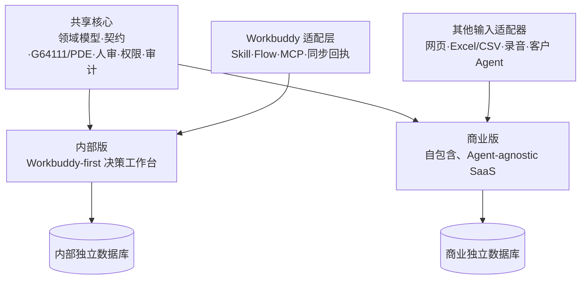

# ADR-001：内部版、商业版与共享核心的关系基线

**状态：** 已接受  
**日期：** 2026-07-11  
**决策人：** 项目所有者  
**Owner：** 项目所有者  
**Approved at：** 2026-07-11  
**Last verified commit：** `2c4f93051c979af02fb2ff8012deb6849605e81b`
**Supersedes：** 历史文档中把 Workbuddy 或“江湖自算”规定为全产品唯一入口的产品关系结论  
**Superseded by：** `docs/ADR-002-商业版单一演进与通用CRM能力分层.md`（仅替代“两个产品方向持续演进”的产品路线；共享核心、安全、人审、隔离与变更治理继续有效）
**适用范围：** 江湖代码仓、内部部署、未来商业 SaaS 立项及 Workbuddy 集成

## 0. 决策摘要

> 2026-08-19 更新：本节中“两个产品方向持续演进”的产品路线已由 ADR-002 替代。以下共享核心、独立部署、安全、人审与治理约束继续有效。

江湖原按“**一个共享核心、两个产品方向、独立部署与路线图**”演进：

- 不建立长期维护的完整代码 Fork。
- 内部版保持 **Workbuddy-first**，江湖承担唯一数据真相、审核、判断、纠错和行动闭环。
- 商业版保持 **Agent-agnostic 且自包含**，即使客户不安装 Workbuddy，也能完成核心用户旅程。
- G64111、PDE、领域模型、Action/API/MCP 契约、权限、安全、审计和人审流程只实现一次。
- 两个版本使用独立域名、数据库、密钥、配置、发布流水线、需求池和成功指标。

这项决策可以概括为：**产品独立，核心代码共享；输入渠道可替换，数据真相与决策纪律不可分叉。**

## 1. 背景与约束

当前内部团队已经把大量采集、整理和录入工作放在 Workbuddy 中，江湖更接近作战地图、判断台和人审前台。未来商业客户不一定拥有同样的桌面 Agent、Skill 和微盘工作流，因此商业版必须具备自助使用能力。

两个方向的差异主要在输入渠道、首次使用、运营能力和商业配套，而不是领域模型。若直接复制仓库形成长期 Fork，下列能力将不可避免地双份维护：

- G64111 与 PDE 规则；
- Prisma schema 与数据迁移；
- 多租户、RBAC 和隐私边界；
- AI 候选、人审、证据和审计；
- MCP、Action 与前后端契约；
- 安全修复、依赖升级和恢复机制。

现有设计已经给出共享原则：每个能力只在领域层实现一次，Web、MCP、CLI/Agent 都是客户端（`docs/产品设计方案.md:302-334`）。本 ADR 将这项原则落实为内部版与商业版的长期治理规则。

## 2. 四层关系模型



### 2.1 共享核心 Core

共享核心是唯一权威实现，内部版和商业版都不得复制或改写一份私有版本。

| 能力 | 当前主要位置 | 长期规则 |
|---|---|---|
| 领域实体与数据契约 | `app/src/types.ts`、`app/src/store.ts`、`server/prisma/schema.prisma` | 逐步收敛为共享契约；两端不得自行扩展同名不同义字段 |
| G64111 | `packages/g64111/` | 单一共享包是唯一算法实现；App/Server/MCP 只做 adapter，权威规格仍是 `docs/G64111-评分规格.md` |
| PDE | `packages/pde-kernel/`、`server/src/pde/` | Kernel 继续单一实现；oracle/golden 变更遵守交接包规则 |
| 提案与人审 | `server/src/suggest.ts`、`server/src/proposals.ts`、证据审核路由 | 所有机器推断统一进入候选/提案层 |
| 通用情报与干系人焦点 | `packages/domain-contracts/src/intelligence.ts`、`server/src/intelligenceFocus/`、`server/prisma/schema.prisma` | `IntelligenceItem` 区分 observed/reported/inferred 并保留来源；`StakeholderFocus` 是唯一方法论中立焦点权威，只能由用户确认，不读取或回退 `primaryDPersonId`、评分或方法论角色 |
| 销售假设与验证历史 | `packages/domain-contracts/src/hypotheses.ts`、`server/src/hypotheses/`、`server/prisma/schema.prisma` | `SalesHypothesis` 是唯一在线假设权威；Revision 与已审核 Evidence 链接追加保留，状态建议只读，正式状态只能由用户确认 |
| 多租户、RBAC、隐私 | `server/src/`、Prisma schema | 所有渠道执行同一服务端权限策略 |
| 审计、幂等、迁移、恢复 | 服务端与部署层 | 两个产品共同使用，分别部署和验证 |
| API/MCP | `server/src/index.ts`、`server/src/mcpServer.ts` | MCP 是领域 API 的适配器，不拥有第二套业务逻辑 |

### 2.2 内部版 Internal Edition

内部版的定位是：

> Agent 负责采集和初步结构化；江湖负责唯一真相、人审、判断、纠错和行动。

内部版应保留：

- Workbuddy 驱动的客户档案、商机、拜访记录和候选情报输入；
- 收件箱、人审、关系地图、G64111/PDE、今日聚焦和行动反馈；
- 最小但完整的纠错、撤销、恢复、合并、重新绑定和同步冲突处理；
- 内部部署、人工开通和内部运维方式。

内部版不以补齐通用 SaaS 表单为目标。与 Workbuddy 重复、又不承担纠错和恢复价值的录入界面可不建设。

### 2.3 商业版 SaaS Edition

商业版的定位是：

> Agent 驱动信息采集、人工审核的复杂销售决策系统；Agent 是可选输入渠道，不是使用前提。

商业版必须能够在不安装 Workbuddy 的情况下完成客户、商机、人物、关系、证据和行动的创建、纠错、审核与复盘。网页录入是可靠兜底，不要求退化为以表单为中心的传统 CRM。

商业版专属能力包括自助开通、组织管理、导入、使用引导、配额、商业运营、客户支持和合规配套。这些能力不得反向侵入内部版主旅程。

### 2.4 Workbuddy Adapter

Workbuddy 是内部版默认启用的一种输入适配器，不是共享核心，也不是未来商业版硬依赖。

Workbuddy 侧允许拥有：

- Skill、Flow、prompt、定时任务和本地文件处理；
- MCP 配置、同步编排和内部模板；
- 与内部组织习惯有关的便利功能。

Workbuddy 侧不得拥有：

- 独立演进的 G64111/PDE 权威实现；
- 与江湖不同的数据模型或角色口径；
- 绕过服务端租户、权限、人审和审计的写入路径；
- 将微盘 Markdown 重新定义为数据库之外的第二真相源。

### 2.5 AI 成本与模型策略

当前资料同时存在 BYO、平台代付和 Workbuddy 自有模型三种口径。本 ADR 不替商业版提前作成本决策，近期执行规则固定为：

- 内部版默认使用 Workbuddy 自有模型能力或江湖现有 BYO 配置，不新增平台模型成本；
- 共享核心保持 provider-agnostic，不绑定单一模型供应商；
- 商业版在独立商业模式 ADR 批准前继续遵守 BYO 安全边界；
- 平台代付、套餐内含模型额度、统一托管客户模型凭据均属于重大偏差。

## 3. 数据与人审边界

### 3.1 唯一真相源

- 江湖数据库是客户、商机、关系、证据、行动和审核状态的唯一 SoR。
- Workbuddy 本地文件、微盘 Markdown 和导出文档是输入工作区、缓存或快照，不是并列主库。
- 两个产品版本使用相同 schema/migration 规则，但运行在完全独立的数据库实例中。

### 3.2 允许直写的内容

只有满足下列条件的事实型内容可以由 Workbuddy 经幂等接口写入正式表：

1. 来源是用户明确输入或用户已经在 Workbuddy 中确认的业务事实；
2. 写入带 `origin`、`externalRef`、提交用户、时间和原始依据；
3. 服务端重新执行租户、父子归属、字段值域和权限校验；
4. 重复提交得到同一业务结果；
5. 写入能够审计和恢复。

每次跨端写入至少由服务端形成或验证：`actorId`、`actorRole`、`channel`、`assertionMode`、`origin`、`sourceRef`、`occurredAt`、`idempotencyKey`、`schemaVersion` 和 `reviewStatus`。缺少信任字段只能降低为机器提案，不能提升为正式事实。

适用对象限于客户基本档案、商机基本事实和原始拜访记录。原始记录可以直存，但从原始记录抽出的结构化判断仍遵守人审边界。

### 3.3 必须进入候选/提案的内容

下列内容无论来自江湖自算、Workbuddy、企查查还是其他 Agent，均不得自动成为正式事实：

- 新干系人身份及其客户归属；
- 人际关系、权力关系和战略关系；
- 角色、支持度、可信度、关键影响人；
- BI、UCV、行为信号及其方向；
- AI 对现有字段的覆盖性修改；
- 会影响 G64111/PDE 判断的机器推断。

统一数据流为：`原始依据 → 候选/字段提案 → 收件箱 → 人工采纳/改后采纳/驳回 → 正式态 → 重新计算`。

### 3.4 评分边界

- 只同步评分输入状态，不同步计算结果。
- G64111 和 PDE 结果由共享 Kernel 根据当前正式态实时计算。
- Workbuddy 若需要离线预览，只能使用同一版本的 golden fixtures 做兼容性检查，不得形成另一套可独立修改的规则。

### 3.5 通用情报与干系人焦点边界

- `IntelligenceItem` 是复杂销售能力包中的方法论中立正式情报对象，但不等于 Evidence。`reported` 是默认类型；`observed` 必须带发生时间；`inferred` 仍保留推断标签。任何类型变更都只修改同一情报对象，禁止通过改标签创建、覆盖或伪装 `EvidenceEvent`。
- 手工来源保留用户描述；Interaction 来源必须绑定精确版本并继续执行其底层 SourceArtifact creator/share ACL；Evidence 来源只允许引用同 tenant、Customer、Matter 下已审核的精确版本。来源撤权、父级漂移或存储损坏时读取失败关闭。
- `StakeholderFocus` 是 `stakeholder.focus` 的当前和目标唯一权威。每个 Matter 最多一个当前焦点，目标 Person 必须是当前 MatterParticipant；目标变化、理由、依据或证据缺口及有效期由用户明确提交，确认人和确认时间由服务端写入。
- 焦点到期只改变读取投影，不自动选择另一人物；替换和退役必须经过 CAS、幂等命令与审计。机器、Candidate、Agent、G64111 分数或 MethodologyPack 只能形成建议，不能直接创建焦点。
- `Opportunity.primaryDPersonId` 继续只属于 G64111 兼容 adapter。通用焦点写入、读取、迁移和回滚均不得复制到该字段，也不得从该字段或方法论角色反向重建焦点。
- IntelligenceItem 与 StakeholderFocus 的所有命令、回放、列表和按 ID 读取都必须执行 tenant、当前数据库角色、`sales.workspace`、EffectiveResourceScope 和父级闭包；viewer 禁止写入，并继续受 Customer 归属隔离。

### 3.6 销售假设与验证边界

- `SalesHypothesis` 是 `sales.hypothesis` 的唯一在线身份和状态权威；`SalesHypothesisRevision` 保存不可变判断历史，`HypothesisEvidenceLink` 只追加同一当前 Revision 下已审核 Evidence 的 supporting/contradicting 精确版本引用。在线读取和写入不得回退旧 `StrategyRisk(kind=assumption)`，也不得长期双写。
- 每个用户修订必须明确 claim、reason、预期信号和反证条件；修订以 CAS 推进当前 Revision 并把当前判断重置为 `untested`，旧 Revision、EvidenceLink、审计和命令历史保持不可变。迁移保留的 legacy-incomplete Revision 只能由后续完整用户修订替代，迁移不得臆造内容。
- 正式状态固定为 `untested | testing | supported | contradicted | retired`，只能由明确用户命令修改。状态建议仅按当前 Revision 的 supporting/contradicting EvidenceLink 确定性投影；混合或无链接不建议状态，且建议不得写入假设、Candidate、Evidence、关系、阶段、预测、焦点、评分或方法论数据。
- 所有关联 Evidence 必须是同 tenant、Customer、Matter 下已审核的精确版本 0；链接追加后该 Evidence 不得删除。Person 若存在必须是当前 MatterParticipant。命令、回放、列表、直查和建议均重载当前数据库角色、`sales.workspace`、EffectiveResourceScope 与父级闭包；viewer 禁写并继续执行 Customer 归属隔离。
- 旧 manual `StrategyRisk(kind=assumption)` 只在 marker-last 双库迁移中保守回填：`open → untested`，`resolved | dismissed → retired`；不得推断 supported/contradicted、负责人、Person、复盘时间、预期信号、反证条件或创建者。回填后 assumption 新增、更新、删除及 risk↔assumption 转换失败关闭，但 `StrategyRisk(kind=risk)` 行为不变，旧行保留用于审计和非破坏性应用回滚。
- AI、Agent、Candidate、Relationship Radar、G64111 或 MethodologyPack 只能产生带来源、证据和置信度的候选／只读建议，不得导入或调用正式假设 writer。SAAS-208/SAAS-209/SAAS-212 只能作为受权读消费者或经用户确认的专用命令发起方，不能建立第二套假设权威。

## 4. 代码和部署边界

### 4.1 近期代码策略

近期保持当前 monorepo，不复制整个仓库。商业化开发使用短期 feature branch/worktree，完成后回到共享主干。

先建立集中式 edition/capability 边界，再根据真实差异决定是否出现两个前端 shell：

```text
shared core
  ├─ domain contracts / policies
  ├─ g64111 / pde
  ├─ review workflow / audit
  └─ API / MCP contract

product shells
  ├─ internal: workbuddy-first capabilities
  └─ saas: self-contained capabilities

connectors
  ├─ workbuddy
  └─ import / recording / external agents
```

不得在业务组件中散布无组织的 `if (internal)`。Edition 差异必须由集中式 capability 配置、路由装配或适配器接口表达，并同时在服务端执行授权。

### 4.2 独立部署

即使共用代码，内部版和商业版也必须从第一天保持以下隔离：

- 数据库和备份；
- 域名和 TLS 证书；
- JWT、AI、企查查、MCP 等密钥；
- 对象存储和日志；
- 发布流水线与回滚点；
- 监控、告警和使用指标；
- 测试数据与真实客户数据。

禁止从内部数据库复制真实客户数据到商业演示或测试环境。

## 5. 需求分类与流向

所有新需求在进入开发前必须标记为下列一种：

| 类型 | 定义 | 处理规则 |
|---|---|---|
| `CORE` | 两个版本都依赖的数据、算法、安全和可靠性能力 | 进入共享核心，要求最高测试和兼容标准 |
| `INTERNAL_ADAPTER` | Workbuddy、内部 Flow、内部模板和部署便利 | 留在适配器/配置层，不改变共享领域语义 |
| `SAAS_PRODUCT` | 自助使用、商业运营和外部客户体验 | 进入商业产品壳，不强迫内部版展示 |
| `CUSTOMER_EXTENSION` | 单一客户的特殊流程或字段 | 通过扩展点、模板或配置实现，不直接硬编码核心 |

一个内部需求只有满足以下至少一项，才进入当前内部版计划：

- 每周反复发生并显著影响内部团队使用；
- 能验证一个明确的商业产品假设；
- 能提高共享核心的数据质量、安全性、可恢复性或决策正确性。

否则优先留在 Workbuddy Skill/Flow 或内部运营流程中。

## 6. 路线图关系

- 共享核心的安全、数据一致性、算法正确性优先级高于两个产品壳的新功能。
- 内部版先做可信同步、最低纠错和决策闭环；不补齐公开 SaaS 商业配套。
- 商业版在共享核心达标后，补自包含录入、导入、引导、组织与运营能力。
- 内部团队是共享核心的 Alpha/Canary 用户，但不是商业版唯一需求来源。
- 内部需求只有被至少两个外部设计伙伴验证，才自动升级为通用商业能力；否则仍需单独产品判断。

## 7. 重大偏差定义与变更流程

### 7.1 以下情况属于重大偏差

出现任一项，必须暂停实施并由项目所有者重新批准：

1. 建立长期代码 Fork，或复制共享 Kernel/领域模型形成第二权威实现；
2. 改变“江湖数据库是唯一 SoR”；
3. 允许机器推断绕过候选/提案层直接改变正式判断；
4. 改变 G64111、PDE、ADURC 或客户分类的权威口径；
5. 引入不能同时服务两个版本的破坏性 schema/API 变更；
6. 降低 tenantId、RBAC、隐私、加密、审计或恢复要求；
7. 将 Workbuddy 从内部适配器提升为商业版硬依赖；
8. 在安全和数据一致性阶段门未通过前，跳到后续大功能建设；
9. 引入新的重依赖、敏感数据外发路径或不可逆外部平台绑定；
10. 使已批准阶段的目标、范围或预计工作量变化超过 30%。

### 7.2 不属于重大偏差

在不改变上述边界的前提下，下列事项可以按正常任务评审执行：

- 文件拆分、命名和内部实现重构；
- 文案、布局、可访问性和错误提示修正；
- 增加测试、日志和指标；
- Workbuddy prompt/Flow 的内部优化；
- 同一阶段内不改变依赖关系的任务排序微调。

### 7.3 重大偏差处理步骤

1. 新建一份 ADR 修订案，描述现状、触发证据和受影响任务 ID；
2. 至少比较“保持基线”和“采用偏差”两个方案；
3. 列出数据迁移、兼容、测试、发布和回滚影响；
4. 获得项目所有者明确批准；
5. 先更新本 ADR、开发计划和待办清单，再开始代码变更。

未完成上述步骤时，不得以“先实现再补文档”的方式推进重大偏差。

## 8. 文档权威顺序

发生冲突时，按以下顺序判断：

1. `AGENTS.md` 中的安全与仓库硬规则（`CLAUDE.md` 保持同口径镜像）；
2. `docs/G64111-评分规格.md` 和 `docs/pde-handoff/` 中的算法权威；
3. `docs/ADR-002-商业版单一演进与通用CRM能力分层.md` 的持续产品路线与能力分层，以及本 ADR 仍被保留的共享核心、安全边界、物理隔离和重大偏差治理；
4. `docs/superpowers/plans/2026-08-19-lightweight-personal-crm-commercialization.md` 的商业主线执行顺序；
5. `docs/商业版开发待办清单v1.md` 的当前执行状态；
6. `docs/superpowers/plans/2026-07-11-internal-edition-development.md` 与 `docs/内部版开发待办清单v1.md` 的维护冻结和历史证据；
7. 其他专题设计和历史实施方案。

与历史文档的关系：

- 保留 `docs/产品设计方案.md:302-334` 的领域能力只实现一次、API/MCP 平权原则；
- 保留 `docs/架构-江湖自算主线设计v1.md:18-105` 的 DB SoR、三层信息、人审和评分边界；
- 按 ADR-002 将商业版设为唯一持续功能建设和常规发布形态；内部计划、清单和发布验收只承载维护冻结与历史证据；
- 将该文档中“Workbuddy 只退居道具”的单一产品结论细化为：内部版 Workbuddy-first、商业版 Workbuddy 可选；
- `docs/集成-端到端最小链实施方案v1.md` 和 `docs/集成-WorkBuddy销售包对接设计.md` 继续作为内部适配器资料，不再代表整个产品方向；
- 历史文档中任何机器直写描述，均以本 ADR 第 3 节的新边界为准。

## 9. 架构阶段验收

以下条件同时成立，才认为双版本关系真正落地：

- G64111/PDE、领域契约和人审策略不存在两份可独立修改的权威实现；
- 内部版可通过 Workbuddy 完成采集，并在江湖完成审核、纠错、判断和行动；
- 商业版能够在不安装 Workbuddy 的情况下完成核心旅程；
- 两套部署的数据、密钥、备份和发布相互隔离；
- 所有需求都能归入四类之一，且内部专属代码不污染共享核心；
- 重大偏差均有先批准、后修改的记录。
